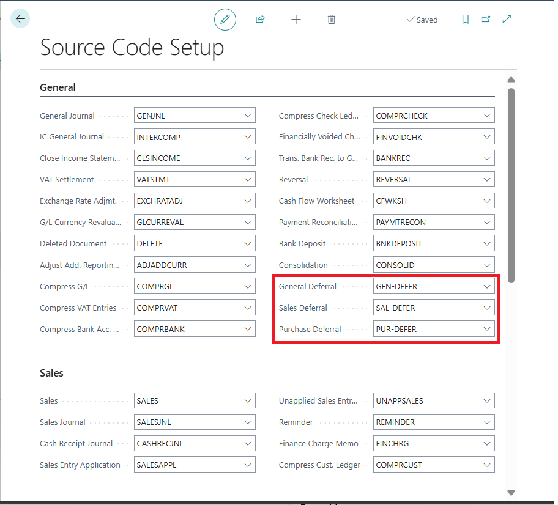
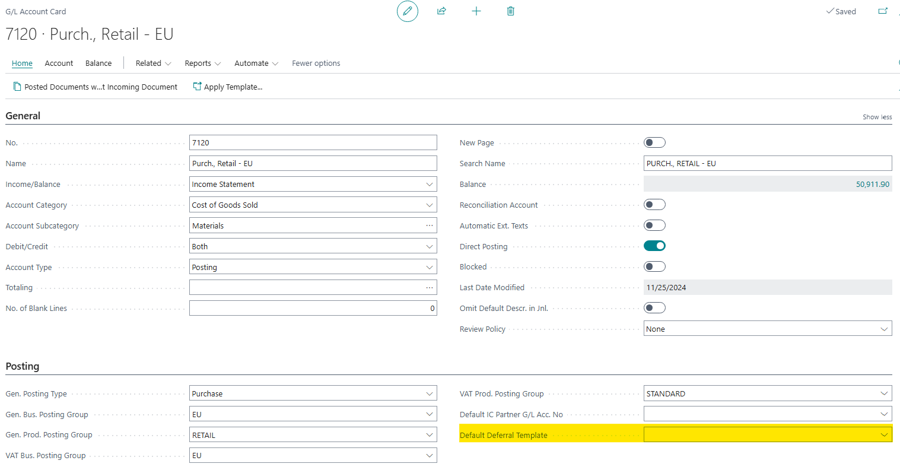
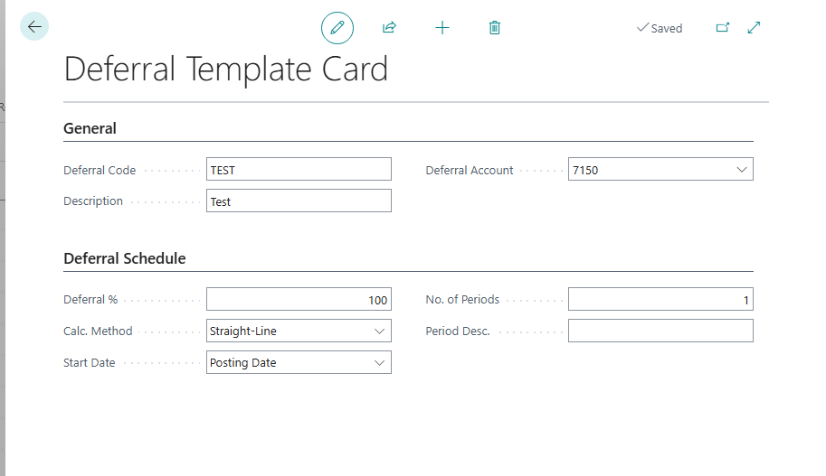
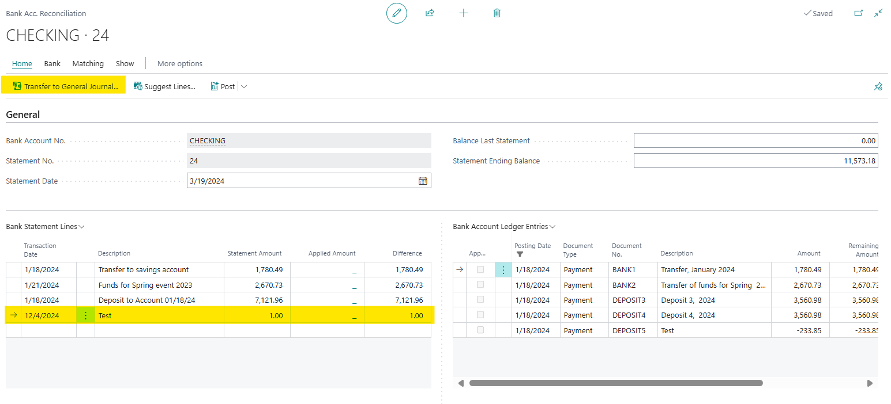
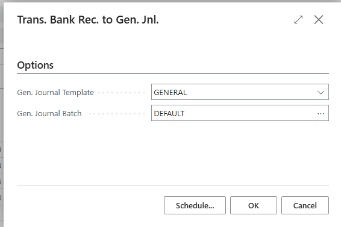
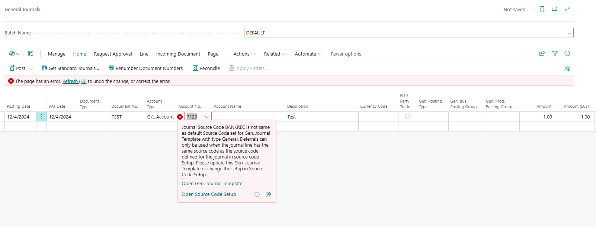
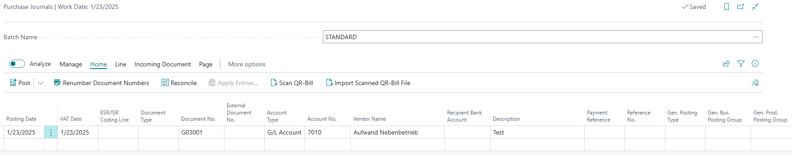

# Title: Error when performing Transfer to General Journal due to default deferral on the selected G/L account: "Journal Source Code BANKREC is not same as default Source Code set for Gen. Journal Template with type General..."
## Repro Steps:
Open the source code setup: (make sure that the general deferral account is setup)

Open the chart of accounts, select account No. 7120:

Create a new deferral template card:

Open the Bank Acc. Reconciliation, add the below line and select Transfer to general journal:

Select the below:

Add the G/L account and you will get the below error:

I tested the same scenario on version 23 and was able to post the journal without any errors:

Expected Results:
the customer should be able to post the journal as it was working in previous versions.

Actual Results:

Error message:
Journal Source Code BANKREC is not same as default Source Code set for Gen. Journal Template with type General. Deferrals can only be used when the journal line has the same source code as the source code defined for the journal in source code Setup. Please update this Gen. Journal Template or change the setup in Source Code Setup.

Internal session ID:
57bef71d-d895-451f-a849-1f5f2a1073c2

Application Insights session ID:
390e61a5-6adb-4402-b2de-8624717b9ac7

Client activity id:
37240a12-b755-4d0a-ad3e-e7ae54f00288

Time stamp on error:
2024-12-04T12:05:04.2211352Z

User telemetry id:
8d18717b-f861-46a1-a462-cdf259fbb175

AL call stack:
"Deferral Utilities"(CodeUnit 1720).CheckDeferralConditionForGenJournal line 53 - Base Application by Microsoft
"Gen. Journal Line"(Table 81)."Deferral Code - OnValidate"(Trigger) line 19 - Base Application by Microsoft
"Gen. Journal Line"(Table 81).GetGLAccount line 31 - Base Application by Microsoft
"Gen. Journal Line"(Table 81)."Account No. - OnValidate"(Trigger) line 22 - Base Application by Microsoft

Custom dimensions:
[]

## Description:
This issue is reproducible in v24.5 but not in v23.
