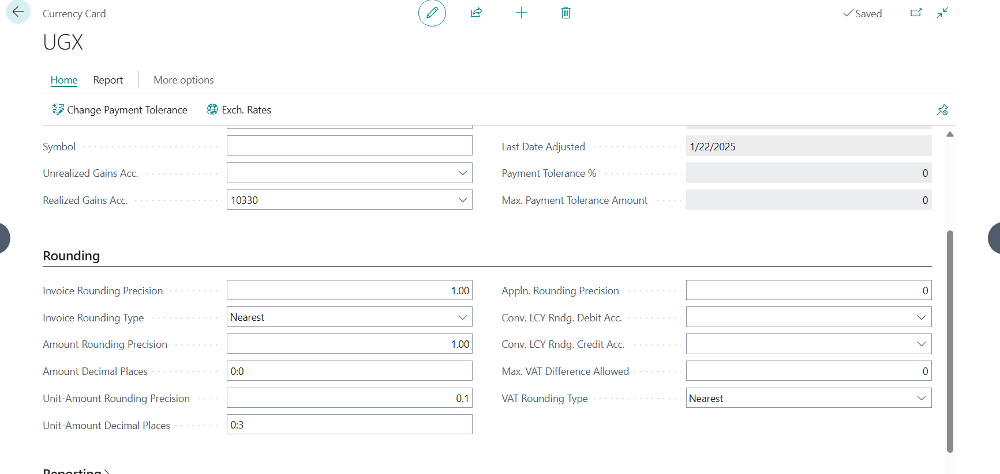
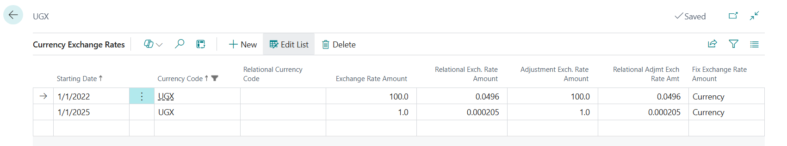
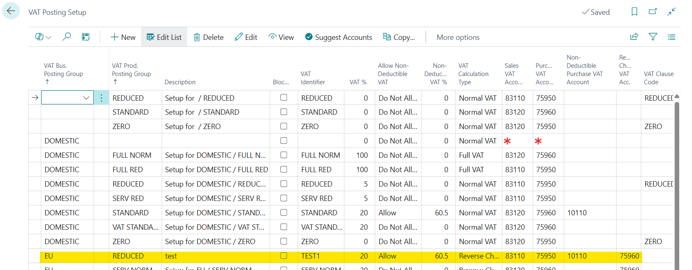
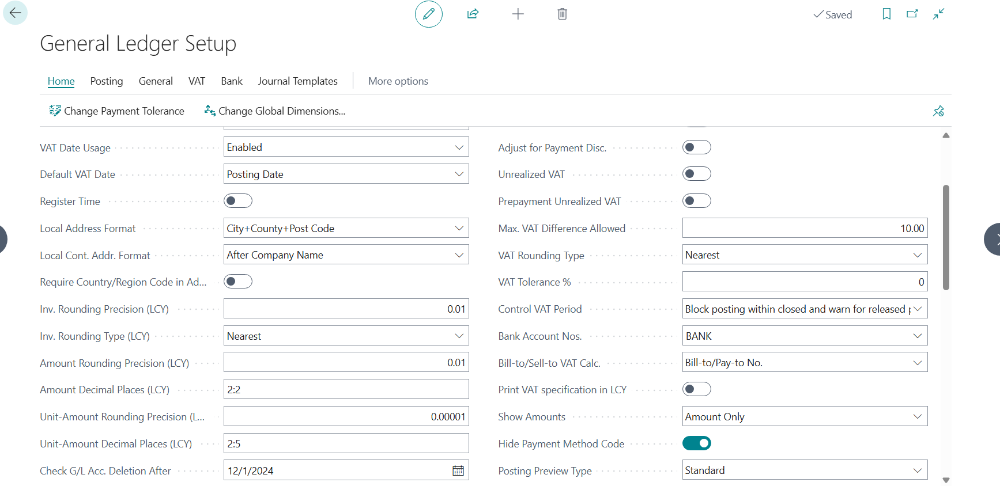
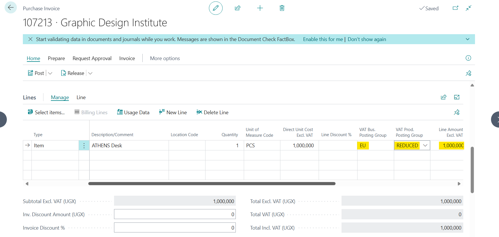
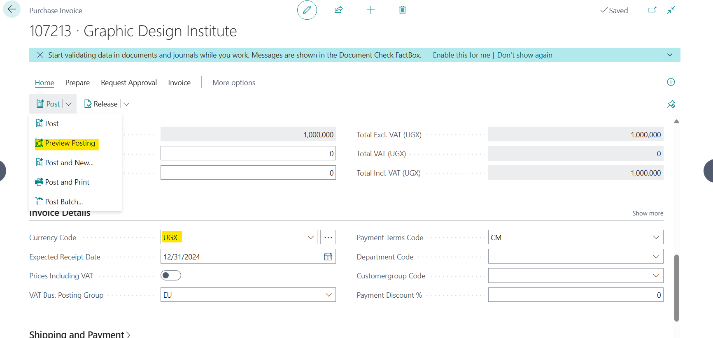
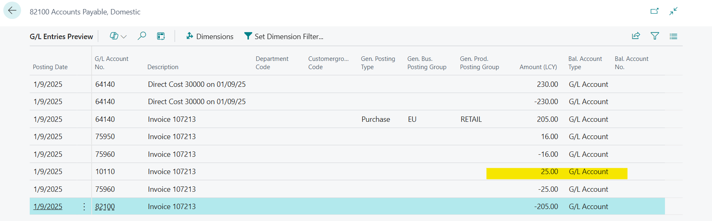
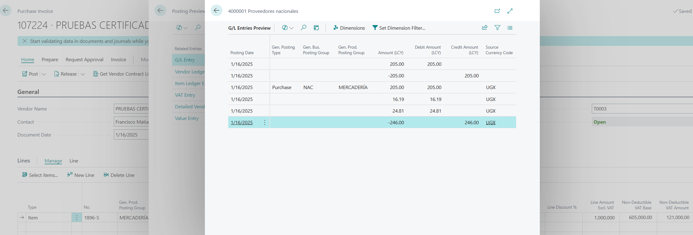

# Title: Issue with Non-Deductible VAT rounding when using Reverse Charge VAT
## Repro Steps:
**The setup:**
1- Currency Card

2- Currency exchange rate:

3- Vat Posting Setup:

4- General Ledger Setup:

**The repro steps:**
1- Create purchase invoice and set fields as following then click on preview posting:

**The actual result:**

The non-deductible VAT is rounded to 25 based on the Rounding Precision set up in the Currency Card, rather than the Rounding Precision configured in the General Ledger Setup.

**The expected result:**

The value should be rounded to 24.81 according to the Rounding Precision set up in the General Ledger Setup, rather than the Rounding Precision configured on the currency card.

​I have tried to replicate the scenario using the normal VAT instead of Reverse Charge VAT and it worked as expected.

## Description:
Issue with Non-Deductible VAT rounding when using Reverse Charge VAT
