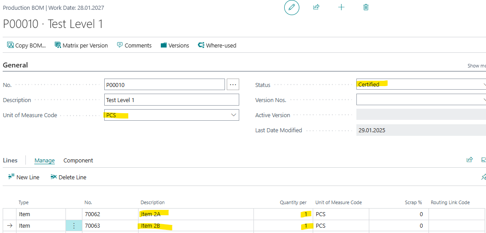
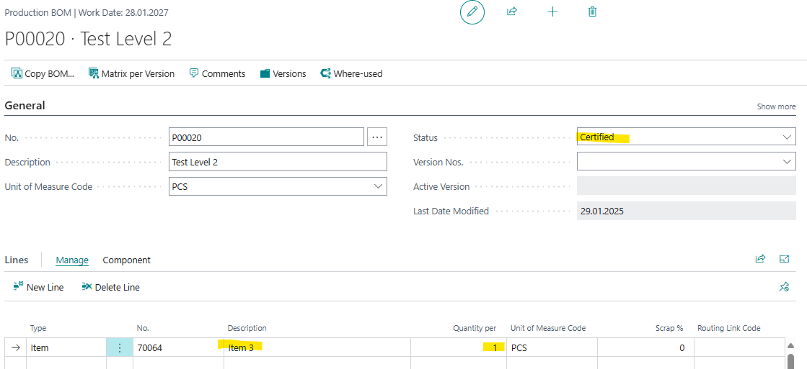
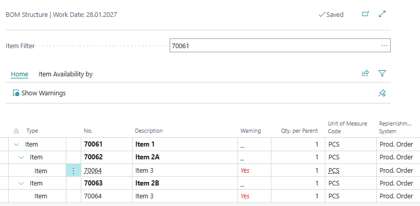
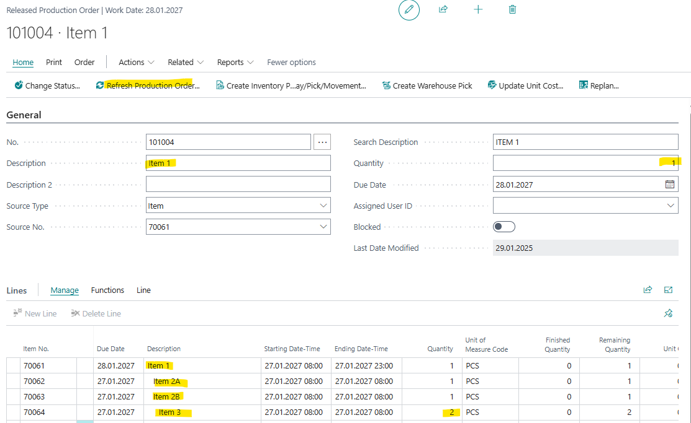
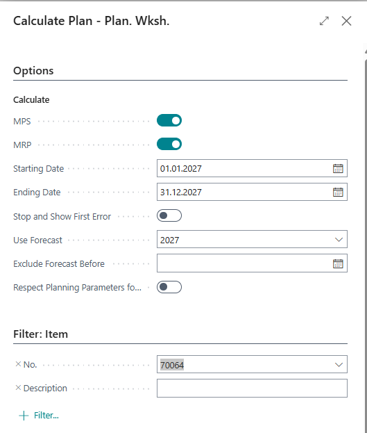
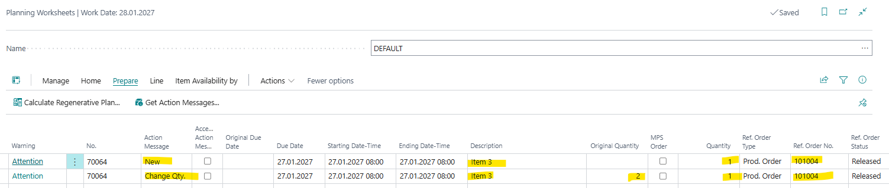

# Title: For an item that is consumed in multiple subassemblies, running planning worksheet suggests to change Quantity from 2 to 1, but then also create a new Prod. Order for 1, which is unnecessary noise and lines on the Planning Worksheet.
## Repro Steps:
1.  Search for items
    Create four items: Item1, Item 2A, Item 2B and Item 3 with
    Replenishment: Prod Order
    Manufacturing Policy: Make to Order
    Reordering Policy: Lot for Lot Manufacturing Policy: Make to Order
2.  Search for Production BOMs
    Create 2 BOMs
    Test Level 1
    Item 2A and Item 2B and assign to item1
    
    And
    Test Level 2
    Item 3 and assing to Item 2A and 2B
    
3.  Final BOM Structure should look like this:
    At Item 1 -> Item -> Structure
    
4.  Search for Released Prod. Order
    Create a new order
    Item1
    Quantity: 1
    Refresh Production Order
    
    You see that for Item 3 is a quantity of 2 since it is used in Item 2A and 2B
5.  Search for Planning Worksheet
    Prepare -> Calculate Regenerative Plan
    Plan for Item 3 (lowest level)
    

ACTUAL RESULT:
Planning suggest to create a new Order with quantity 1
And to change existing order line from 2 to 1

EXPECTED RESULT:
planning should ignore 1003 as it is already reserved in the production order and a calculation is not needed.​

## Description:
