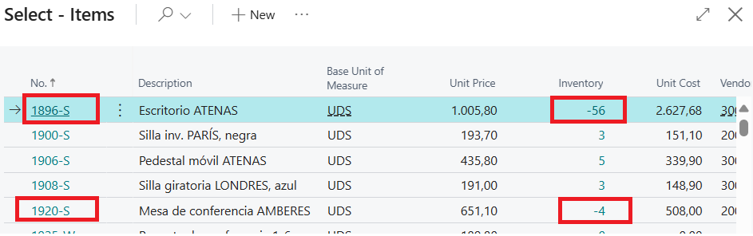
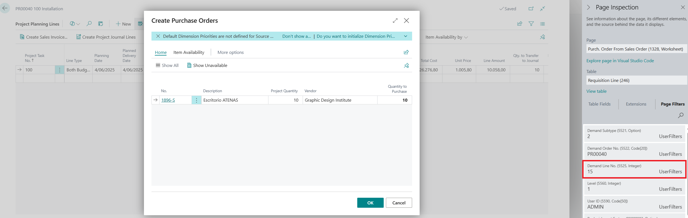
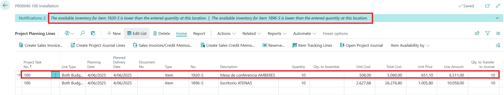
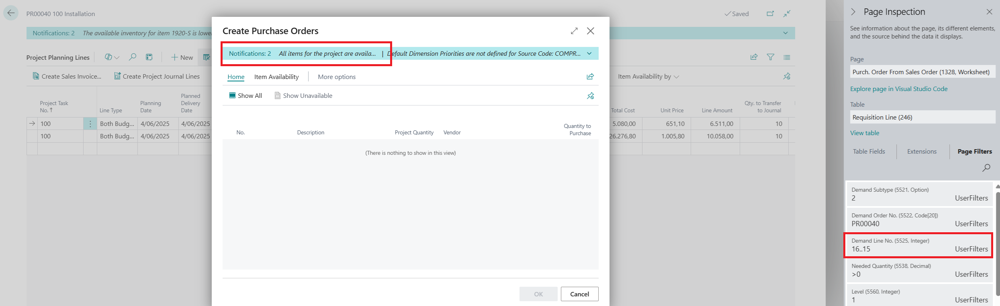
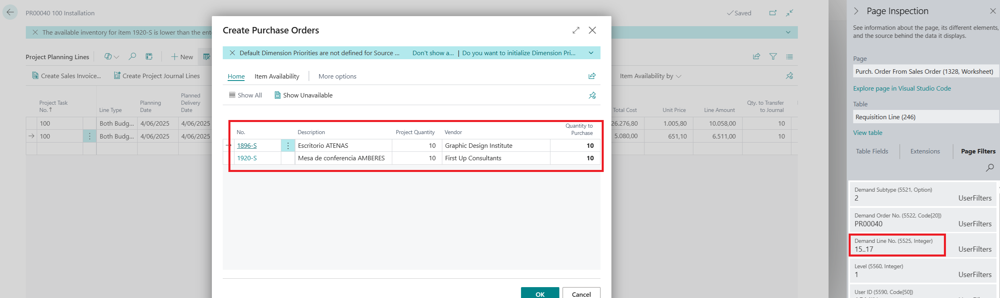
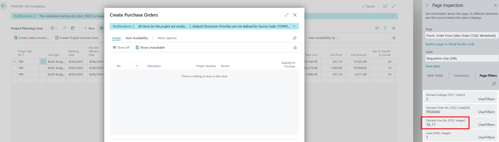

# Title: Create Purchase Order from Project not working as expected if we add Project Planning Lines before the previous ones.
## Repro Steps:
1-Take a BC26 environment.
2-Create a new Project
3-Add a Project Task Line
4-Navigate to the Project Planning Lines.
We will use 2 Items that do not have Inventory: 1896-S and 1920-S

Create a Project Planning Line for the first Item 1896-S with 10 units.
5- Click on Create Purchase Order (Actions, Functions, Create Purchase Order) and check that it shows the Unavailable 10 units as expected:

Check the "Demand Line No" = 15.
Close the window without creating anything.
6- Back to the Project Planning Lines enter a new line BEFORE the other one with NEW.
Use Item 1920-S and another 10 units:
(Check the message on top that both items are unavailable...)

7- Click on Actions, Functions, Create Purchase Order again...
Unexpectedly... it shows a message saying that all is available...????

Check the "Demand Line No." = 16..15
1. Remove this line and try again. It works.
2. Add the same line as previously, but AFTER the existent one.
Click on Create Purchase Order. Then it works. Check "Demand Line No." = 15..17

1.  Add a new line without Inventory again BEFORE the other 2 existent lines... same issue, and check "Demand Line No."...  18..17

All available when it is not true...

ACTUAL RESULTS
Create Purchase Order from Project not working as expected if we add Project Planning Lines before the previous ones.
It seems to be with the "Demand Line No." filter??

EXPECTED RESULTS
The information should be accurate, and show that those Items are unavailable... so we can create the Purchase Orders accordingly.
Maybe take always the lower line no and build the filter with that before?? 15.. X??

## Description:
Create Purchase Order from Project not working as expected if we add Project Planning Lines before the previous ones.
