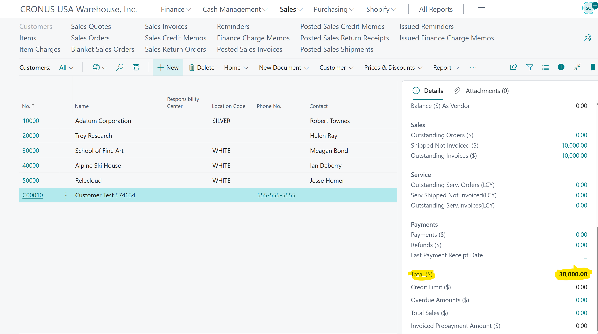
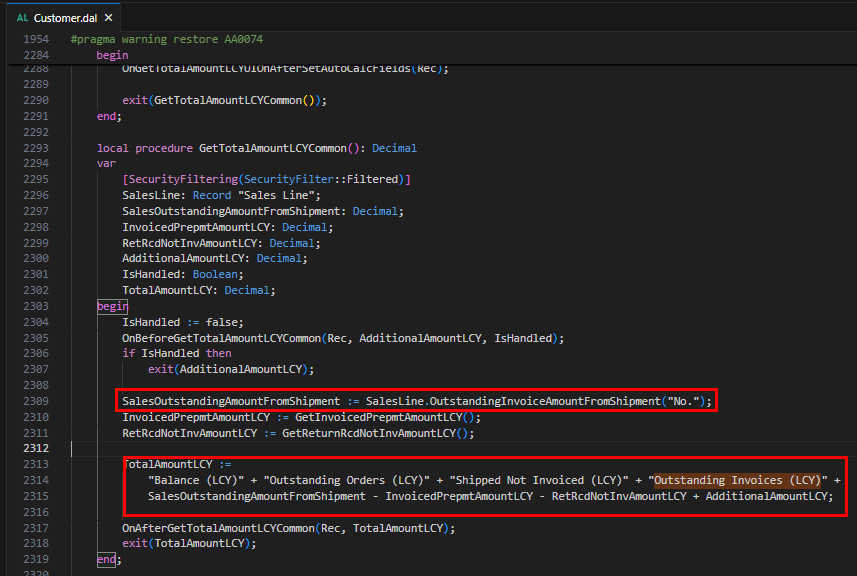

Title: Customer Card Statistics Information on the FactBox reflects T. Amount that is tripled when a Sales Order is Shipped and a Sales Invoice is used to get Shipment Lines prior to post
Repro Steps:
Reproduced by Partner in W1 and DE Version. 
Escalation Engineer in US tested and confirmed in a Version 26 Tenant Sandbox in the US Version. (CRONUS USA Warehouse, Inc. - copy of base CRONUS USA, Inc. Company was used)
1 - Create a new Customer for a clean test and use the standard CUSTOMER COMPANY Template to get required fields populated from the Template.  Added change was to Assign Location MAIN as the default Location for the company.
2 - Go to Item Journals - Create and Post an Item Journal for 10 PCS of Item 1896-S Athens Desks to Location MAIN
3 - Create a new Sales Order for the Customer created in Step 1 - On the Sales Order Lines, select Item for Type and select No. 1896-S. Enter a Quantity of 10 PCS. I changed price to $1,000.00 for easy value validation of $10,000.00 total Sales Invoice Amount.  Click Posting > Post Shipment only
4 - Navigate to Sales Invoices and click the + to create a new Sales Invoice for the new Customer and use Line > Functions > Get Shipment lines to bring in the Shipment of 10 PCS of Item 1896-S
5 - Release the Sales Invoice but do not post.
6 - Search for Customers and select the Customer and open the Customer Card for the new Customer used. Make sure to click the 'i' Icon to open the FactBox as shown below.

**Result:** Identify above highlighted in yellow the Total ($)ted Shipment along with an open Sales Invoice with Get Shipment Line completed to bring the Shipped Inventory into the Invoice Lines for billing, but prior to the Invoice being posted.

**Expected Results:** Instead of being tripled, the Sales Order/Invoice Amount should be calculated only once into the Total $ Sales for the Customer. In the case provided above, it is expected that Sales $ would equal $10,000.00

**NOTE:** The partner provided the following code as being the offending code area:

Description:

