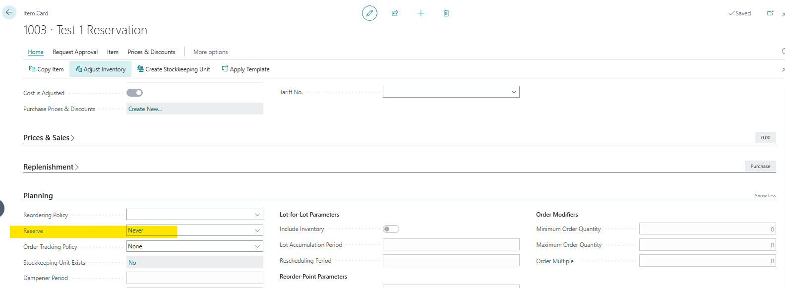
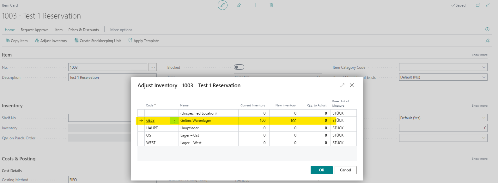
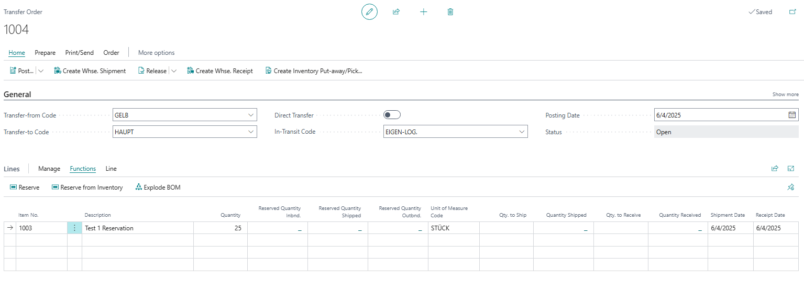
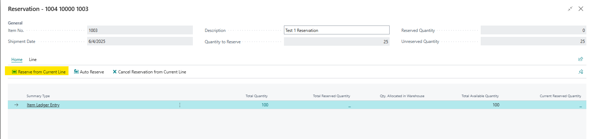
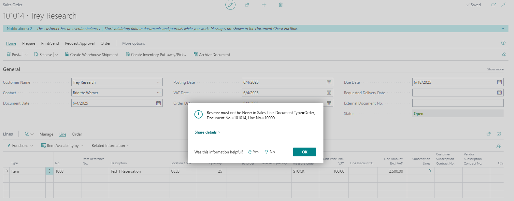

# Title: Reservation of an Item possible with in a Transfer order if the item is set to reserve=never
## Repro Steps:
1- Create an item with reserve = Never:

2- Add amount of 100 to location GELB:

3- Create a transfer order:

4- In the lines fasttab, click reserve and reserve the amount outbound:

The system will allow the reservation of the amount.
I tested the scenario for a sales order and got the below error message:

Expected behavior: The system should show the same error message in the transfer order.

## Description:
