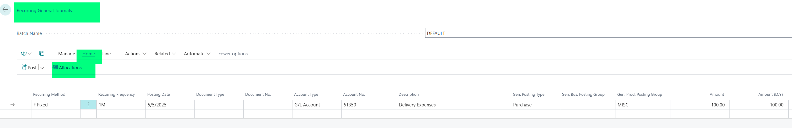
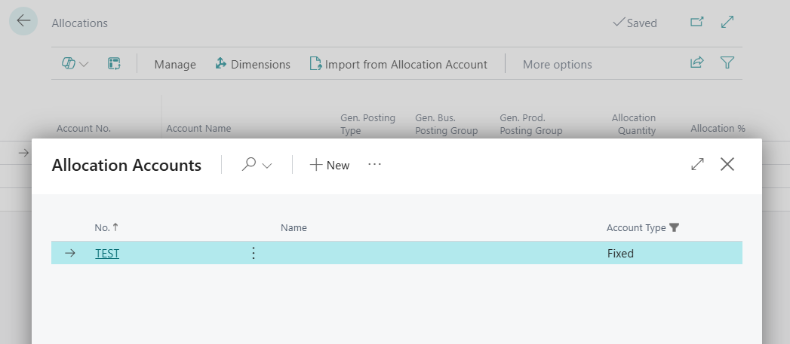

# Title: In Recurring General Journals Import from Allocation Accounts does not import dimensions
## Repro Steps:
Repro steps in US version to use Allocation Accounts in Recurring General Journals:
Create an allocation account with a single distribution line, assign dimensions on the line.

The line has its dimension:

In Recurring General Journals, create a journal line. Navigate to Home/Process > Allocations.

Choose "Import from Allocation Account"

Choose the Allocation Account you chose earlier:

The line from AA comes. Open the dimensions:

Dimensions come empty:

Expected Result:
The lines should have the same dimesion as setup on the Allocation Account when multiple allocation distribution lines exist.

## Description:
In Recurring General Journals Import from Allocation Accounts does not import dimensions.
When you use the Allocation Account on a General Journal line, the dimensions are added correctly.
