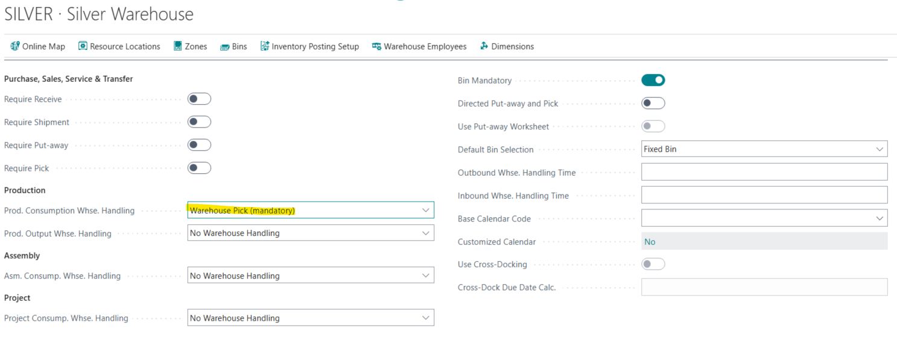
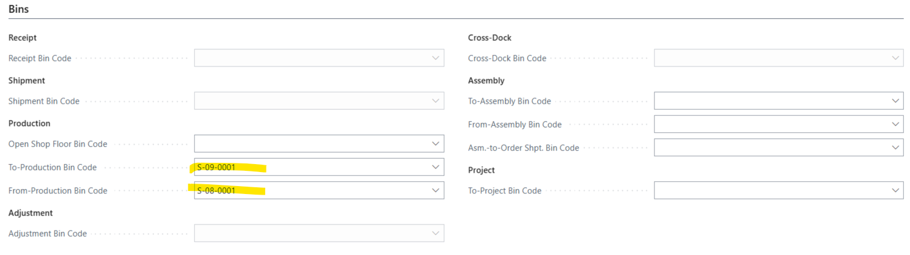
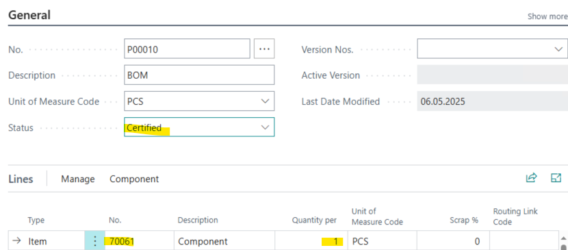
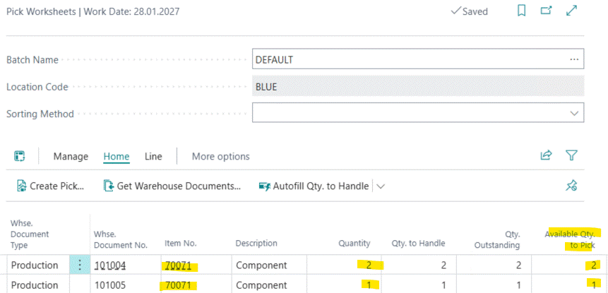
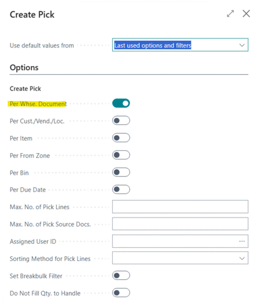
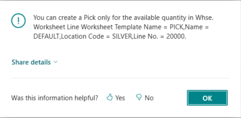

# Title: Availability error when creating pick from pick worksheet with location setup Bin mandatory and the item reserved on the related production order
## Repro Steps:
1. BC 25.5 W1
2. Open location SILVER
Add the following setup:

3. Open Warehouse Employees
Add your User for Location SILVER as default
4. Create 2 Items
Item 70061 Component
Replenishment System: Purchase
Item 70062 Main
Replenishment System: Prod. Order
Manufacturing Policy: Make to Stock
Production BOM No.: P00010

5. Open Item Journal
make a positive adjustment of 3 PCS for Item 70061 to Location SILVER, Bin S-01-0001  -> Post
6. Create 2 released Production Orders
First: Item: 70062 Quantity: 2, Location: SILVER -> Refresh Production Order
Second: Item: 70062 Quantity: 1, Location: SILVER -> Refresh Production Order
Reserve in both Production Orders the components against the added inventory
Line -> Component
Reserve -> Reserve from current line
7. Open Pick Worksheet
-> Get Warehouse Documents
Select the 2 Production Orders -> ok

8. Create Pick

ACTUAL RESULT:
The following availability error appears:

EXPECTED RESULT:
The creation of the Pick should be done since enough Items are available.
If I do the same scenario with a location which has not BIN mandatory the picks are created as expected.
It also works if I do not reserve the component items.

## Description:
If want to create picks from the pick worksheet the following availability error appears:
You can create a Pick only for the available quantity in Whse. Worksheet Line Worksheet Template Name = PICK,Name = DEFAULT,Location Code = SILVER,Line No. = 20000.
This just happens if you have location with Bin mandatory and reserving the component items in the related production order.
