# Title: When the quantity in a Sales Invoices was changed after using 'Get Shipment lines' and an item with item tracking lines and reserve always the tracking information gets lost.
## Repro Steps:
1. Open BC26.0 GB.
2. Search for Item tracking code.
3. Add a New Item tracking code "Test".
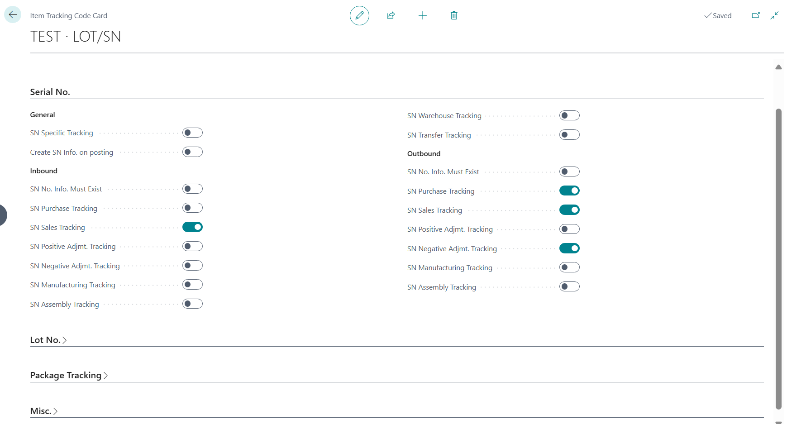
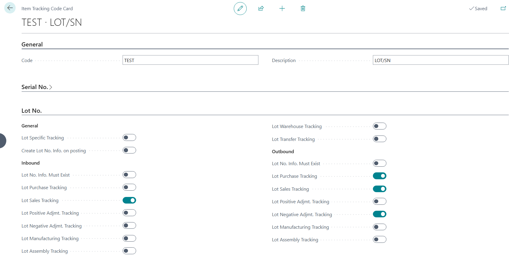
4. Search for items and create a new Item with Reserve set to "Always" and assign Item track code "Test" and No. Series for Lot and Serial No.
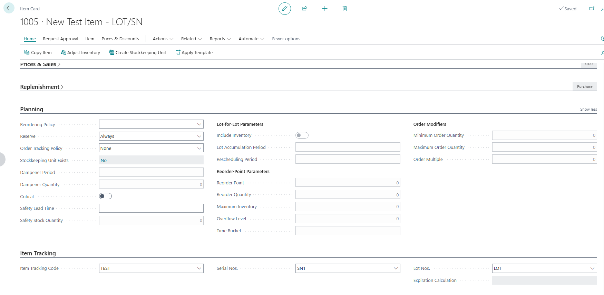
5. Go to Item Journal and add to the inventory for the newly created item.
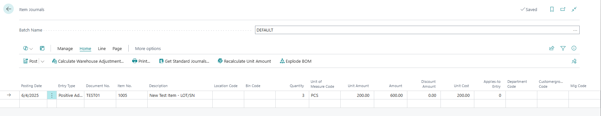
6. Create a Sales order with Customer 20000 and Item 1005 Quantity 3
assign item tracking lines
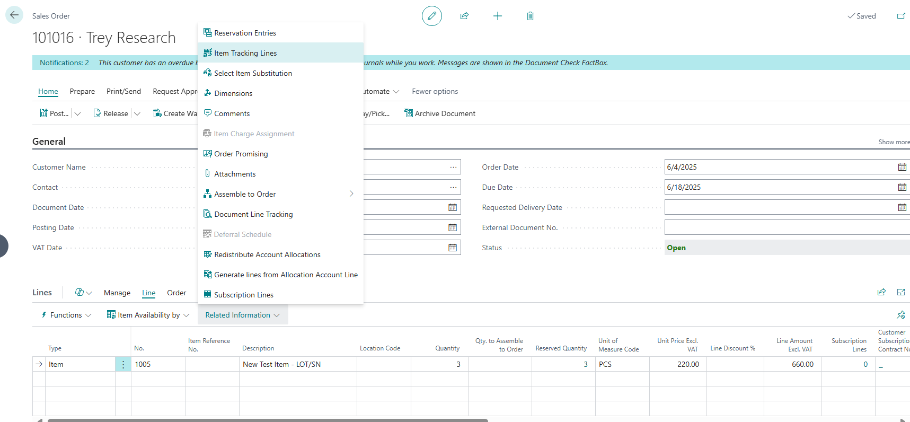
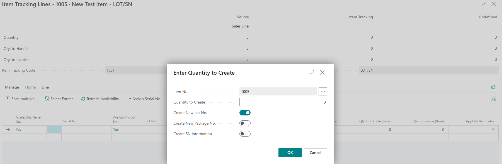
It should look like the below:
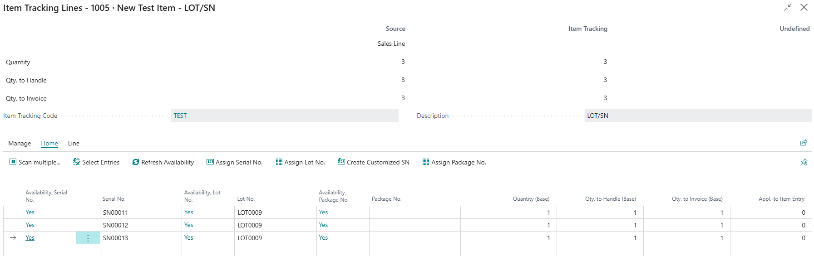
7. Now post the Shipment ((ship only))
8. Go and create a new sales invoice for customer 20000 and generate the sales lines using the "Get shipment lines" function
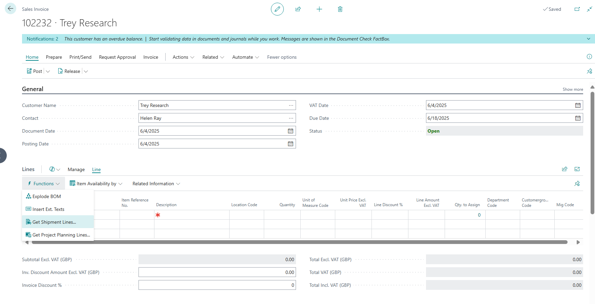
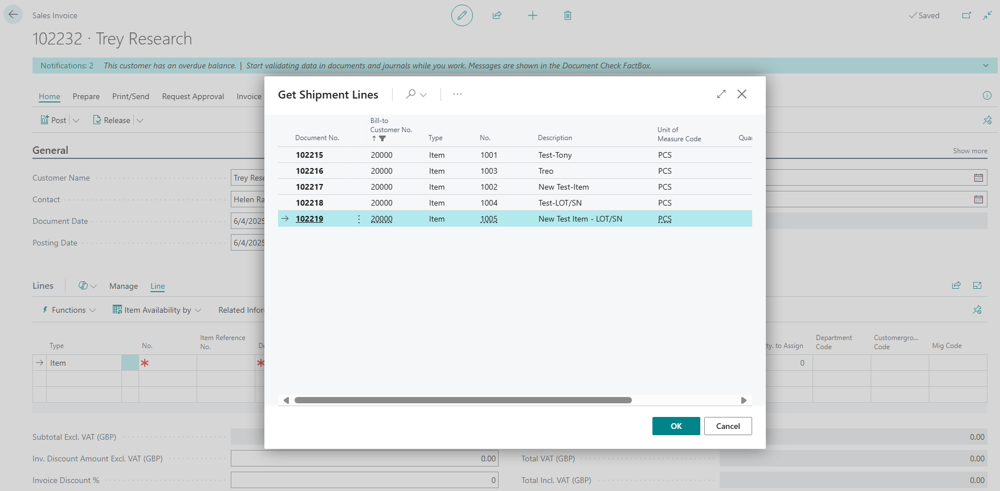
9. On the created sales line
 "Related information" > "Item Tracking lines
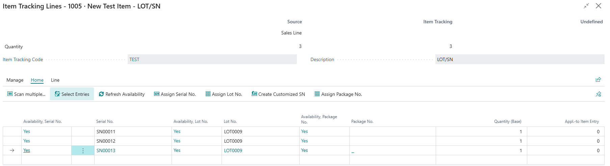
Close this
10. On the sales line reduce the quantity from 3 to 2,
Check the tracking lines again they are cleared
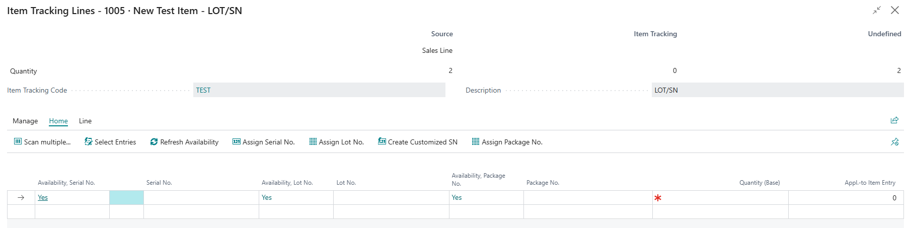
11. And when you proceed post the sales invoice, we encounter the error below:
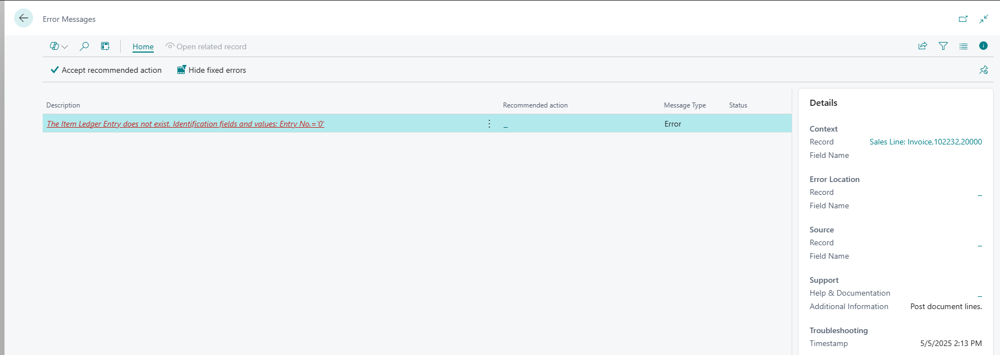

**Additional Information:** The 'Get Shipment Lines' function can be used to regenerate the sales lines along with the associated item tracking lines. However, if one of the quantities on the item tracking line is set to '0' and an adjustment is subsequently made to the quantity on the sales line (e.g., changing it from 3 to 2), the item tracking lines are still removed by the system.

**Actual Result**: The item tracking lines are removed by the system when adjustments are made to the quantity on the sales line, which subsequently results in an error when attempting to post the document.

**Expected Resul**t: The item tracking lines should remain intact when adjustments are made to the quantity on the sales line, ensuring that the document can be posted successfully without any errors.

## Description:
When the quantity in a Sales Invoices was changed after using 'Get Shipment lines' and an item with item tracking lines and reserve always the tracking information gets lost.
