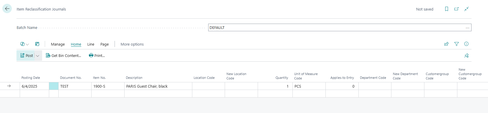
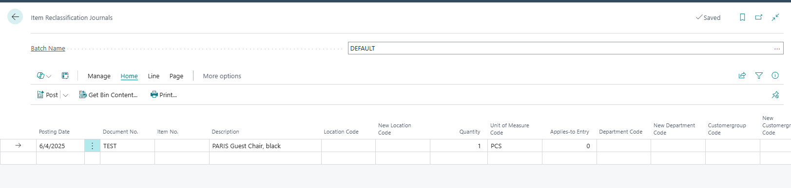
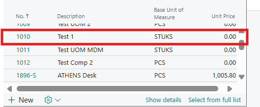
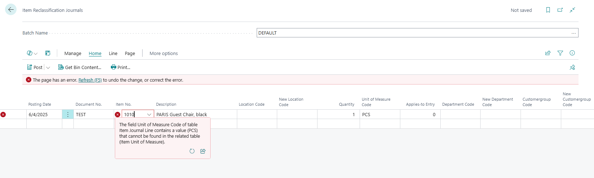

# Title: After deleting item from Item Journal/Reclassification and adding a new item, the UOM is not being revalidated.
## Repro Steps:
**[BT. > NOTE - You can do this in Item Journal also with same result.]**
1- Open item reclassification journal and add an item No.:

2- Delete the item No. and add another item with different UOM:

3- We get the following error message:

**Expected Results:**
The line should be revalidating the UOM when a new UOM is entered.

**Actual Results:**
Error message:
The field Unit of Measure Code of table Item Journal Line contains a value (PCS) that cannot be found in the related table (Item Unit of Measure).

## Description:
Tested this in old NAV2018, and when entering new item number, we revalidate and no issues.
