# Title: Incorrect dimensions assigned to General Ledger Entries and Customer Ledger Entries when a reminder with additional fees is created and the Dimensions are modified in the Reminder before issuing it.
## Repro Steps:
1- Go to Ledger Setup and verify the Global Dimension.
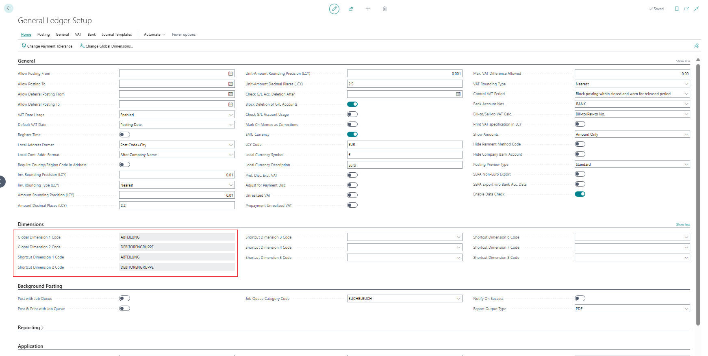
2- Navigate to Reminder Terms, select any option from the list, and enable the toggles for Additional Fees.
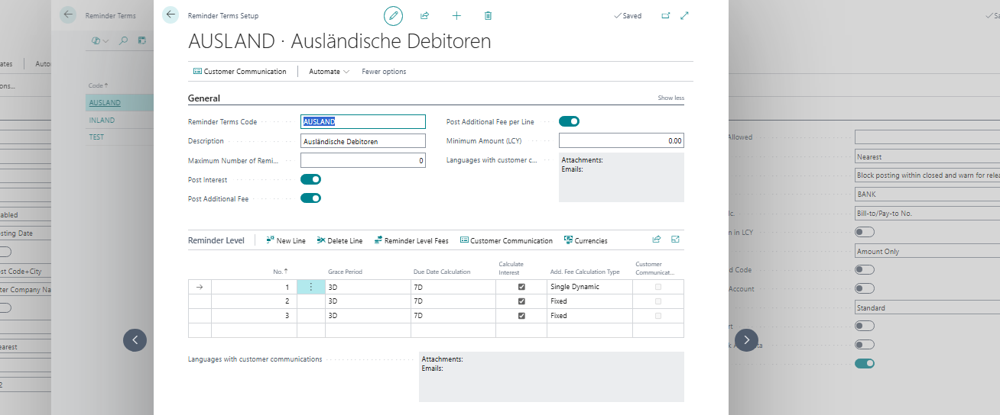
3- Proceed to Reminder Level Fees and confirm the amount is set as shown.
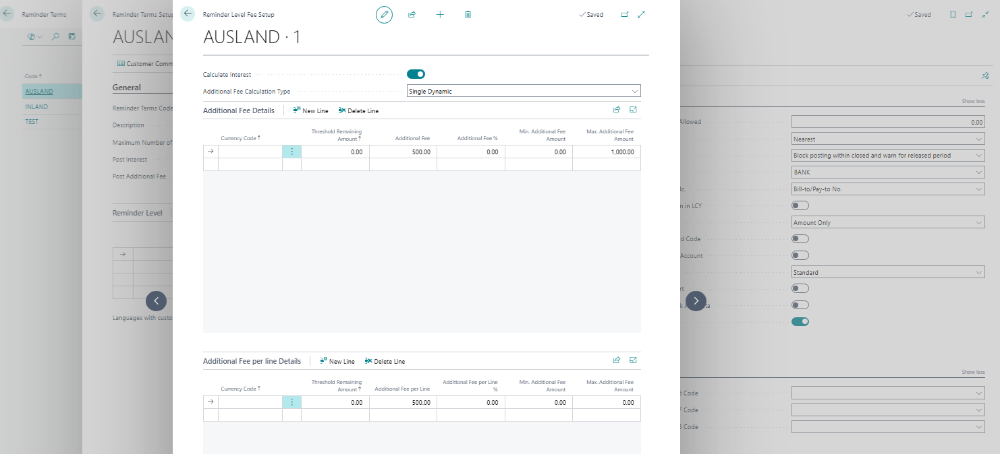
4- Ensure the customer card includes both Payment Terms and Reminder Terms.
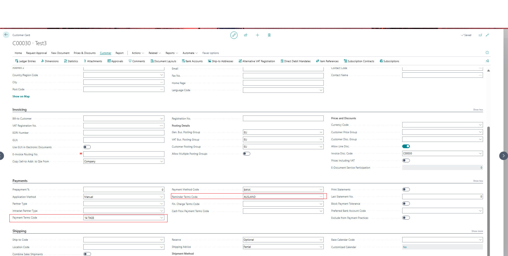
5- Assign the Dimension as indicated.
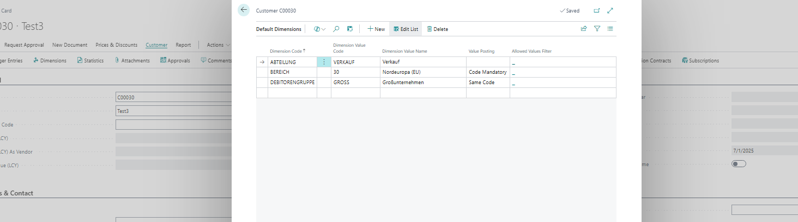
6- Create a Sales Invoice using the specified Posting Date and Due Date. Post it.
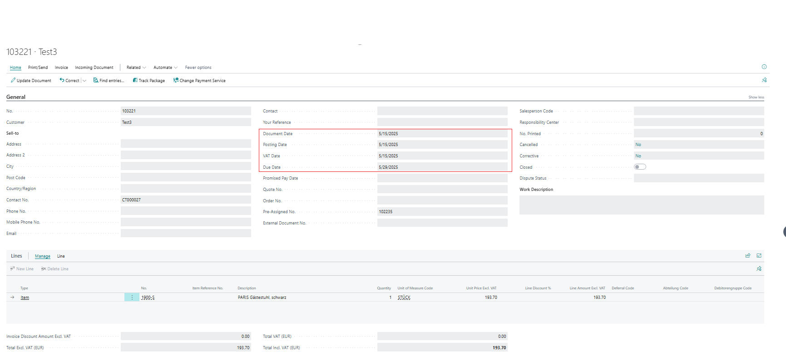
7- Go to Reminders and create a reminder for the customer.
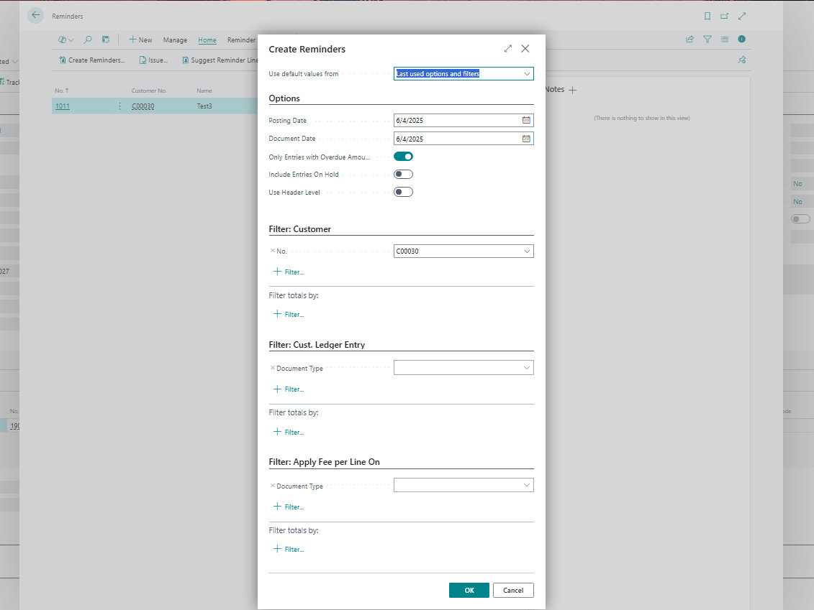
NOTE: You may get an error if you did not specify in "Customer Posting Groups" the "Additional Fee Account" and "Add. Fee per Line Account".
If so, go to "Customer Posting Groups" and fill it in.
8- In the reminder lines, update the Global Dimension to VERW.
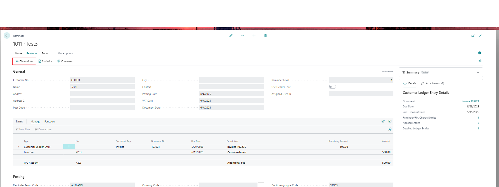
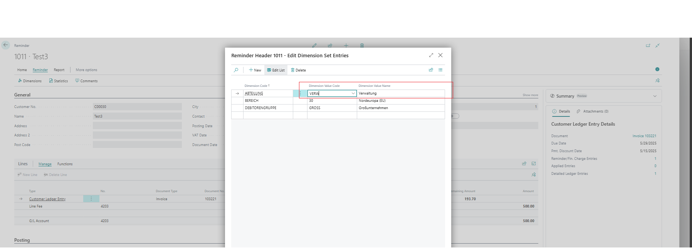
8- Issue the reminder.
 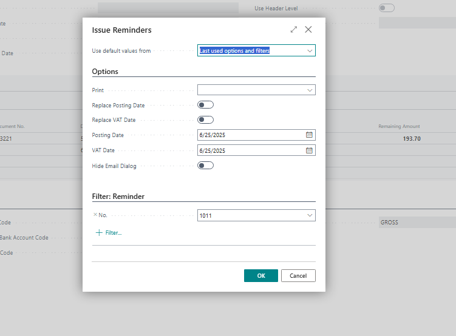
9- Check the Customer Ledger Entries and General Ledger Entries, you’ll see the original dimension from the customer card is still being used.
(Using Find Entries from the Issued Reminder)
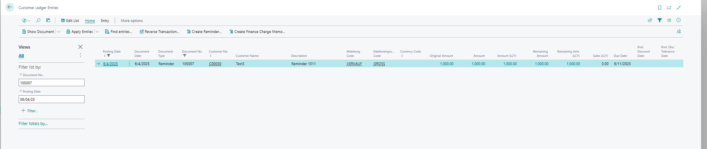
10- In the General Ledger Entries, two entries reflect the updated dimension, while one still shows the original dimension from the customer card.
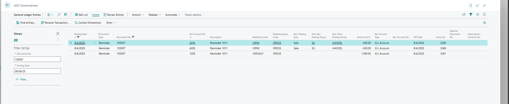
Partner provided the code that could be affecting this behavior:
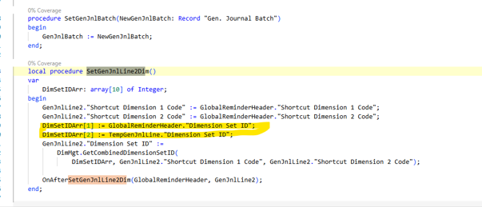

**Expected Outcome:**
The correct dimension should be reflected in both the Customer Ledger Entries and General Ledger Entries.

**Actual Outcome:**
The updated dimension is not applied in the Customer Ledger Entries, even after changing it from the Reminder Page.

**Troubleshooting Actions Taken:**
Tested various scenarios as a workaround. While the dimension can be corrected in the General Ledger Entries, the issue persists in the Customer Ledger Entries.

**Did the partner reproduce the issue in a Sandbox without extensions?** Yes

## Description:
Incorrect dimensions assigned to General Ledger Entries and Customer Ledger Entries when a reminder with additional fees is created and the Dimensions are modified in the Reminder before issuing it.
