# Title: Escalated Error: Lot No. LOT0001 is not available on inventory or it has already been reserved for another document. when trying to register pick for item with reservation and item tracking with location set up FEFO
## Repro Steps:
1- Item Tracking Code:
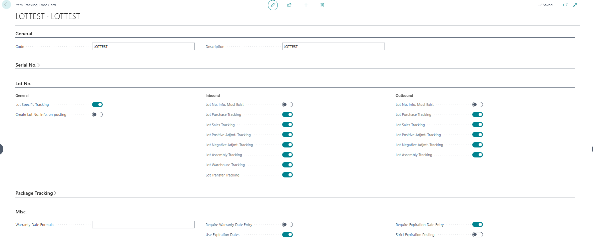
2- Item Card:
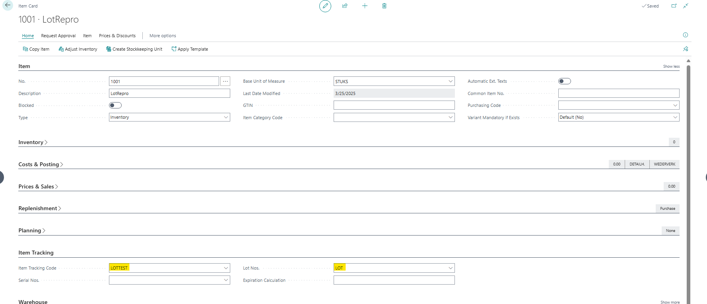
3- Location Card:
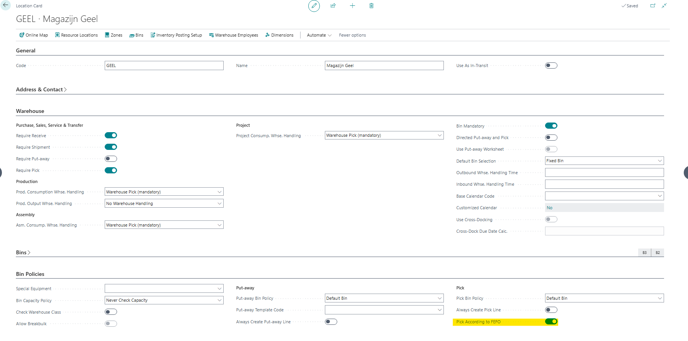

**The repro steps:**
1- Open Item Journals and fill in the fields as following then click on Item tracking lines and assign LOT manually and expiration date as following:
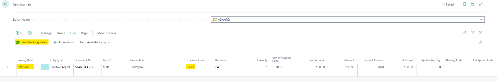
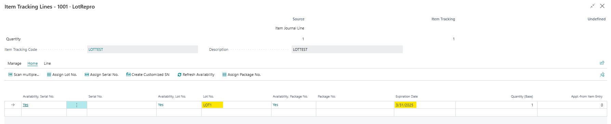
2- Replicate the first step but with changing the Posting Date, LOT No. and Expiration Date Then post the Item Journals:
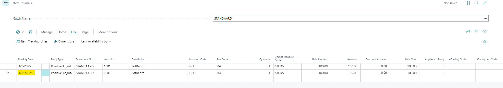
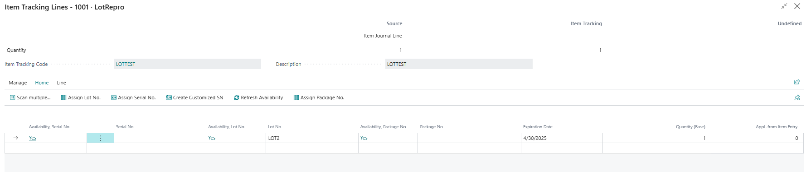
3- Create a new sales order and fill in the fields as following then click on Line > Functions > Reserve > Reserve from Current Line:
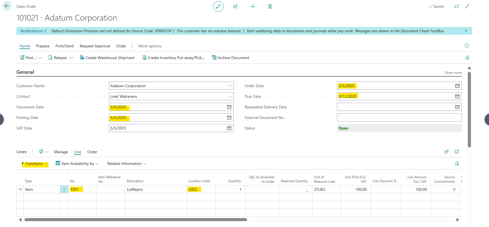
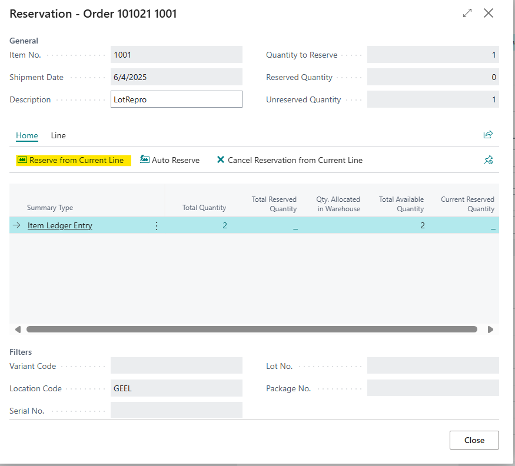
4- Replicate step 3 with a new sales order:
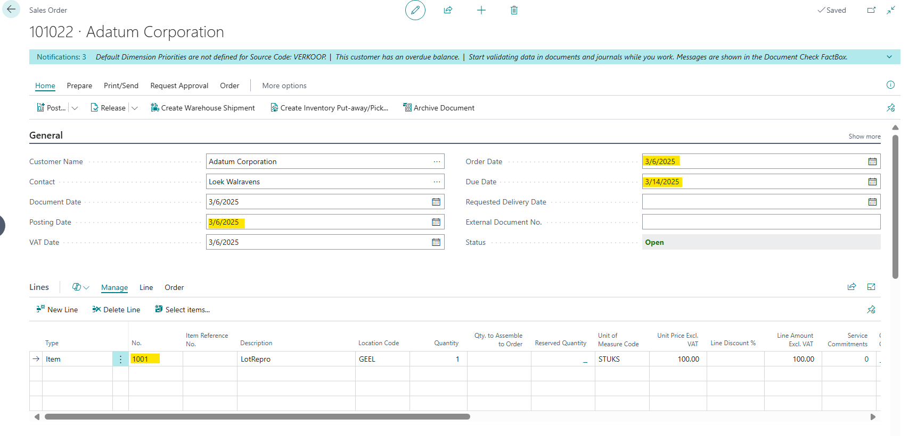
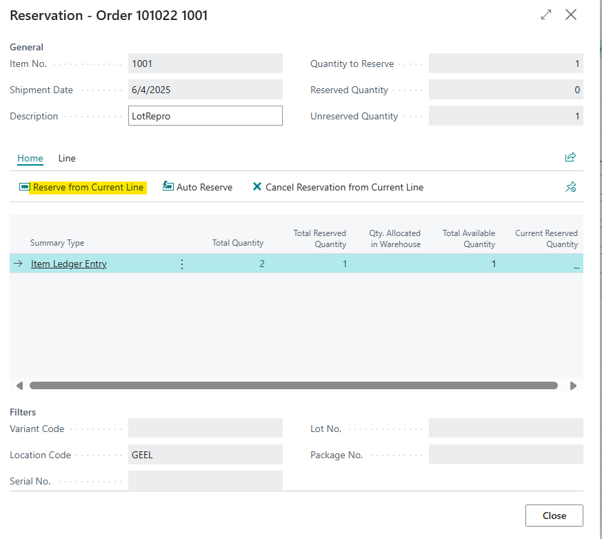
5- Create a warehouse shipment from the second sales order and then create a pick:
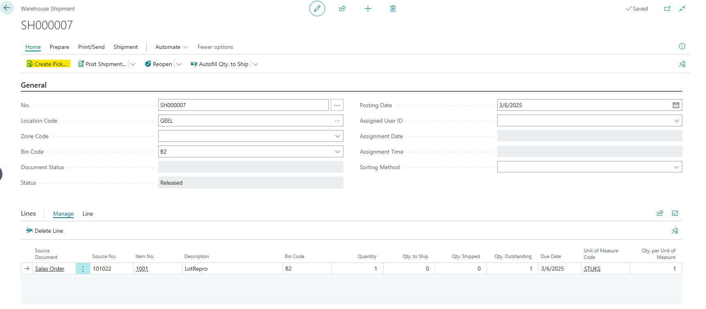
6- Open the pick lines and click on 'Register Pick':
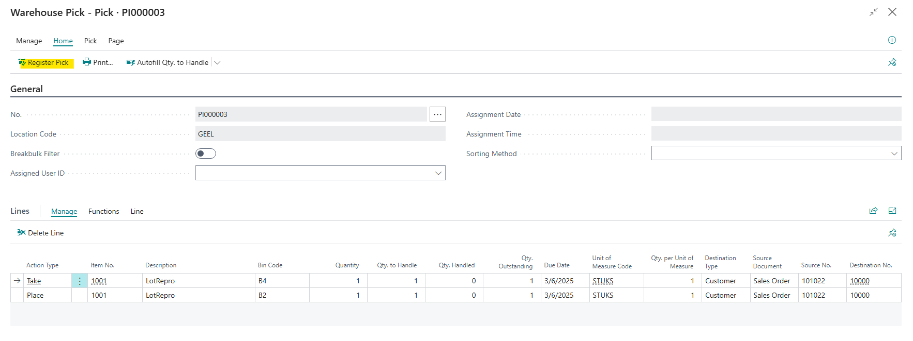

**The actual result:**
Error will be appearing:
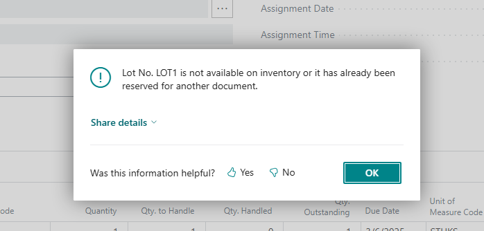

**The expected result:**
It should be registered successfully without any errors.

## Description:
Error: Lot No. LOT0001 is not available on inventory or it has already been reserved for another document. when trying to register pick for item with reservation and item tracking with location set up FEFO
