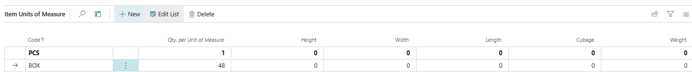
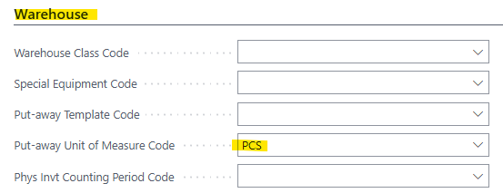
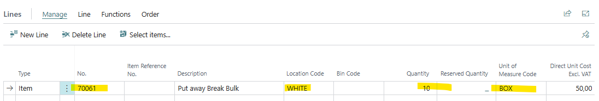
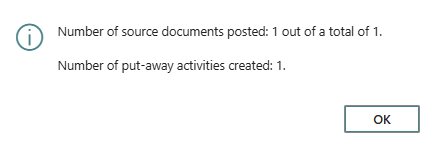
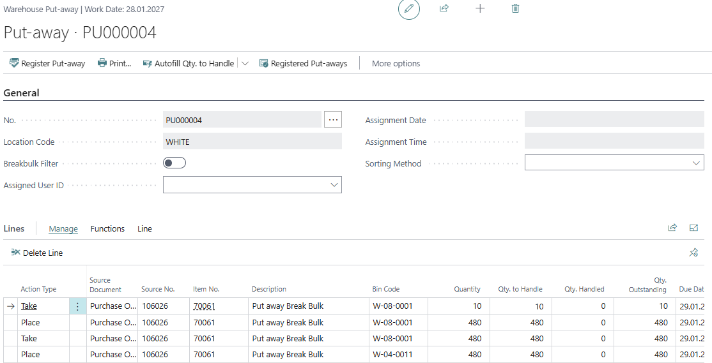
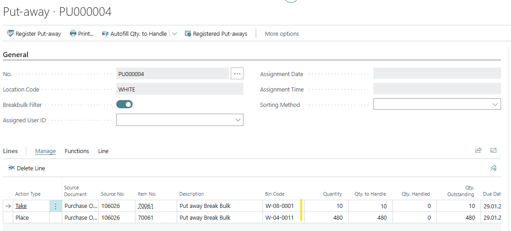
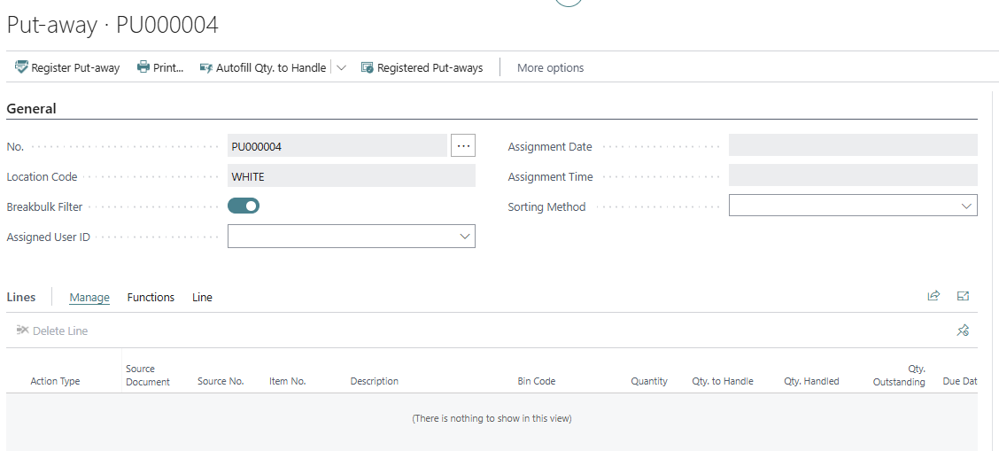
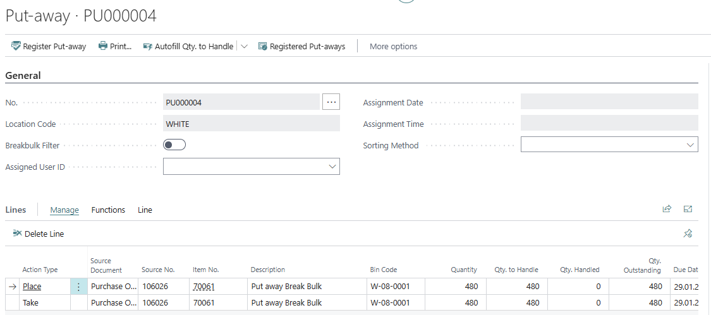
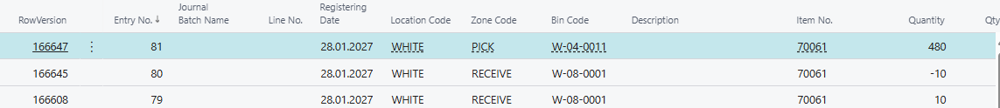
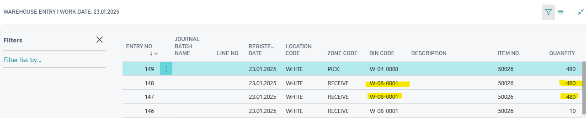

# Title: If you register a warehouse put away with the break bulk filter set to yes, not all put away lines are registered
## Repro Steps:
1.  Open BC 26.3 W1 on Prem
2.  Search for Warehouse Employees
    Add your User for location WHITE
3.  Search for Items
    Create a new Item 70061
    UOM PCS
4.  Add a second UOM
    Related -> Item -> Unit of Measure
    BOX - 48 PCS
    
5.  Add the UOM "PCS" as Put away UOM Code for the item
    
6.  Search for Purchase Orders
    Create a new Purchase Order
    Vendor: 10000
    Item: 70061
    Location: WHITE
    Quantity: 10
    UOM: BOX
    
7.  Create a Warehouse Receipt
    The Receipt is automatically opened
    Add Quantity to receive = 10
    Post the Warehouse Receipt
    
    -> A Warehouse put away was created
8.  Search for Warehouse Put aways
    Select the created put away -> open it
    4 lines are created which is correct
    
9.  Set the Break bulk filter = yes
    The lines of no interest are filtered out as expected.
    
    Register the put away

ACTUAL RESULT:
The put away still exists.

If you take out the Break Bulk Filer = yes

2 lines are not registered.
If you check table 7312 Warehouse Entries

Just 2 lines from the put away are posted.

EXPECTED RESULT:
The full Put away should be registered and in table 7312 you should find all 4 entries as it was in BC14

## Description:
The break bulk filter leads to the effect that not all lines are registered from a warehouse put away.This filter should just give you a better overview on a put away but should not prevent the entries form beiing registered as it was in BC 14.
