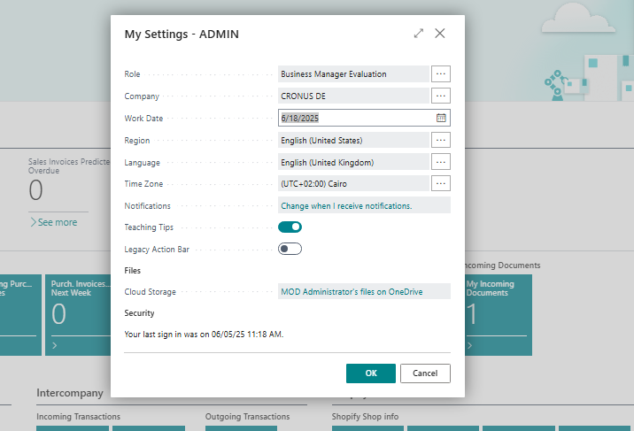
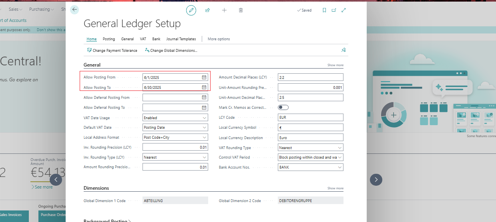
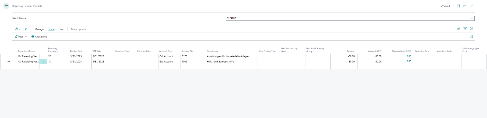
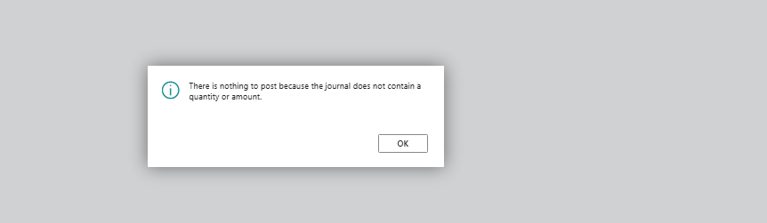

Title: Inaccurate Error Message in Recurring General Journal Posting Validation "There is nothing to post because the journal does not contain a quantity or amount"
Repro Steps:
1- Set the Work Date to June 18, 2025.

2- In the General Ledger Setup, ensure that the "Allow Posting From" and "Allow Posting To" dates are properly configured. 

3-Navigate to the Recurring General Journal and enter the following two lines:
Line 1
Recurring Method = RV (Reversing Variable)
Recurring Frequency = 1D
Posting Date = 31-May-2025
Document No. = 0815
Account = G/L Account (any)
Amount = -50.00
Line 2:
Recurring Method = RV (Reversing Variable)
Recurring Frequency = 1D
Posting Date = 31-May-2025
Document No. = 0815
Account = G/L Account (any)
Amount = 50.00

4- Attempt to preview the posting. The system returns the following message: "There is nothing to post because the journal does not contain a quantity or amount"

CURRENT RESULT
Message:  
There is nothing to post because the journal does not contain a quantity or amount.

EXPECTED RESULT
The system should return a more accurate and context-specific message depending on the scenario.
If the Posting Date is outside the allowed posting range, the message should be:
"Posting Date is not within your range of allowed posting dates in Gen. Journal Line Journal Template Name='', Journal Batch Name='', Line No."
If the Posting Date is later than the Work Date, the message should be:
"There is nothing to post yet, as the Work Date is before the Posting Date in line ..."
These examples assume that all lines in the journal have the same Posting Date, which is the standard practice for most users.
A fix or correction is needed to ensure the system provides accurate feedback in these common scenarios.
In more complex cases where journal lines have different Posting Dates, the system should be able to handle multiple outcomes:
Posting is possible.
Posting is blocked due to out-of-range Posting Date.
Posting is blocked because the Posting Date is after the Work Date.
In such cases, it should be configurable whether the system blocks the entire journal if one line is invalid or allows posting of the valid lines and skips the rest.
A setup option could be introduced to manage this behavior:
Allow Different Posting Dates
Error Handling Mode: Block All or Post Valid Lines
But then ... if there are lines with different Posting Dates, it can get complex.
When we have multiple lines, with different posting dates, the error check can result in different situations:
 posting possible
 no posting for reason #1
 no posting for reason #2
Therefore it would be needed to decide whether to block the entire journal from posting if one line breaks, where for other lines posting would be possible or we allow posting of the lines with good settings.
And for this it would be good to get some setup like
allowed to have different posting dates
error handling (block all  or  post possible)

Description:
Inaccurate Error Message in Recurring General Journal Posting Validation "There is nothing to post because the journal does not contain a quantity or amount"
