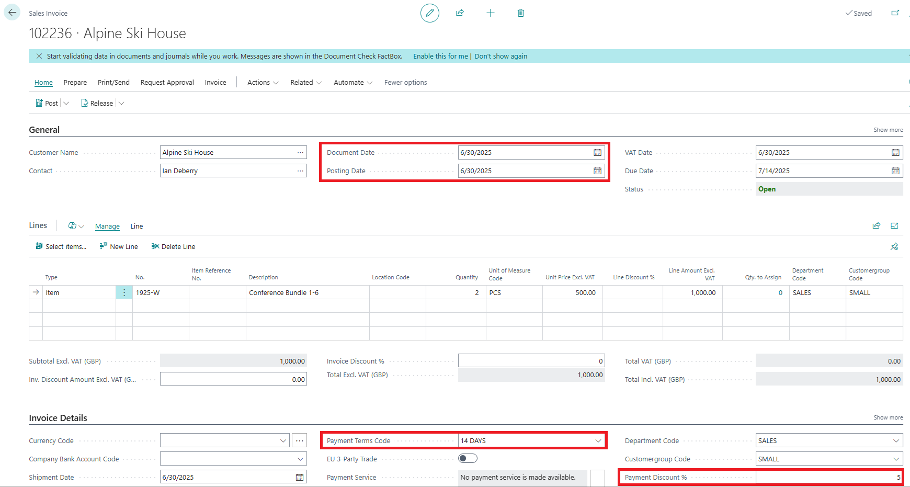
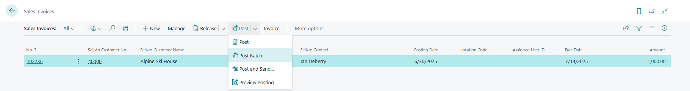
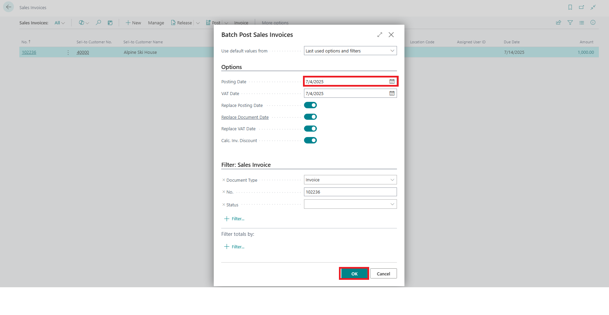
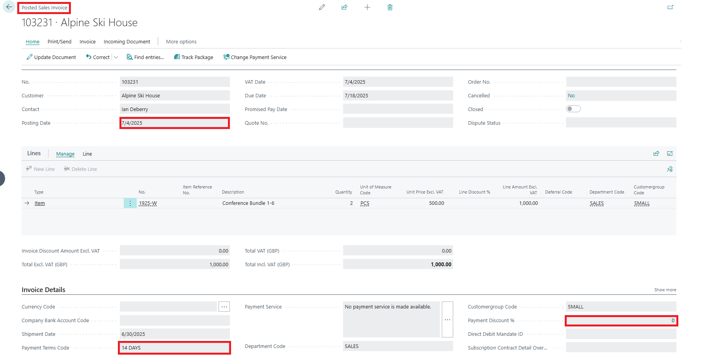

Title: Payment discounts are not being calculated on sales invoices when batch posting with the 'Replace Posting date' and 'Replace document date' options selected
Repro Steps:
1. Open Sales Invoice page.
2. Create a new sales invoice and fill the necessary details. Also ensure the document has the Payment Term Code (14 Days) and Payment discount (5) field filled.

3. Go back to the Sales invoice page and use the Batch posting option to post the document.

4. Ensure all fields are enabled (Set to True) and set a new Posting and VAT date before posting.

1. Go to posted sales invoice page and check the posted document.

**Expected Outcome:**
The Payment discount setup on the Sales invoice should be calculated after posting via batch posting process.

**Actual Outcome:**
The Payment discount setup on the Sales invoice was not calculated after posting via batch posting process.

Description:

