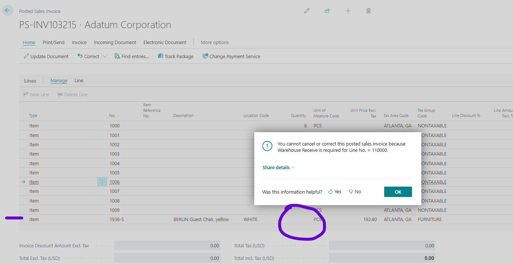

Title: Unexpected You cannot cancel or correct this posted sales invoice because Warehouse Receive is required for Line No. = 110000. when canceling sales invoice
Repro Steps:
create sales order. Any customer (10000)
Add two lines with different items:
Line1. Item1, Qty 3, Location <blank> or MAIN or RED...
Line2. Item2. Qty 4. Location WHITE
Choose Post Ship+Invoice to post first line.
The second line is not posted as I haven't performed any warehouse activites. This is expected.
Navigate to posted invoice. You can see both lines there, but the qty for the ITem2 is 0.
Choose Cancel as you want to restore posted item1.

Result:
Error message:
You cannot cancel or correct this posted sales invoice because Warehouse Receive is required for Line No. = 110000.

AL call stack:
"Correct Posted Sales Invoice"(CodeUnit 1303).TestWMSLocation line 21 - Base Application by Microsoft version 27.0.37996.0
"Correct Posted Sales Invoice"(CodeUnit 1303).TestSalesLines line 52 - Base Application by Microsoft version 27.0.37996.0
"Correct Posted Sales Invoice"(CodeUnit 1303).TestCorrectInvoiceIsAllowed line 13 - Base Application by Microsoft version 27.0.37996.0
"Cancel PstdSalesInv (Yes/No)"(CodeUnit 1323).CancelInvoice line 10 - Base Application by Microsoft version 27.0.37996.0
"Posted Sales Invoice"(Page 132)."CancelInvoice - OnAction"(Trigger) line 4 - Base Application by Microsoft version 27.0.37996.0

I think we should be able to exit if Qty is 0.
    local procedure TestWMSLocation(SalesInvoiceLine: Record "Sales Invoice Line")
    var
        Item: Record Item;
        Location: Record Location;
        IsHandled: Boolean;
    begin
        IsHandled := false;
        OnBeforeTestWMSLocation(SalesInvoiceLine, IsHandled);
        if IsHandled then
            exit;

        if SalesInvoiceLine.Type <> SalesInvoiceLine.Type::Item then
            exit;

        if not Item.Get(SalesInvoiceLine."No.") then
            exit;

        if not Item.IsInventoriableType() then
            exit;

        if not Location.Get(SalesInvoiceLine."Location Code") then
            exit;

        if Location."Directed Put-away and Pick" then
            Error(WMSLocationCancelCorrectErr, SalesInvoiceLine."Line No.");
    end;

Probably same for the purchase side

Description:

