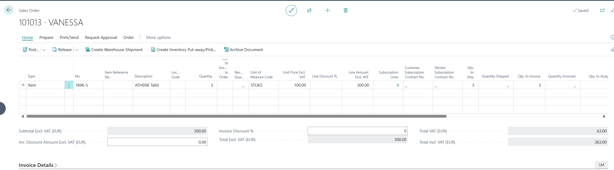
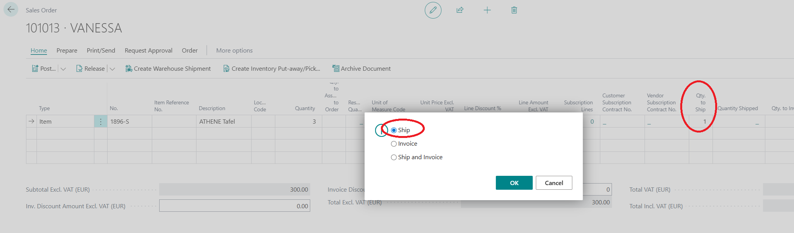
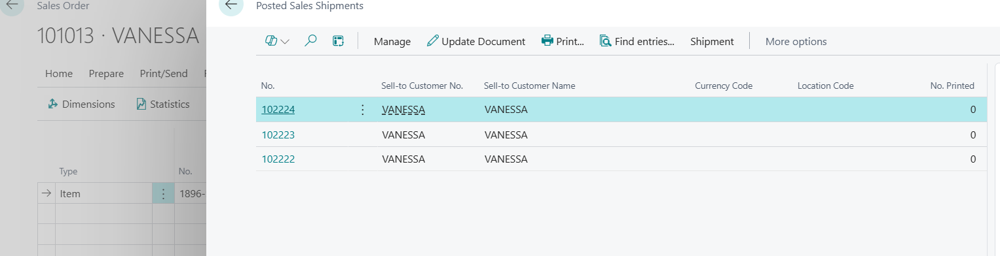
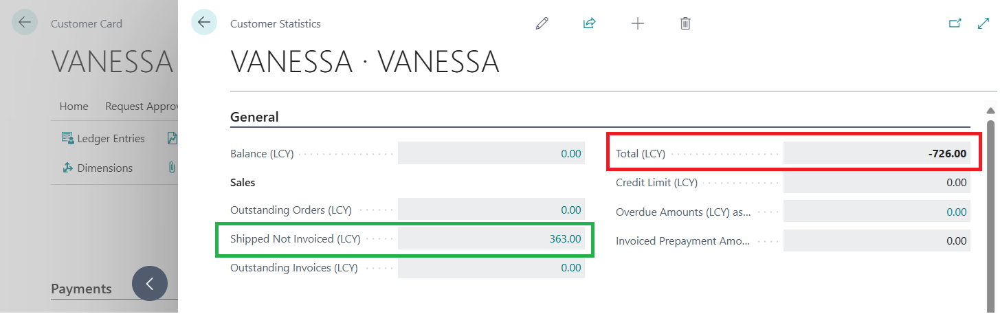

Title: Total (LCY) field on Customer Statistics is incorrectly calculated in case of more than one Shipment per Sales Order.
Repro Steps:
1.Create a new Customer for clarity.

2. Create a new Sales Order for this Customer.
1 line, with 3 units. Amount 100 and VAT 21% in this case.

Total Amount is 363.
Qty to Ship = 3.

3. Change Qty to Ship = 1 every time, and post the SHIPMENT only the 3 times.

4 The you have 3 Shipments linked to this Sales Order for this new Customer.

1. Go back to the new Customer, which has only this Sales Order with 3 different Shipments.
Check the Customer Statistics:

================
ACTUAL RESULTS
================
Total (LCY) field on Customer Statistics is incorrectly calculated in case of more than one Shipment per Sales Order.
"Shipped Not Invoiced" = 363. OKEY
"Total (LCY)" = -726 ??????

It seems it calculates Balance + Shipped Not Invoiced - Shipped Not Invoiced (going to main Sales Order and taking the whole amount 3 times?) = 363 - (3*363) 1089 = -726  WHY??

================
EXPECTED RESULTS
================
Total (LCY) field on Customer Statistics should be correctly calculated in case of more than one Shipment per Sales Order.

Description:
Total (LCY) field on Customer Statistics is incorrectly calculated in case of more than one Shipment per Sales Order.
