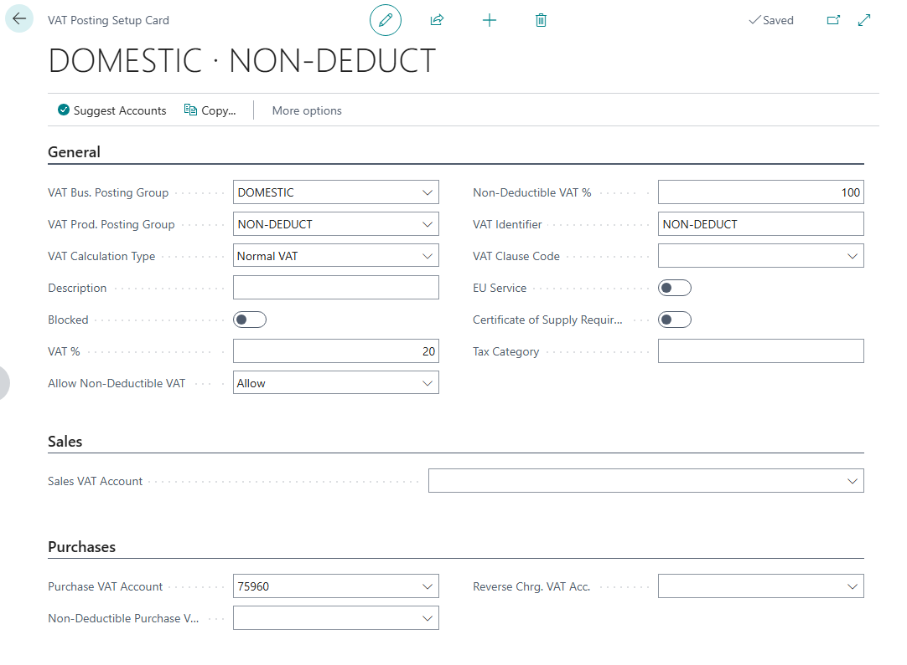
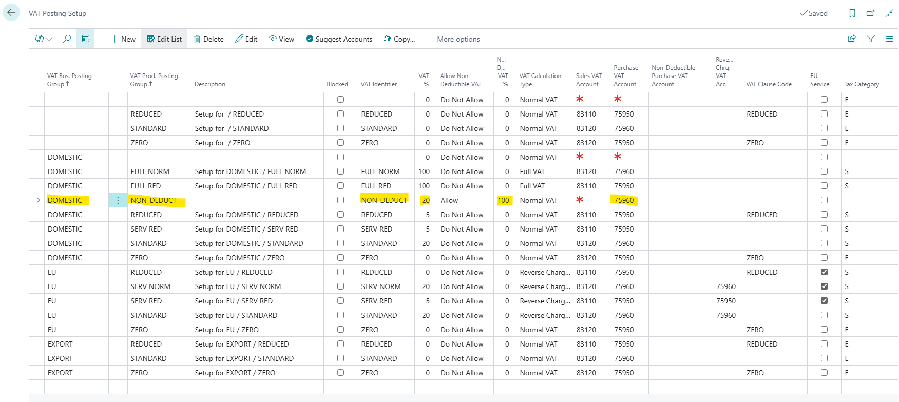
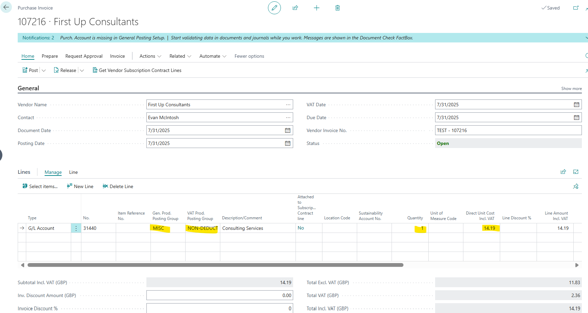
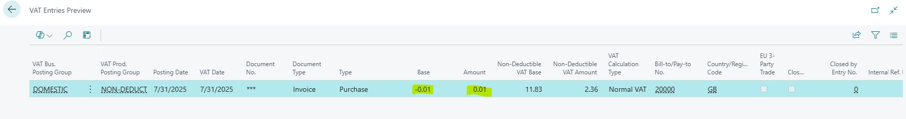
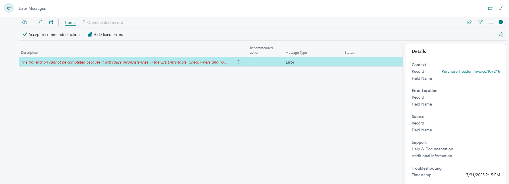

# Title: Rounding inconsistency when posting purchase invoice with 50% non-deductible VAT - Prices Including VAT
## Repro Steps:
Recreation steps 1 - Background setups to complete first

1. I change DOMESTIC Vendor 20000 to TICK Prices Including VAT

2. In VAT Setup I ensure Non-Deductible VAT.

3. Create a VAT Prod Posting Group called NON-DEDUCT.

4. In Chart of Accounts, I choose G/L Account 31440 as my example and change its Gen Prod Posting Group to MISC then its VAT Prod Posting Group to be NON-DEDUCT

5. In VAT Posting Setup I create the combination for DOMESTIC/NON-DEDUCT with **Non-Deductible VAT % = 50** (partial deductibility).

Recreation steps 2 - Now the background setup is in place, I create an example

1. Purchase Invoices
2. Create New
3. Choose my example Vendor - 20000, which defaults to Prices Including VAT
4. Note the Purchase Invoice No - 107216
5. Choose Vendor Invoice No - Test - 107216
6. In Lines, choose Type = G/L Account then No = 31440, to use the G/L Account I've set up above to use Non-Deductible VAT
7. Choose Quantity = 1 and Direct Unit Cost Incl VAT of 14.19

Preview Post Check VAT Entries:

When you try to Post, it throws a CONSISTENT error:

**Expected Outcome:**
The VAT Entry values should reflect partial deductibility, as the Non-Deductible VAT is 50%. The Base and Amount should be non-zero (representing the deductible portion) and the posting should succeed without error.

**Actual Outcome:**
The system throws an inconsistency error on posting the document due to rounding mismatch when computing partial non-deductible amounts with Prices Including VAT.

## Description:
• When Non-Deductible VAT % is 50%, the system should correctly compute partial deductible VAT amounts
• With Prices Including VAT enabled, the reverse calculation from gross to net introduces rounding that affects the non-deductible amount splitting
• The VAT Entry should show non-zero Base and Amount representing the 50% deductible portion
• The system should handle the rounding correctly for any Non-Deductible VAT percentage, not just 100%
