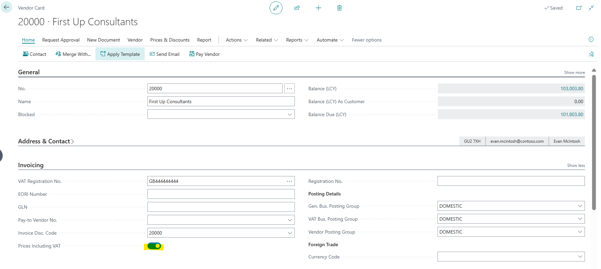
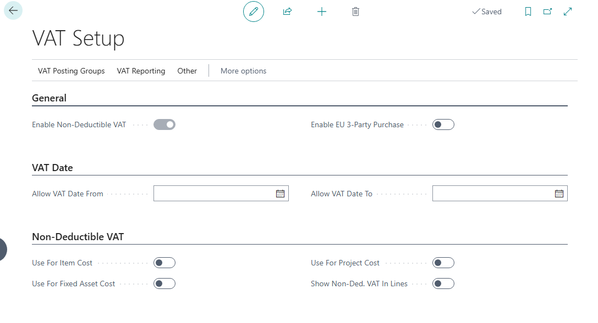
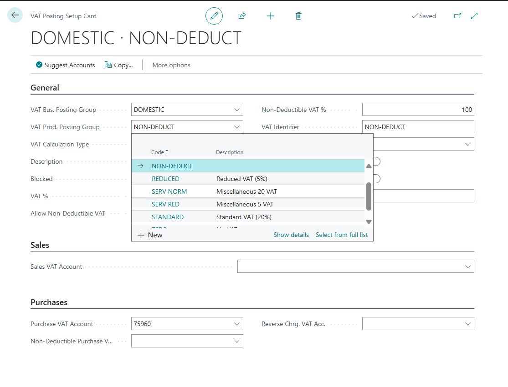
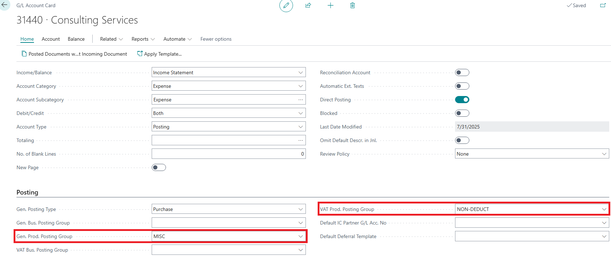

# Title: Non-deductible VAT posting on purchase invoice without Prices Including VAT should succeed with zero VAT entry amounts
## Repro Steps:
Recreation steps 1 - Background setups to complete first

1. DOMESTIC Vendor 20000 does NOT have Prices Including VAT ticked (the vendor uses net pricing).

2. In VAT Setup I ensure Non-Deductible VAT.

3. Create a VAT Prod Posting Group called NON-DEDUCT.

4. In Chart of Accounts, I choose G/L Account 31440 as my example and change its Gen Prod Posting Group to MISC then its VAT Prod Posting Group to be NON-DEDUCT

5. In VAT Posting Setup I create the combination for DOMESTIC/NON-DEDUCT with Non-Deductible VAT % = 100.

Recreation steps 2 - Now the background setup is in place, I create an example

1. Purchase Invoices
2. Create New
3. Choose my example Vendor - 20000, which does NOT use Prices Including VAT
4. Note the Purchase Invoice No - 107216
5. Choose Vendor Invoice No - Test - 107216
6. In Lines, choose Type = G/L Account then No = 31440, to use the G/L Account I've set up above to use Non-Deductible VAT
7. Choose Quantity = 1 and Direct Unit Cost of 14.19 (net price, since Prices Including VAT is off)

**Expected Outcome:**
When Prices Including VAT is disabled, the posting should succeed without error. The VAT Entry Base and Amount should both be 0.00 (ZERO) as the Non-Deductible VAT is 100%.

**Actual Outcome:**
The system throws an inconsistency error due to rounding mismatch in the non-deductible VAT amount adjustment for LCY values.

## Description:
• When Prices Including VAT is disabled on the vendor, the system calculates VAT from net amounts (forward calculation)
• With 100% Non-Deductible VAT, the VAT Entry Base and Amount should both be 0 since all VAT is non-deductible
• The zero-output behavior should work correctly regardless of the Prices Including VAT setting
• The system should handle the non-deductible VAT amount update for LCY values consistently
