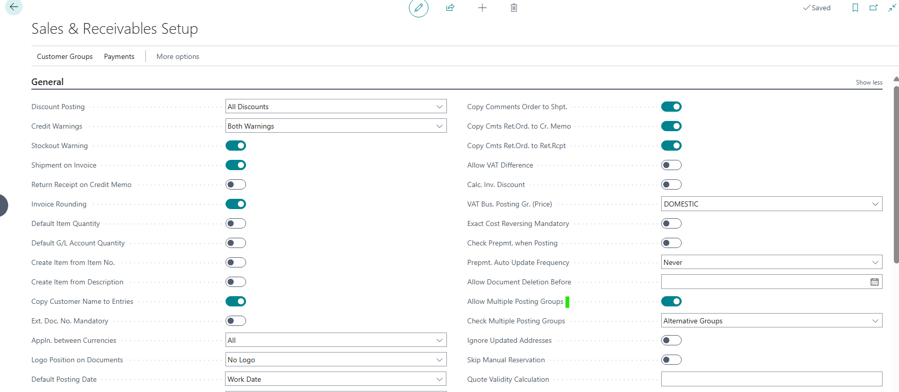
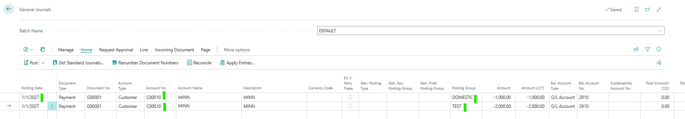
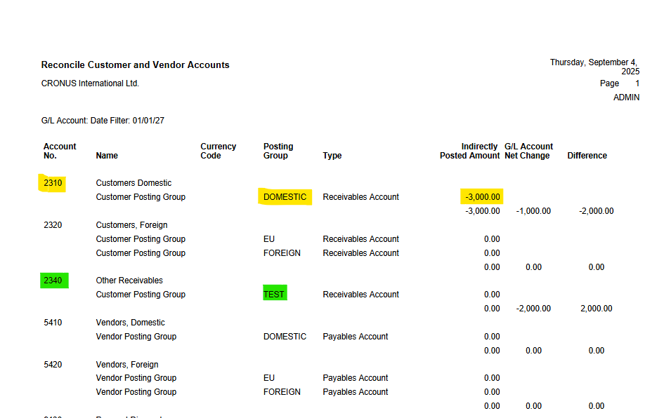

# Title: Report Reconcile Customer and Vendor Accounts shows wrong amounts when multiple posting groups are used
## Repro Steps:
The “Allow Multiple Posting Groups” is Enabled

Different Receivables Account is being assigned to the specific Customer Posting Groups

Alternative Customer Posting Group (TEST) is assigned to DOMESTIC

Allow Multiple Posting Group is also Enabled in the specific Customer Card

In General Journal, we made 2 payments with posting date (1/1/2027) for the same customer using the Customer Posting Group (Domestic and Test) respectively

In Posted General Journal, we confirmed that the Customer Ledger Entries correctly shows the Customer Posting Groups used in this scenario

Using Report ID 33

The Report currently considers only the booking group at the debtor/creditor level instead of at the individual debtor/creditor entry level.

**Expected Outcome:**
Individual debtor/creditor entry level should be considered as this would show allow users see and review the different account in which the entry was posted.

**Actual Outcome:**
The Report currently considers only the booking group at the debtor/creditor level instead of at the individual debtor/creditor entry level.

**Troubleshooting Actions Taken:**
Replicated the issue and noticed the faulty data

**Did the partner reproduce the issue in a Sandbox without extensions?** Yes

## Description:
The customer reports that Microsoft Standard Report ID 33 produces faulty data starting from Business Central version 20. The report incorrectly considers only the booking group at the debtor/creditor level instead of at the individual debtor/creditor entry level, causing issues for customers using alternative booking groups.
