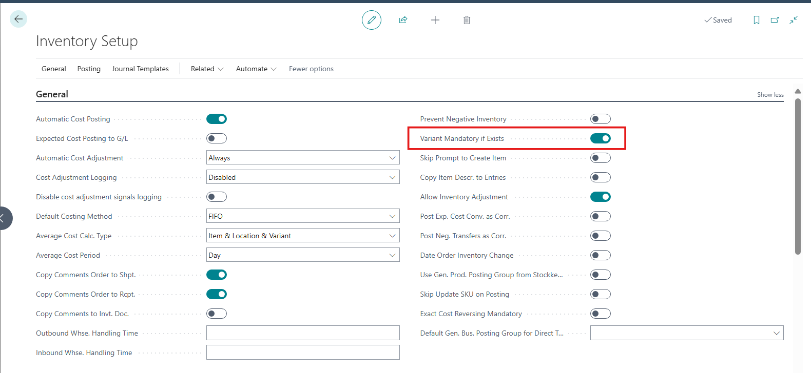
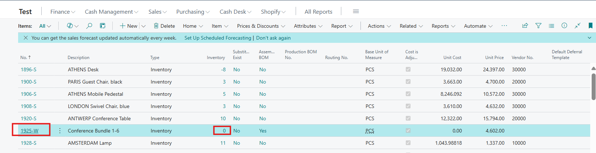
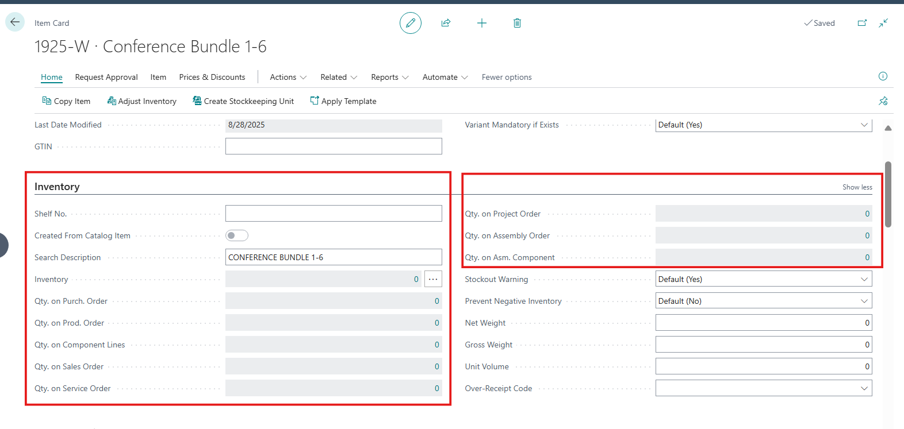
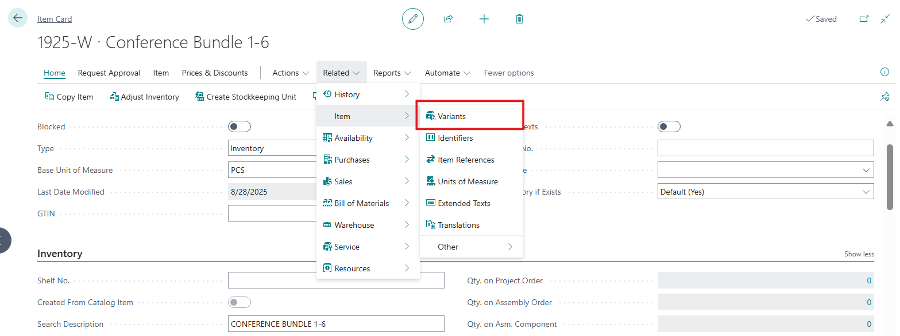
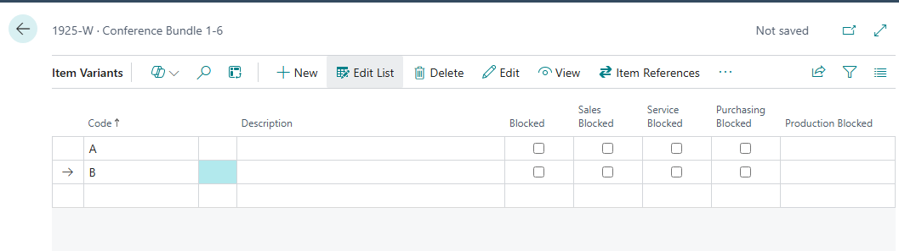
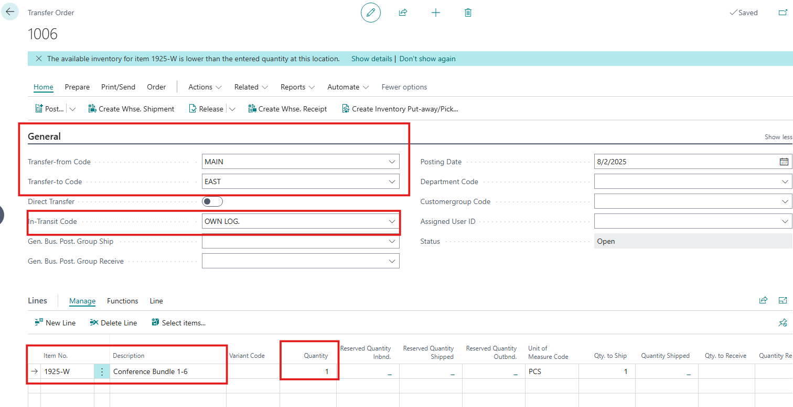
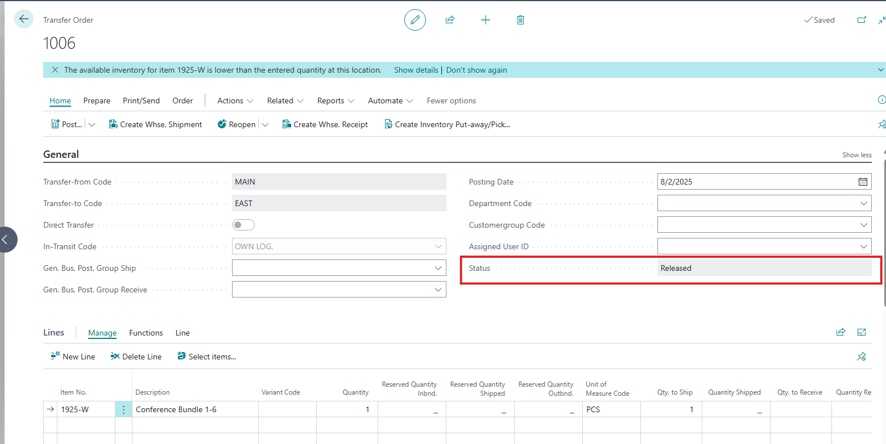
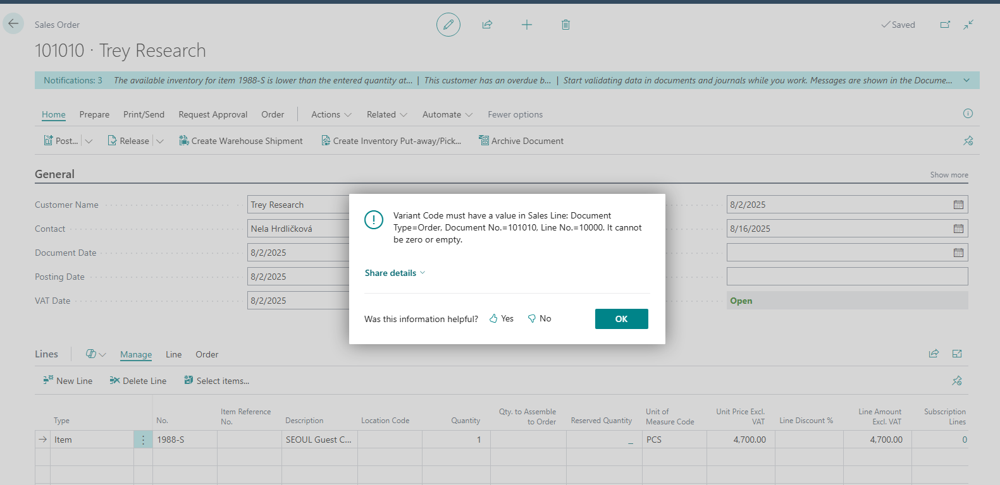

# Title: Variant mandatory if exists is not checked in transfer orders
## Repro Steps:
Tested in CZ version 26.4 but appears in W1 as well

1- Open the inventory setup and enable "Variant mandatory if exists":

2- Check an item with zero inventory and does not exist in any document lines: (by default item 1925 does not have)

3- Open the variants and add 2 codes:

4- Open a new transfer order, add the below details:

5- Release the document:

The system should show an error that variant code is does not exist.

6- If we added the same item in a sales or purchase order and released the order we get the below error:

Error message:
Variant Code must have a value in Sales Line: Document Type=Order, Document No.=101010, Line No.=10000. It cannot be zero or empty.

**Actual Outcome:**
Document is released without adding a variant code.

**Expected Outcome:**
The system should not allow the transfer order to be released. The same error as in the PO and SO should be shown.

## Description:
