Title: The due date of the created reminder does not update when the due date is changed to an earlier date
Repro Steps:
1- Customer setup:
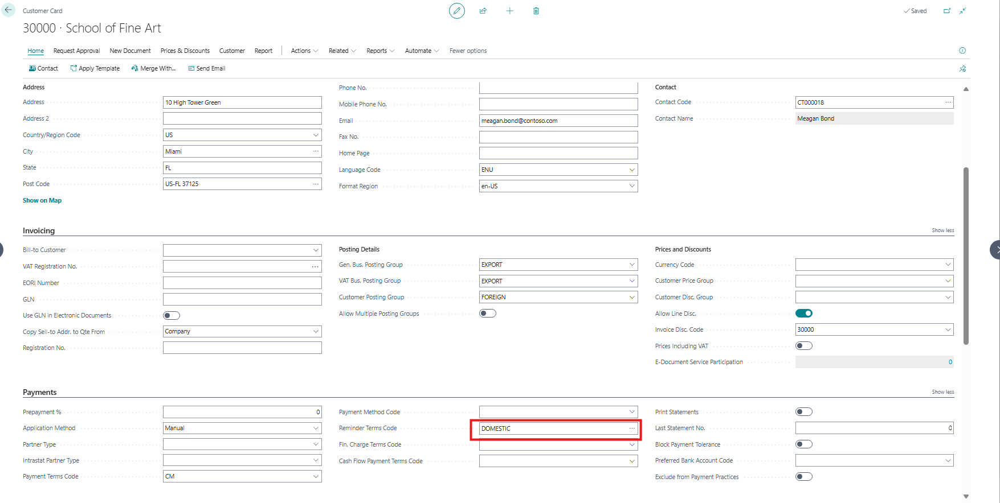
2- Reminder terms:
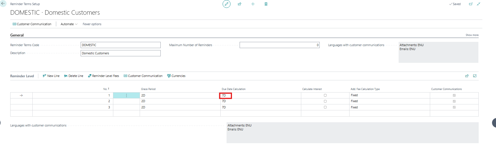
3- Create a sales invoice and fill in the fields as following then post it:
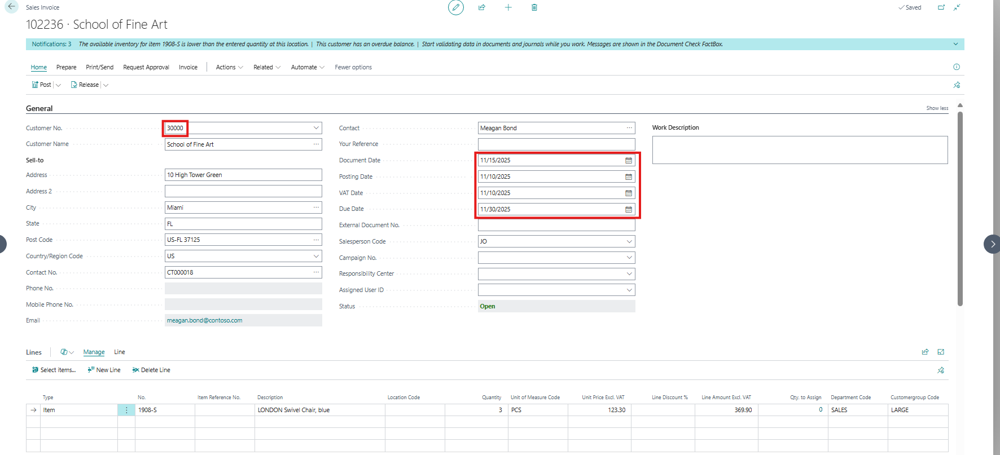
4- Open reminders and create a new one for that customer then 'Suggest Reminder Lines' then issue it:
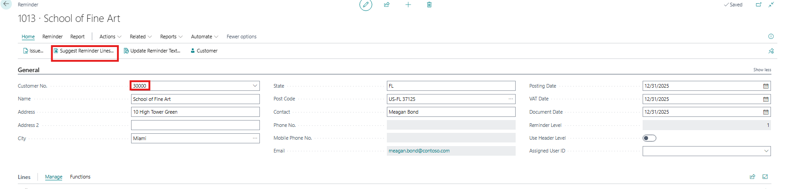
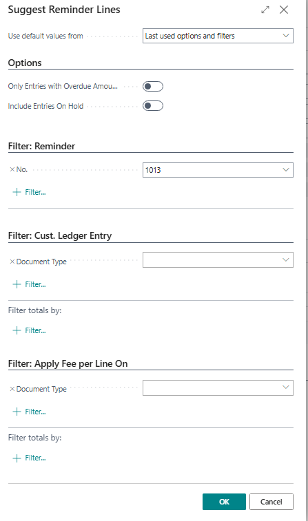
5- Open the customer ledger entries, select the invoice and then open 'Reminder/Fin. Charge Entries':
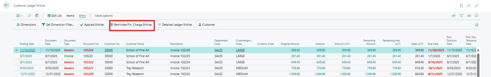
6- Inspect the page and search about the due date:
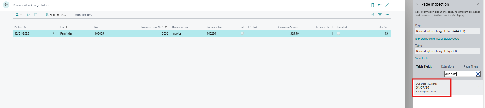
The due date has been calculated based on the reminder's document date.

7- Return back to the customer ledger entries and change the due date to be later than the Due Date of the reminder:
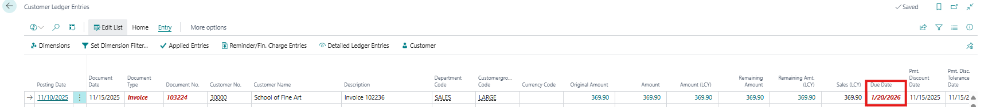
8- Repeat steps 5 and 6 again:
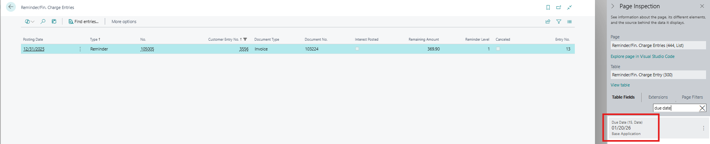
The due date has been updated according to the new due date of the invoice.
9-Repeat step 7 again but change it to an earlier date than the due date of the reminder:
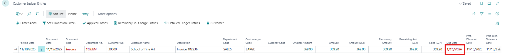
10- Repeat steps 5 and 6 again:

The due date wasn't updated according to the new due date.
However if you have opened the related posted sales invoice and clicked on 'Update Document' you will see the updated due date:
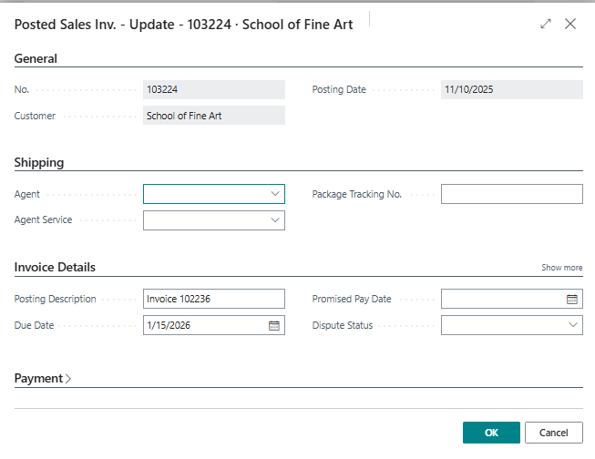

**Our questions that needs to be addressed:**
Why is the reminder’s due date updated when the document’s due date changes, even though it was originally calculated from the document date?

Why does the reminder’s due date update when the document’s due date is moved forward, but not when it’s moved backward?

Is it correct, that the due date of the reminder is updated at all, when the due date of the invoice is changed?
And if yes, why only in one direction (forward, not backwards)?

**Troubleshooting Actions Taken:**
The issue was reproducible on our side and we tested some scenarios are being discussed in the repro steps

**Did the partner reproduce the issue in a Sandbox without extensions?** Yes
Description:
