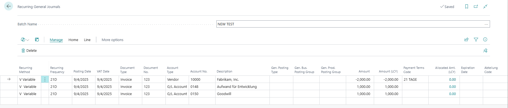
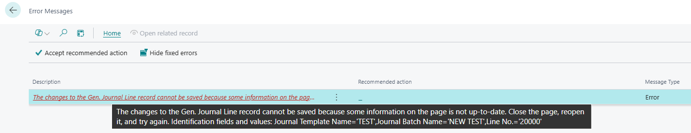

Title: "The changes to the Gen. Journal Line record cannot be saved because some information is not up-to-date" error when posting Recurring General Journal and the Unlink Incoming Document on Posting option is activated.
Repro Steps:
Take any BC 25.5 / BC 26.x environment.
1. Go to General Journal Template, create a new one
    Name = Test
    Type = General
    Recurring = True
    Bal. Account Type = G/L Account
    Force Doc. Bal./Copy VAT setup to Jnl. Line/Unlink Incoming Document on Posting = True.

2. Go to Recurring General Journal and Create a batch for the journal template.
    Name = New Test
    Bal. Account Type = G/L Account
    Copy VAT setup to Jnl. Line= True.

3. From the general journal batches page, click "General Journal" from the top navigation and select "Recurring General Journal" to open the recurring general journal page.

4. Enter the 3 lines as seen in the screenshot below:

5. Make sure your posting date is lower or same as your date in the settings page.

6. Post the lines.

**Expected Outcome:**
The recurring general journal lines should be posted.

**Actual Outcome:**
The recurring general journal lines is not posted, and an error is generated.

**Troubleshooting Actions Taken:**
Tested in BC 26.4 and 25.5

Error in function UnlinkIncDocFromGenJnlLine
A Modify after a Commit, throws an error, as the Record is not pulled from the Database after a Commit. When using the new function in Templates to Unlink Incoming Documents on Posting (Field 34, Table 80).

Codeunit 13
Line 1525 Functioncall UnlinkIncDocFromGenJnlLine

Function UnlinkIncDocFromGenJnlLine Line 1019 GenJnlLine.Modify();

**Did the partner reproduce the issue in a Sandbox without extensions?** Yes

Description:
"The changes to the Gen. Journal Line record cannot be saved because some information is not up-to-date" error when posting Recurring General Journal and the Unlink Incoming Document on Posting option is activated.
