Title: Purchase Invoice with Allocation Account and Prices Incl. VAT leads to incorrect VAT and G/L Entries.
Repro Steps:
Purchase invoice with allocation accounts (Allocation to G/L accounts with and without VAT) and Prices Incl. VAT leads to incorrect G/L and VAT ledger entries
1. Setup:
Allocation account is created as follows:
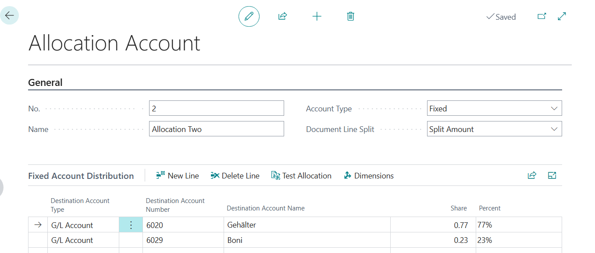
Account type: Fixed
Document line split: Split amount

G/L account 6020 looks like this:
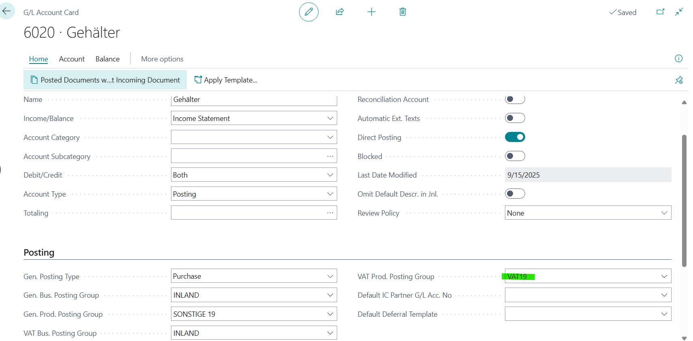
G/L account 6029 looks like this:
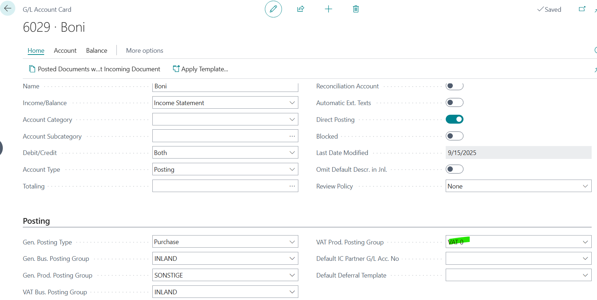
The VAT posting matrix is defined as follows:
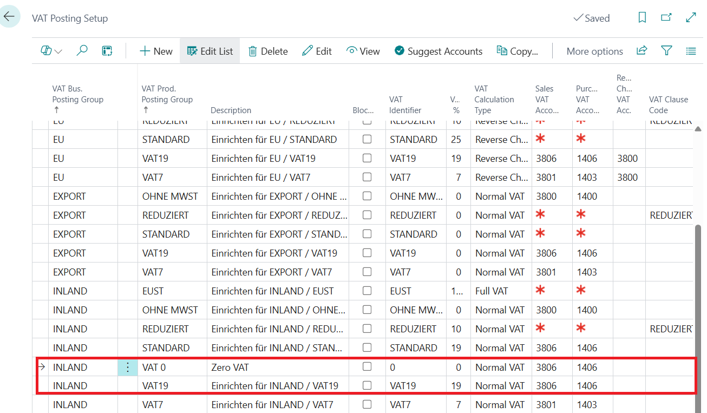

2. Process description

A new purchase invoice is created.

Information such as vendor number, posting date, external document number, etc. is entered as usual.

The purchase invoice is filled with “Price incl. VAT.”

In the lines, the allocation account is selected in the “Type” field and allocation account 1 is selected in the “No.” field.
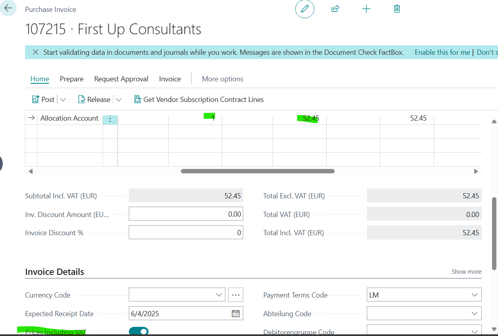

The specified €52.45 must now be split 77% and 23%. The 77% allocation includes 19% VAT. The 23% allocation does not include Vat (see allocation in the allocation accounts).

This means that the VAT base for the 77% should be €33.94 plus €6.45 vat. For the 23%, a VAT base of €12.06 and a vat amount of €0 will have to be calculated.

In the above case, however, the amounts for the vax are now calculated incorrectly.

In the posting preview, it now looks like this (incorrectly calculated values are outlined in red):

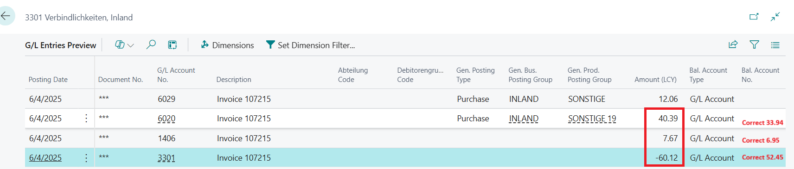

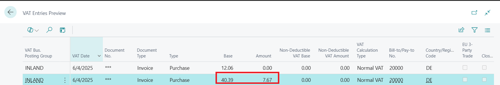

If I click on the “Generate lines from allocation account line” function, it becomes clear what is going wrong:

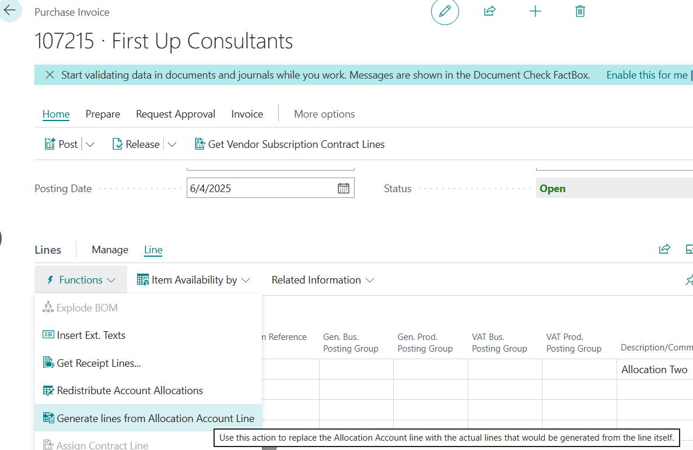

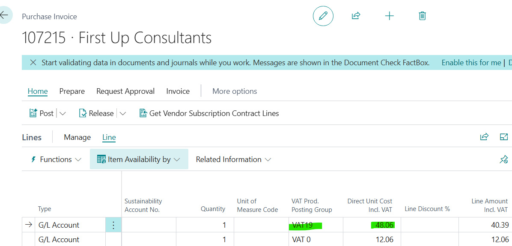

Here, the vax is still included in the calculation, resulting in an incorrect VAT base. The correct value here would be €40.39 and not €48.06.

If I were to overwrite the values manually, the result would look like this – and that is what I would expect as standard when posting with allocation accounts directly (which is not currently the case):

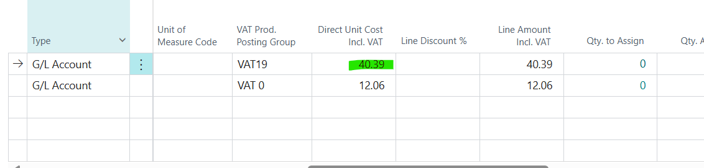

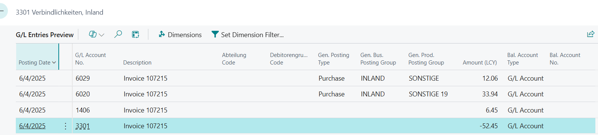

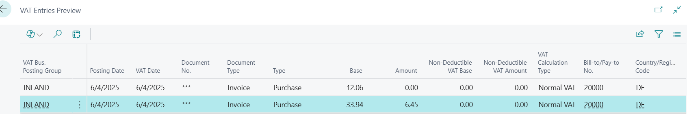

*Expected Outcome:*
Purchase invoice with allocation accounts (Allocation to G/L accounts with and without VAT) leads to incorrect G/L and VAT ledger entries

*Actual Outcome:*
Purchase invoice with allocation accounts (Allocation to G/L accounts with and without VAT) should have a correct G/L and VAT ledger entries

*Troubleshooting Actions Taken:*
I was able to reproduce the issue on my environment.

*Did the partner reproduce the issue in a Sandbox without extensions?* Yes

Description:
Purchase invoice with allocation accounts (Allocation to G/L accounts with and without VAT) and Prices Incl. VAT leads to incorrect G/L and VAT ledger entries. Prices Incl. VAT are not calculated. It calculates Amount from Percent and then add the VAT%.
