Title: Issue with the new feature for reminder texts where the configured body text is not included in the XML for report 117 (Reminder)
Repro Steps:
1) Set a Customer Card as below.
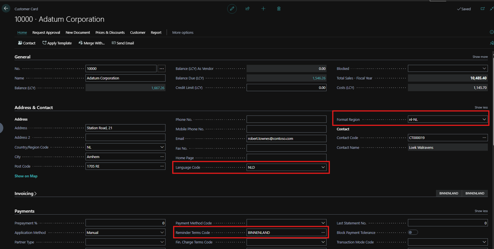
2) Create a Sales Invoice for that customer, with the dates as shown below; and post the Invoice.
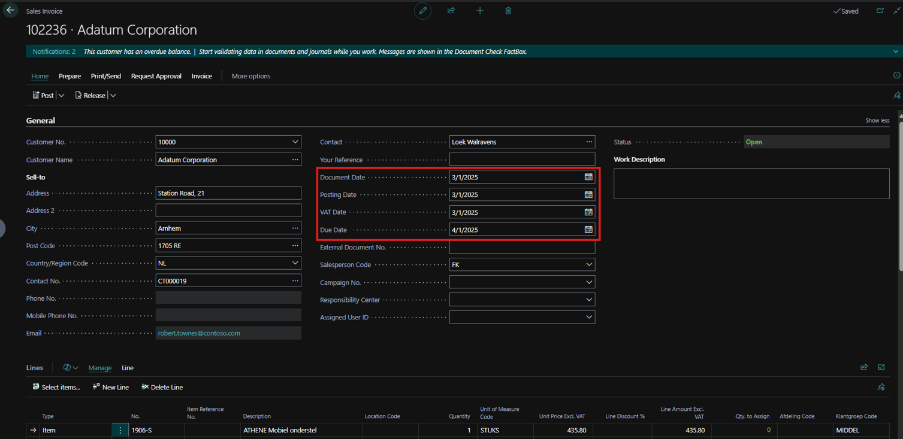
3) Make sure the reminder feature is enabled.
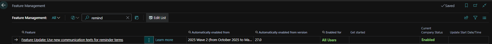
4) In Reminder Terms, select the same one setup for the customer.
5) Click on Customer Communication for each Level to edit the default message.
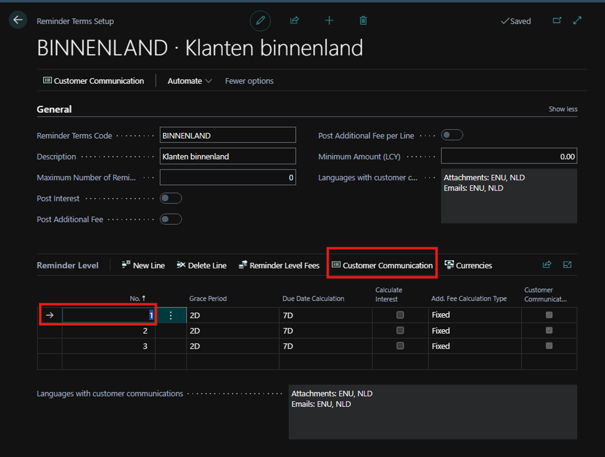
6) Click “Add text for language”, then add “NLD”; and select it from “Language Code”.
7) Edit the message body.
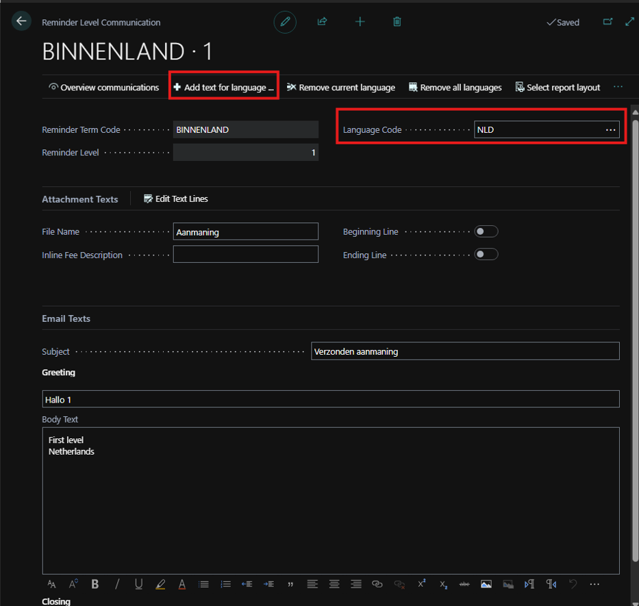
8) Go into Reminders and create a new one for the same customer.
9) Select the date, then click “Suggest Reminder Lines”.
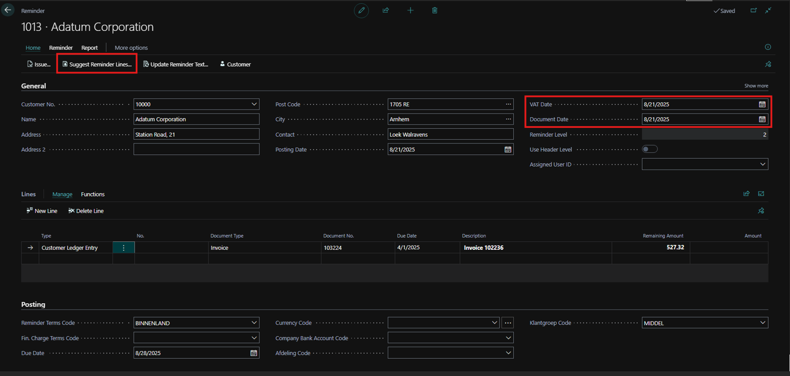
10) Issue the reminder.
11) Go into Issued reminders > Select the created reminder > Send by Email.
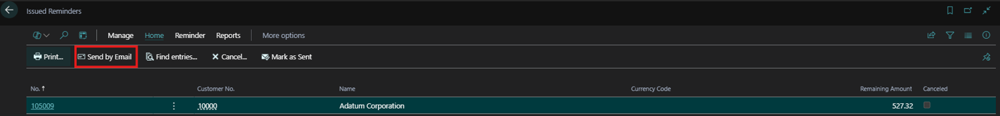
12) The customized message will show up.
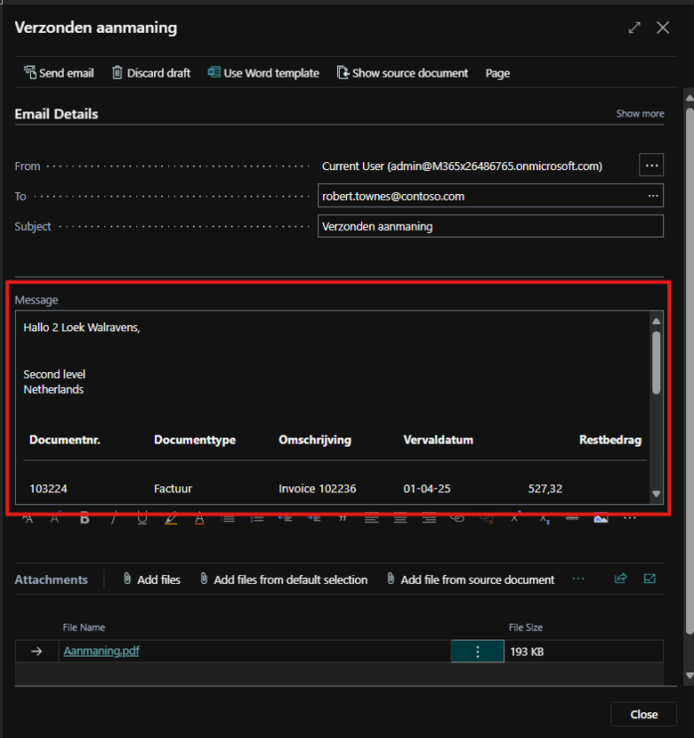
13) In Issued Reminders > Select Print.
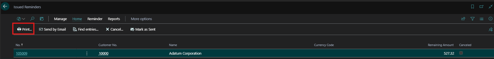
14) 14) Send To.
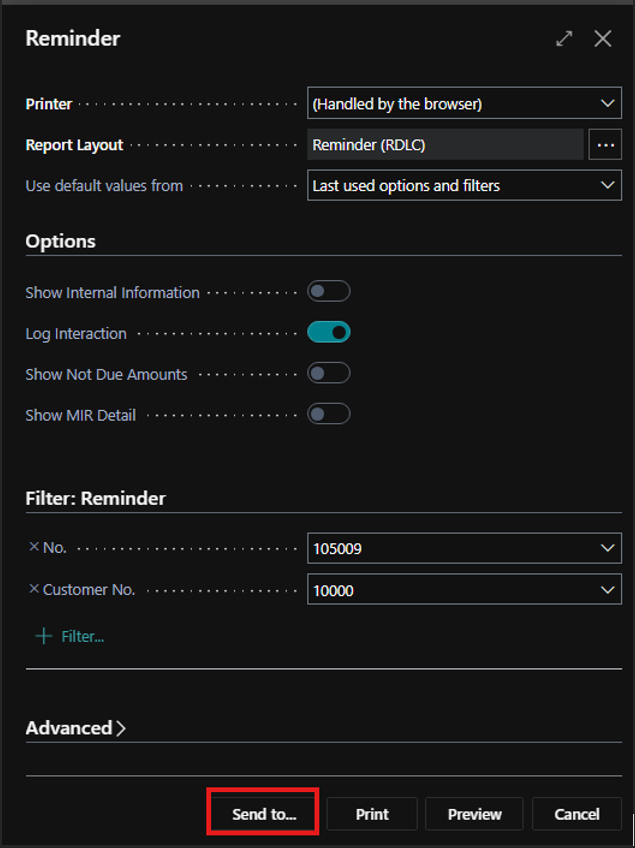
15) Select XML Document.
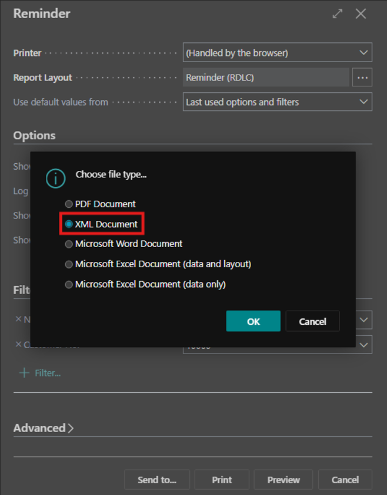
16) At the bottom of the document, "AmtDueText" is blank.
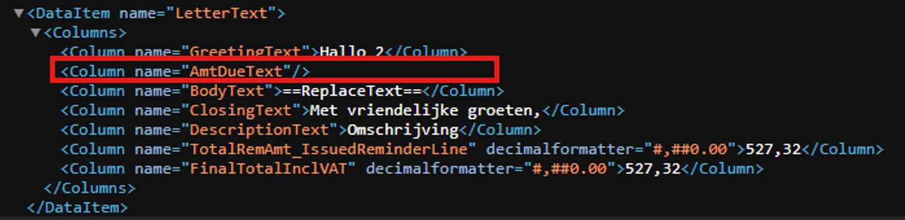
17) If we change the Language code in the Customer Card for FRA for example, without creating a customized text for that language, it will show as below.
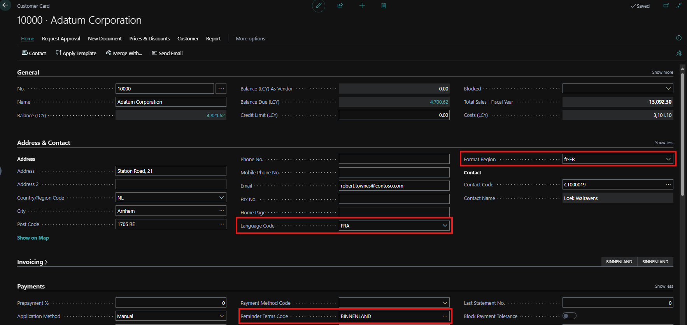
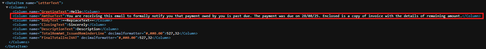
18) Same happens for Netherlands, if change the Language Code back to NLD.
19) Then delete the customized text from the Reminder Terms for all the levels.
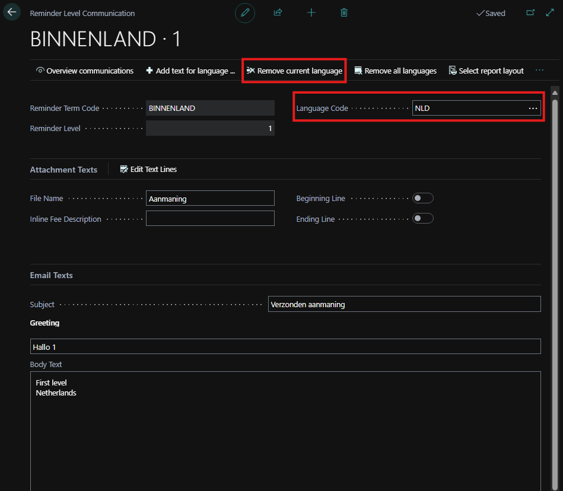
20) Issued reminders will now show the BodyText in AmtDueText.
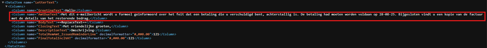
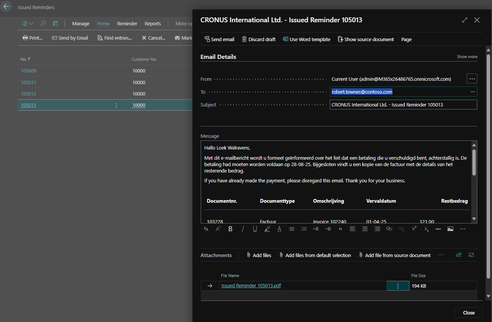
* The customer says he expects the issue to be with this part of the code.
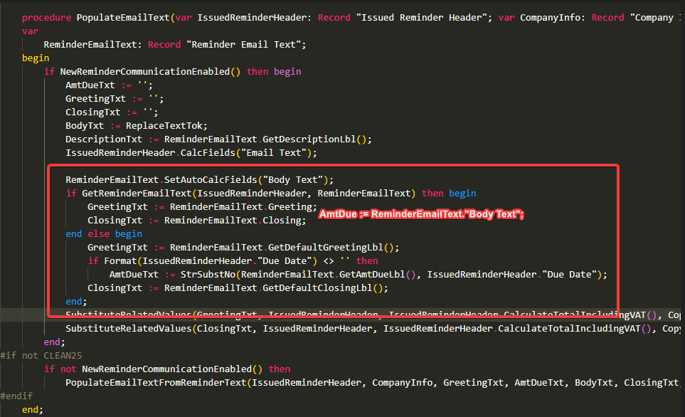

**Expected Outcome:**
The customer expects the customized message body to be included in the XML report in the “AmtDueText” section.

**Actual Outcome:**
There is no message included in the XML report in the “AmtDueText” section.

**Troubleshooting Actions Taken:**
Tried the same flow with different languages.Did the partner reproduce the issue in a Sandbox without extensions? Yes

Description:
