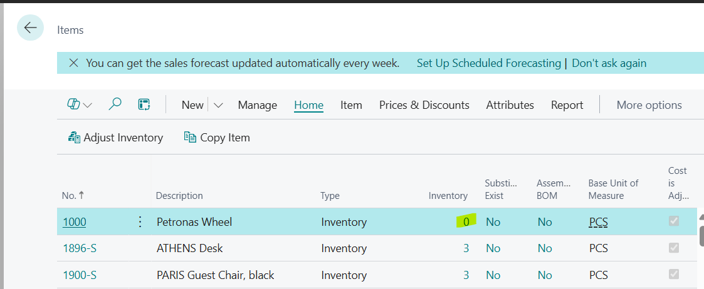
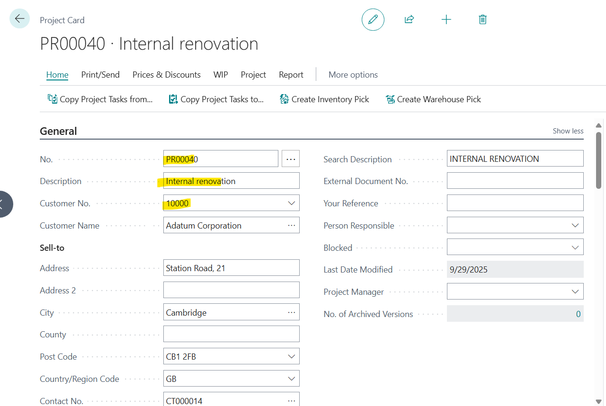
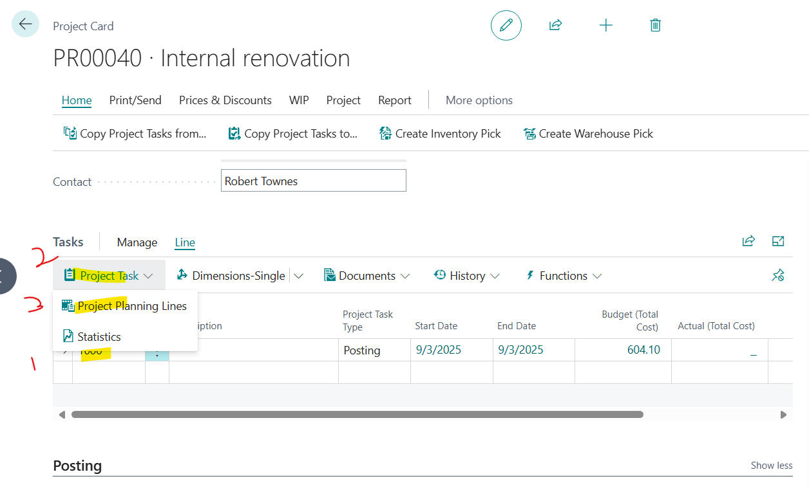
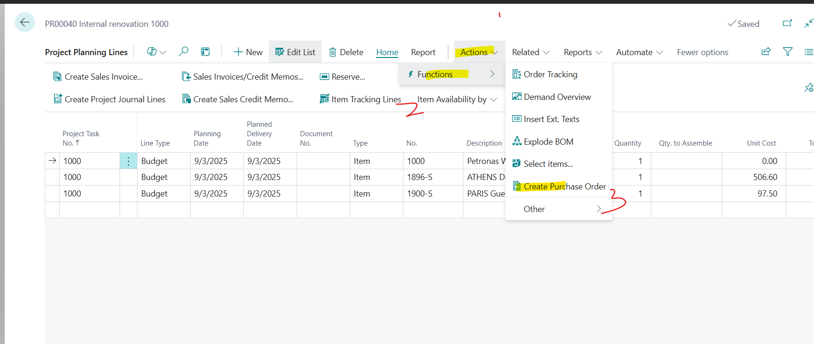
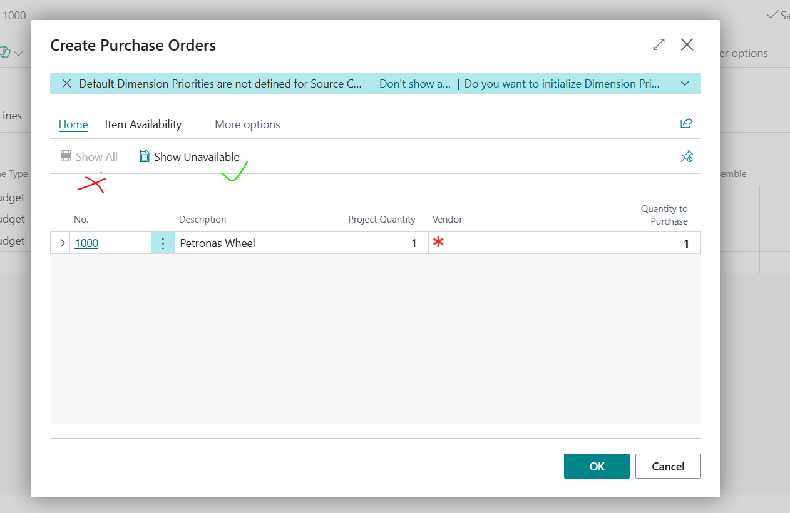

# [master] [ALL-E] If you create a purchase order for project planning lines not all items are shown/added.

## Repro Steps

1. I have these three Items, only the First Item is not available in Inventory
I created Item 1000 with Repelenishment: Purchase

2. Create a new Project,
Customer:10000
add a description

3. Add a Project Task, Code  1000
Open Project Planning Lines.

4.  Add the three Items shown in step 1 above

Click on Actions => Create Purchase Order

**Actual Outcome:**
Only the first Item is shown on the Lines for the Purchase Order to be created.

The Button "Show All" does not show all the Project Lines, (because they are available)

**Expected Outcome:**

The button 'show All' should show all Project planning lines and give the Users the flexibility to create Purchase Orders for all the Items on the Project Planning Lines whether available Inventory or not.

(This is very helpful in scenarios where the user wants to Drop Ship the PO to the Ship-to Address of the Customer)

## Description

If you create a purchase order for project planning lines not all items are shown/added.
The button 'show All' should show all Project planning lines and give the Users the flexibility to create Purchase Order for all the Items on the Project Planning Lines whether available Inventory or not.
