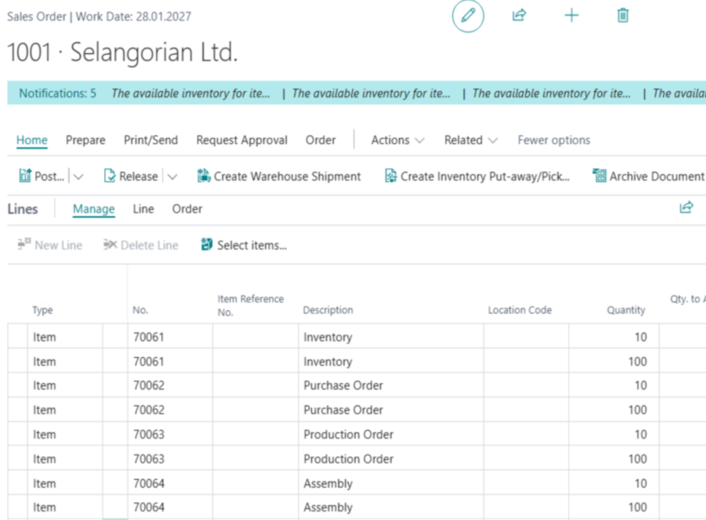
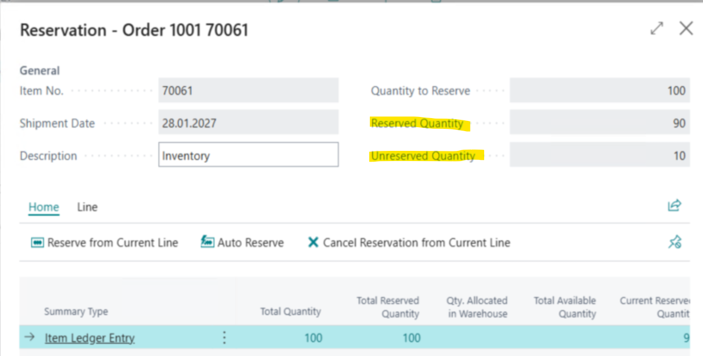
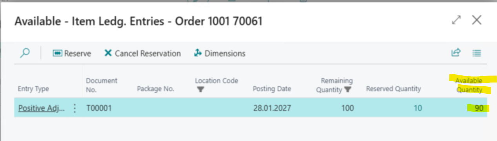
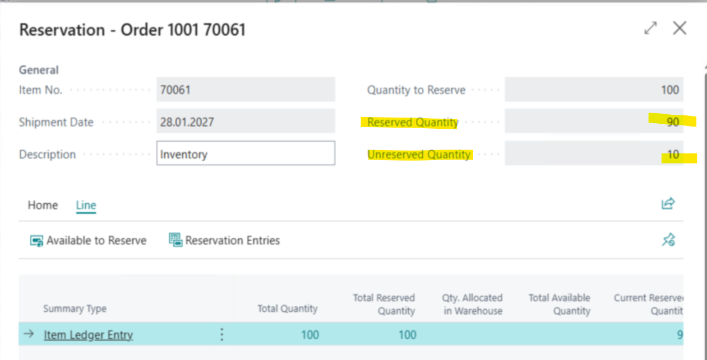
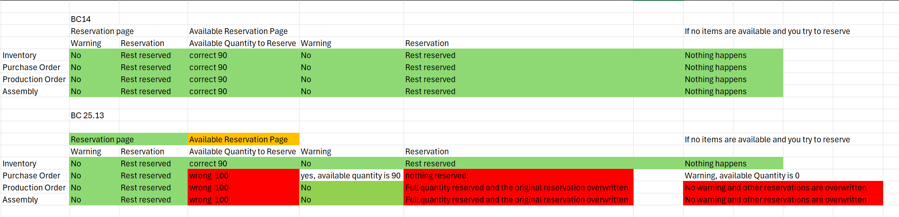

# [master] [ALL-E] Incorrect Inventory Availability Display and Reservation Overwrite When Reserving Against Production Orders out of the avaiable to reserve page

## Repro Steps

*
Open BC 25.13 W1 on Prem

Prepare the following Data for the Test

  * search for items
Create 4 new Items

a 70061 Inventory
Replenishment System: Purchase
b 70062 Purchase Order
Replenishment System: Purchase
c 70063 Production Order
Replenishment System: Prod. Order
Manufacturing Policy: Make-to-Stock
d 70064 Assembly
Replenishment System: Assembly
Assembly Policy: Assemble-to-Stock

  * Open the Item Journal
Positive Adjustment for Item 70061
Quantity: 100
Location: BLANK
Post

  * Search for Purchase Orders
Create a new Purchase Order
Vendor:10000
Order Date: 01.01.2027
Posting Date: 01.01.2027
Order Date: 01.01.2027
Item 70062
Quantity: 100
Location: BLANK
Close

  * Search for Released Production Order
Create a new Order
Item 70063
Quantity: 100
Location: BLANK
-> Refresh Production Order
Close

  * Search for Assembly Orders
Create a new Order
Quantity: 100
Location: BLANK
Close

  * Search for Sales Order
Create a new Sales order
Customer: 20000

Add 8 Lines
for each Item 2 Lines, first Quanity: 10 second Quantity: 100
Location: BLANK

Now the Test

  * open the Reservation Page for the first Line
Line -> Functions -> Reserve
Rexerve from Current Line

Repeat this for Line 3, 5 and Seven
It should look like this afterwards

  * Select the second line open the reservation
Reserve from current line

Result is as expected
no message, just the available quantity was reserved
**
**Cancel reservation from current line

  * Line -> Available to reserve
The available quantity is shown correct

Reserve

Result -> No Warning
Rest Quantity is reserved

Do the same with line 4,6 and 8
  * ======== start addition by Andrei Panko=====>>>

  * while action Reserve from current line produces expected result (it reserves available 90)
  * if user navigates to Line -> Available to Reserve - the Available Quantity there is populated wrongly (100, while expected 90). **We need to focus on fixing this part.**
  * The wrong Available Quantity 100 leads to additional issues - like inability to reserve for purchase or reset original reservations (see details in table below)
  *

  * ======== end addition by Andrei Panko=====<<<
Result:

Expected Result:
Needs partly to be clarified
Basically, I believe all should behave the same.
Warnings? Do we need them? If yes then for all
Production Order/ Assembly Order reservations should not be overwritten!!!!!
Purchase Order, why is the available quantity not reserved?

* Andrei Panko:

  * EXPECTED RESULT: Available Quantity to Reserve must be 90 for all cases.

## Description

[@Andrei Panko](https://dynamicssmb2.visualstudio.com/Dynamics%20SMB/CSS/_workitems/create/Bug?templateId=13d31dc6-42bd-4842-a16f-fd1b3869fbd4#) [@Predrag Maricic](https://dynamicssmb2.visualstudio.com/Dynamics%20SMB/CSS/_workitems/create/Bug?templateId=13d31dc6-42bd-4842-a16f-fd1b3869fbd4#)
We have here again an issue with reservation entries.
Please take a look and let us know your opinion
Expected Result:
Needs partly to be clarified
Basically, I believe all should behave the same.
Warnings? Do we need them? If yes then for all
Production Order/ Assembly Order reservations should not be overwritten!!!!!
Purchase Order, why is the available quantity not reserved?
