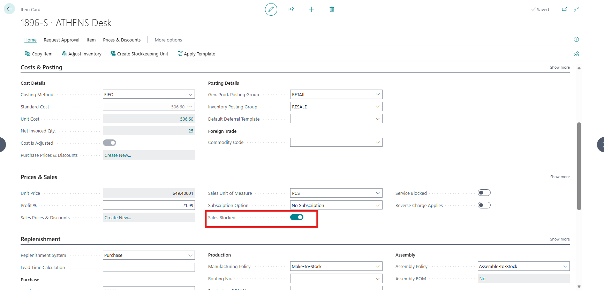

# [master] [ALL-E] "Sales/Purchase Blocked" items are now listed in dropdown list of items in a sales/purchase lines after upgrading to v27

## Repro Steps

REPRO:

==============

1- Open Item card an enable 'Sales Blocked':

2- Create a new sales order and open the dropdown list of items.

EXPECTATION:

==============

The item marked as Sales Blocked should not be displayed in the item list.

RESULT:

==============
Is is shown in the list of items
