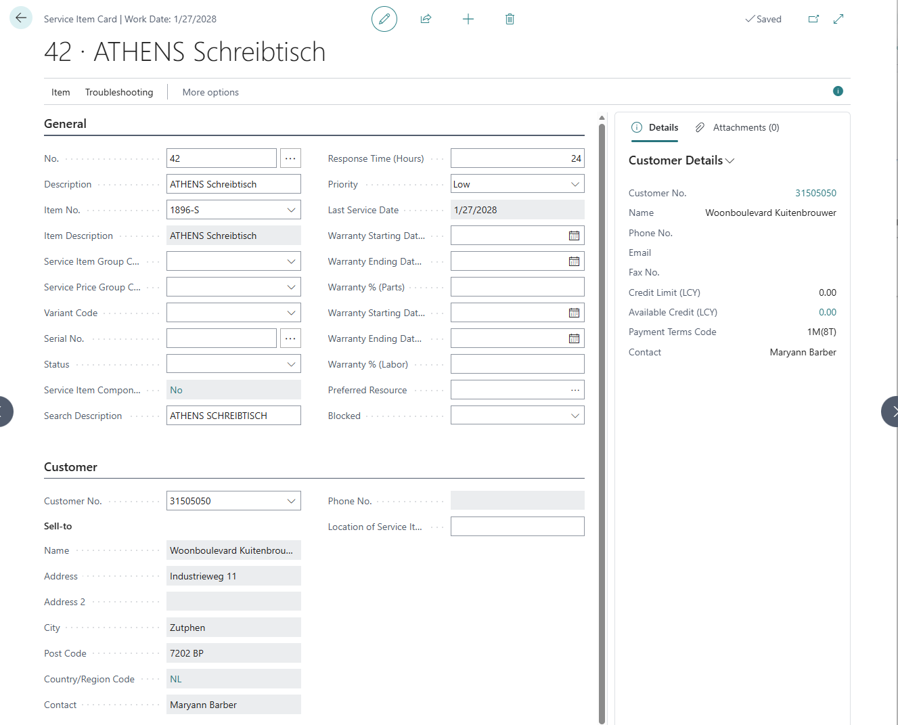

# [master] [ALL-E] Printing Certificate of Supply from posted Service shipment does not work - The Sales Shipment Line table is empty.

## Repro Steps

REPRO:

==============

Tested in DE Business Central 27.3 (Platform 27.0.44301.0 + Application 27.3.44313.44331)

Create a new Service item

Item 1896-S for Customer Customer 31505050

Create a new Service Order for Customer 31505050 and add the previsously created Service item to it.

In the "Lines tab" click on "Service item wowrksheet"

In the Service item worksheet  add  item 1900-s

Delete Location code Yellow

and add Quantity to 1

Open the "General Posting Setup" - and for the combinatino of EU / Production set COGS Account to 4090

In the Service order card, post your service order.

Go to posted Service shipment

Click on Certificate of Supply - Print Certificate of Supply.

In the request page set "Create Certificates of Supply if Not Already Created" =  true

Error message:

The Sales Shipment Line table is empty.

AL call stack:

"Certificate of Supply"(Report 780).GetLines line 23 - Base Application by Microsoft version 27.3.44313.44331

"Certificate of Supply"(Report 780)."CertificateOfSupply - OnAfterGetRecord"(Trigger) line 16 - Base Application by Microsoft version 27.3.44313.44331

"Certificate of Supply"(Table 780).Print line 5 - Base Application by Microsoft version 27.3.44313.44331

"Posted Service Shipment"(Page 5975)."PrintCertificateofSupply - OnAction"(Trigger) line 6 - Base Application by Microsoft version 27.3.44313.44331

This was as well rpeorted by the partner on github:

[[Bug]: Several errors in printing Certificate of Supply for service shipment · Issue #29553 · microsoft/ALAppExtensions](https://github.com/microsoft/ALAppExtensions/issues/29553)

Open Posted Service Shipment, tab Certificate of Supply, action Print Certificate of Supply.
Message: The report couldn’t be generated, because it was empty. Adjust your filters and try again.
Error is caused on the action button by not filtering correct. The record remains empty and gets the document type 'Sales Shipment' automatically as it is the first value in enum.
2nd Bug:
Open Posted Service Shipment, tab Certificate of Supply, action Certificate of Supply Details, action Print Certificate of Supply -- works.
After that try 1st Bug again. Posted Service Shipment, tab Certificate of Supply, action Print Certificate of Supply.
Message: The Sales Shipment Line table is empty.
Now the Rec is filtered and not empty anymore, but the filter is wrong, as it has not been filtered to Service Shipment.
This leads to
3rd Bug: local procedure GetLines which takes a FindSet of the TempSalesShipmentLines.
This is not correct, as this part of code will be run without checking the cases before. So when it is a Return Shipment it will lead to an error as well.

I am very sorry, but this is so confusing, that I do not know how to correct it. I think somebody missed to add the Service Documents to this process of printing.

EXPECTATION:

==============

Printing of Certificates of Supply should be possible for all document types.

RESULT:

==============

Error
