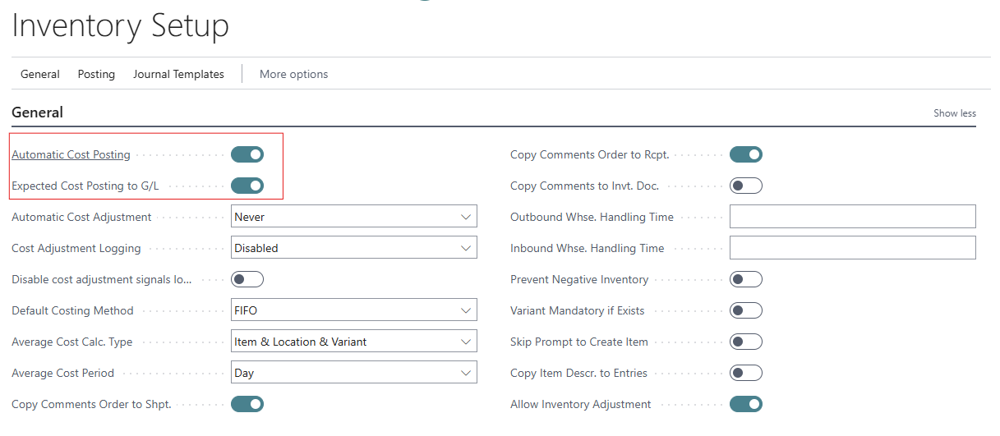
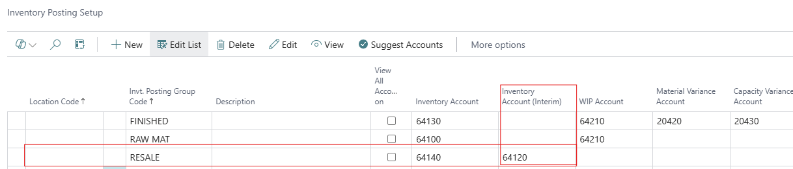
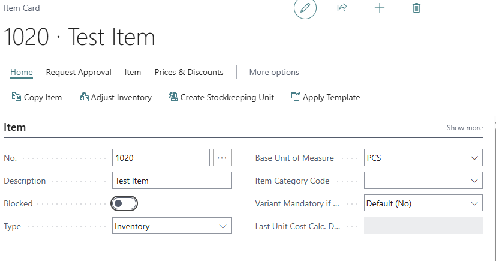
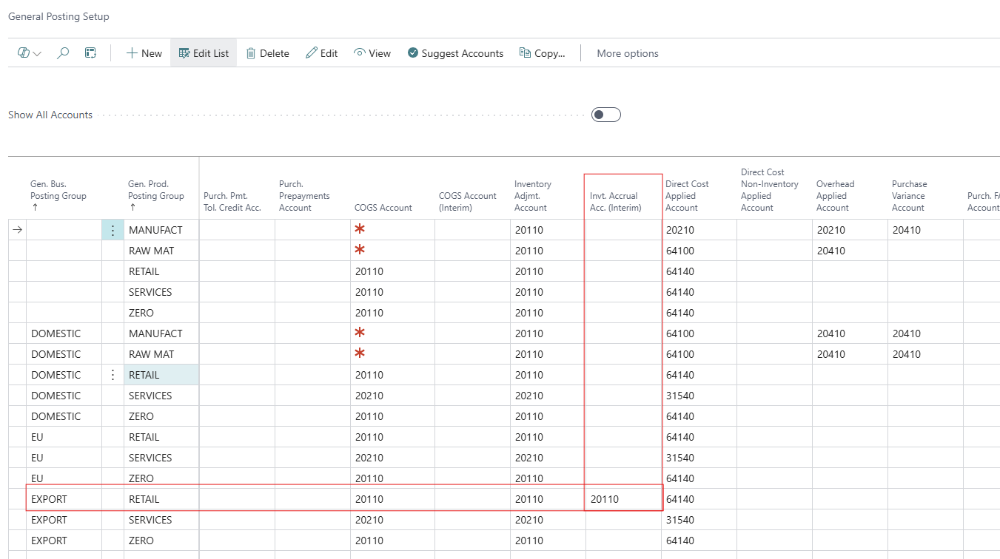
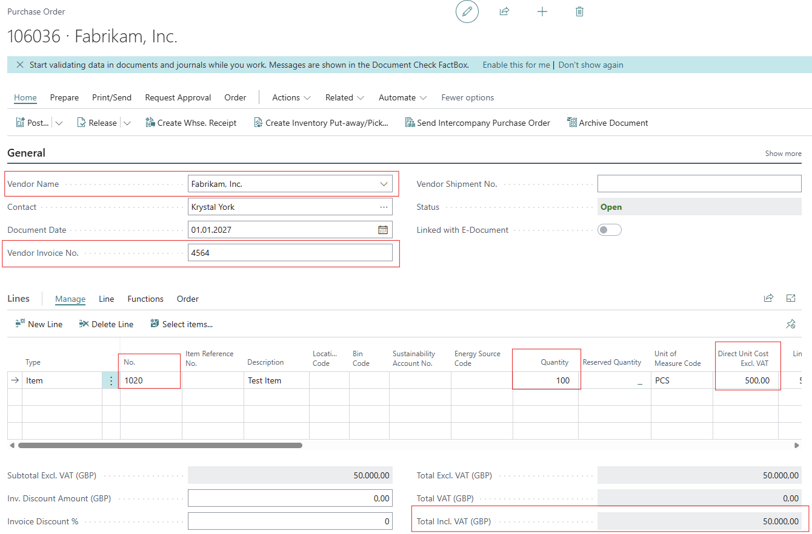
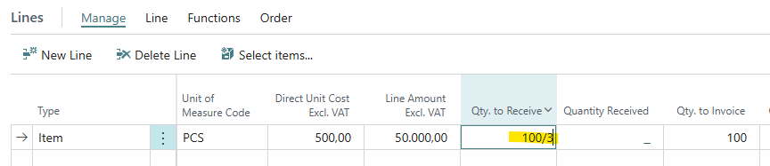
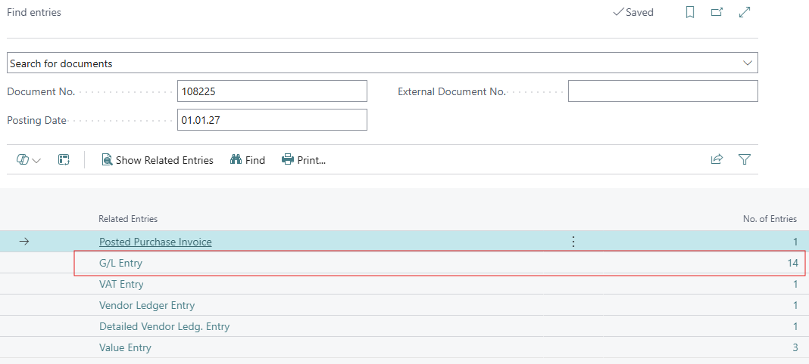
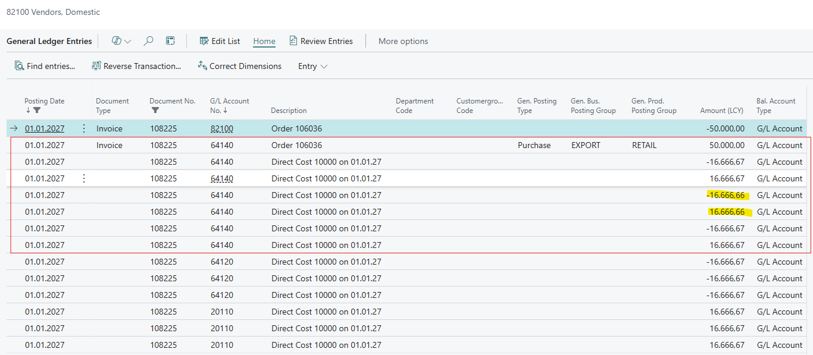
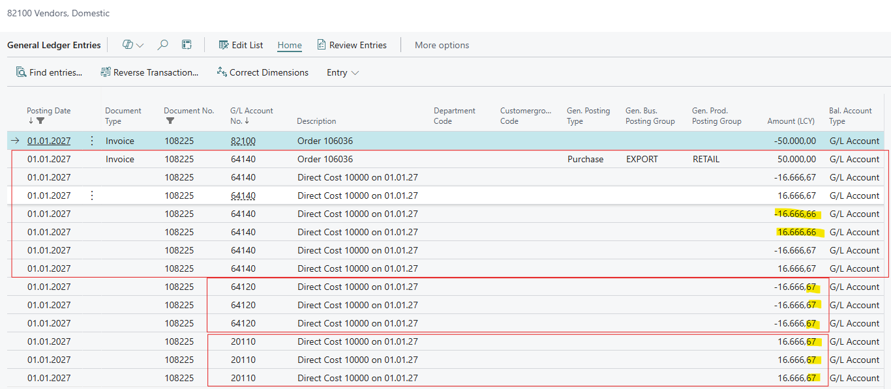

# [master] [ALL-E] Posting purchase order in partial receipt leads to an rounding issue when posting the invoice when you have Automatic Cost Posting active

## Repro Steps

1) Inventory Setup

Automatic Cost Posting = True
Expected Cost Posting to G/L = True

Open Inventory Posting Setup
Add an Inventory Account (Interim)

2) Create a new Item

Open General Postin Setup
Add an Account Invt. Accrual Acc (Interim)

3) Create a Purchase Order
Vendor: 10000
Vendor Invoice No.: Any
Item: 1020
Location: Blank
Quantity: 100
Unit Cost: 500,00

4) Post a partial receive  '100/3' = 33,33333 Post -> receive

Do a second partial receive with the same Quantity
Post the third partial receive with the Rest Quantity: 33,33334

5)Post the purchase invoice
Post -> Invoice

6) Open the posted invoice

Open the General Ledger Entries
Home -> Find Entries

ACTUAL RESULT:
The Entires for Account 64140 were adjusted, so that this sums up to 0,00

But for the accounts 64120 and 20110 we have a difference of 0,01

EXPECTED RESULT:
The entries for Account 64120 and 20110 should summ up to 0,00 as well:

In BC 14 was it as expected:
see description
