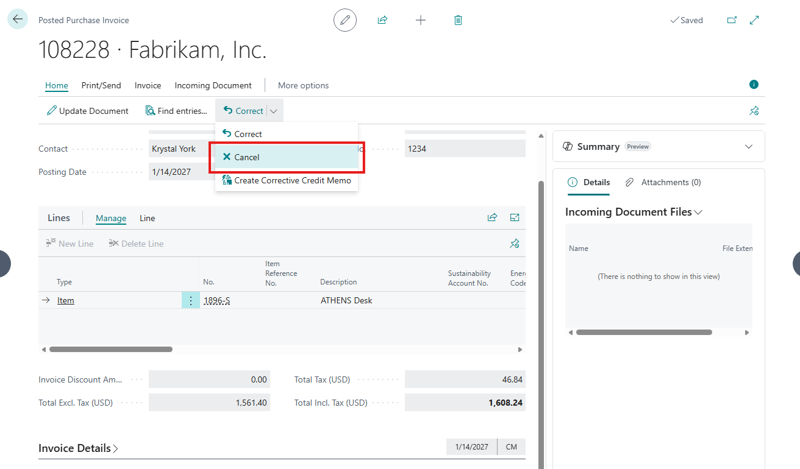
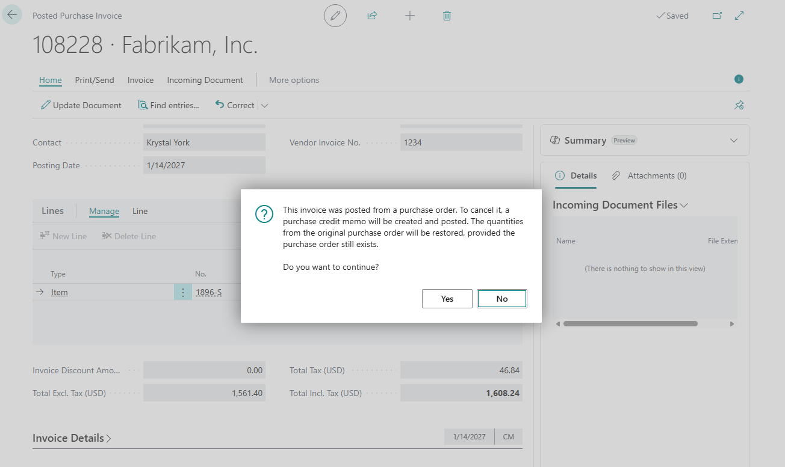

# [ALL-E] Incorrect warning during cancelling Posted Purchase Invoice

## Repro Steps

1. Create Purchase Invoice (any vendor and item)

2. Post the Purchase Invoice

3. Cancel the Posted Purchase Invoice and encounter the incorrect message

This invoice was posted from a purchase **order**. To cancel it, a purchase credit memo will be created and posted. The quantities from the original purchase order will be restored, provided the purchase order still exists.

## Description

User experiences an incorrect warning when cancelling a posted purchase invoice in Business Central. The message incorrectly states that the invoice was posted from a purchase order, although it was posted from a purchase invoice. " This invoice was posted from a purchase order. To cancel it, a purchase credit memo will be created and posted. The quantities from the original purchase order will be restored, provided the purchase order still exists."
