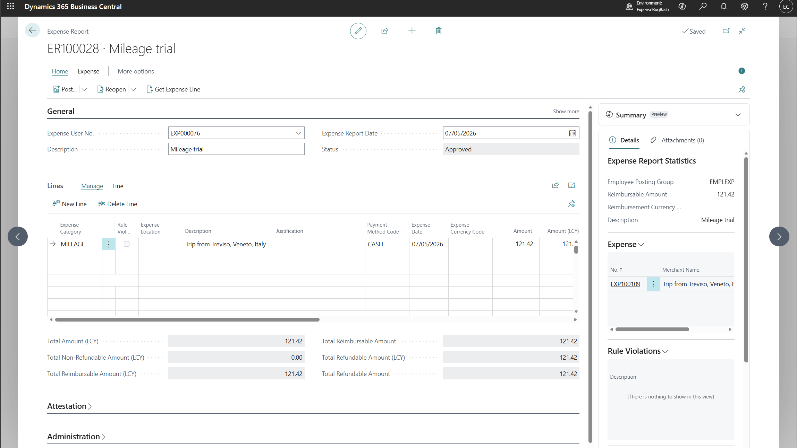
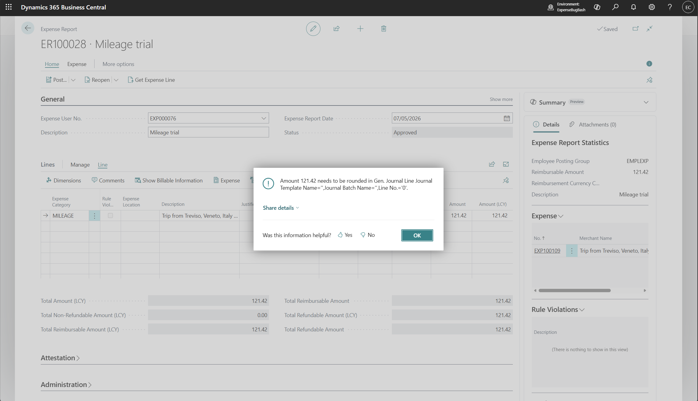

# [ExpenseAgent] Posting an expense report that contains a mileage line gives error "Amount needs to be rounded in Gen. Journal Line Journal Template Name ..."

## Repro Steps

Create an expense report with a mileage line in 28.1

For example:

Make sure it's approved.

Try to post.

Verbatim:

If requesting support, please provide the following details to help troubleshooting:

Error message:
Amount 121.42 needs to be rounded in Gen. Journal Line Journal Template Name='',Journal Batch Name='',Line No.='0'.

Internal session ID:
334af4b2-908e-4036-893c-15da28dd173d

Application Insights session ID:
133def31-ed4b-43eb-ab42-a0e3abf1eecd

Client activity id:
860e346f-7efa-4533-8b44-ab0c726f1f49

Time stamp on error:
2026-05-07T14:22:06.4138465Z

User telemetry id:
67d0dceb-695d-4d06-aa56-04230f9bf86b

AL call stack:
"Gen. Jnl.-Post Line"(CodeUnit 12).InitAmounts line 40 - Base Application by Microsoft version 28.1.49838.50112
"Gen. Jnl.-Post Line"(CodeUnit 12).Code line 30 - Base Application by Microsoft version 28.1.49838.50112
"Gen. Jnl.-Post Line"(CodeUnit 12).RunWithCheck line 11 - Base Application by Microsoft version 28.1.49838.50112
"Expense Post. Mgt"(CodeUnit 6987).PostRefundableJnlLine line 23 - Expense Agent (Preview) by Microsoft version 28.1.49838.50112
"Expense Post. Mgt"(CodeUnit 6987).CreateAndPostJournalEntry line 5 - Expense Agent (Preview) by Microsoft version 28.1.49838.50112
"Expense Post. Mgt"(CodeUnit 6987).ProcessExpenseReportLines line 32 - Expense Agent (Preview) by Microsoft version 28.1.49838.50112
"Expense Post. Mgt"(CodeUnit 6987).CheckAndCreatePostedDocument line 6 - Expense Agent (Preview) by Microsoft version 28.1.49838.50112
"Expense Post. Mgt"(CodeUnit 6987).RunWithCheck line 19 - Expense Agent (Preview) by Microsoft version 28.1.49838.50112
"Expense Post. Mgt"(CodeUnit 6987).PostExpenseReport line 11 - Expense Agent (Preview) by Microsoft version 28.1.49838.50112
"Expense Report"(Page 6910).PostDocument line 7 - Expense Agent (Preview) by Microsoft version 28.1.49838.50112
"Expense Report"(Page 6910)."Post - OnAction"(Trigger) line 2 - Expense Agent (Preview) by Microsoft version 28.1.49838.50112

Microsoft Entra tenant ID: f0ac72d1-c1b3-4c2a-a196-8fb82cac5934, Environment: ExpenseBugBash (Production)

Version: US Business Central 28.1 (Platform 28.0.50017.0 + Application 28.1.49838.50112)
User telemetry ID: 67d0dceb-695d-4d06-aa56-04230f9bf86b
