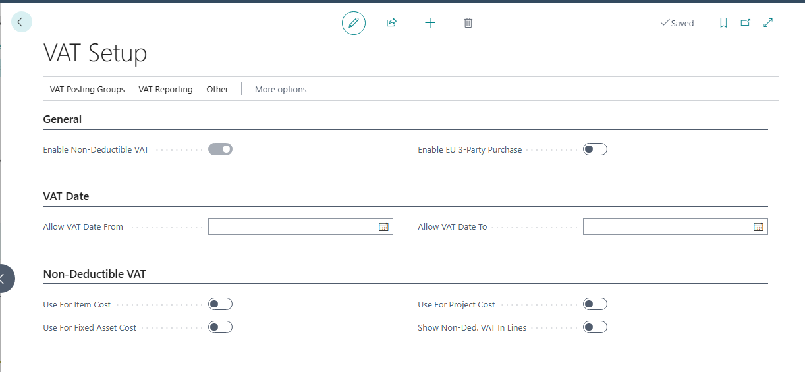
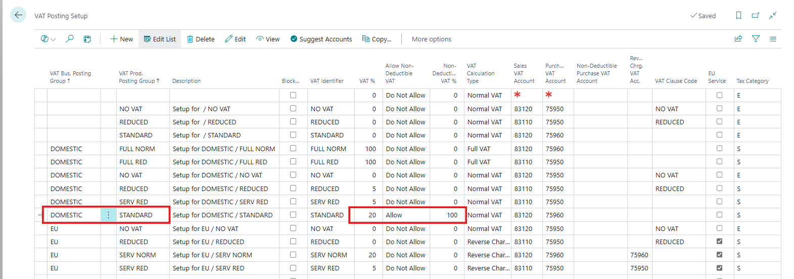
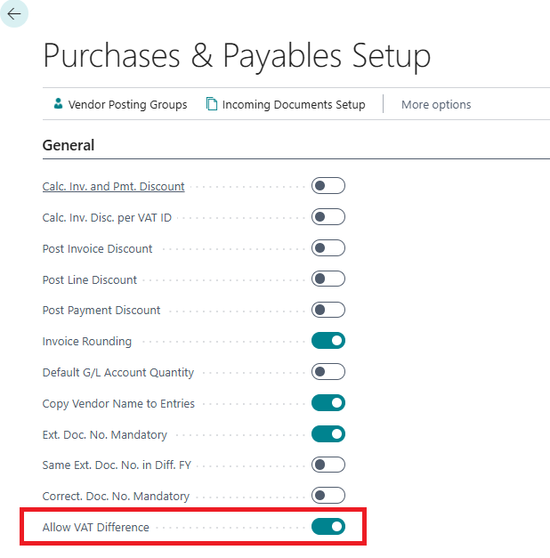
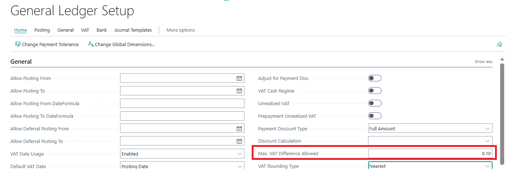
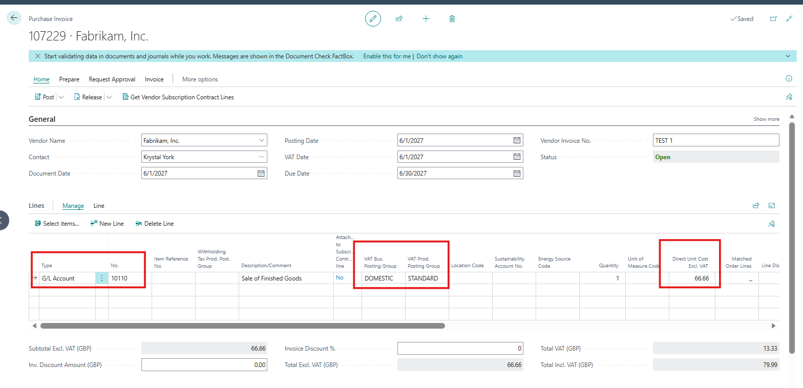
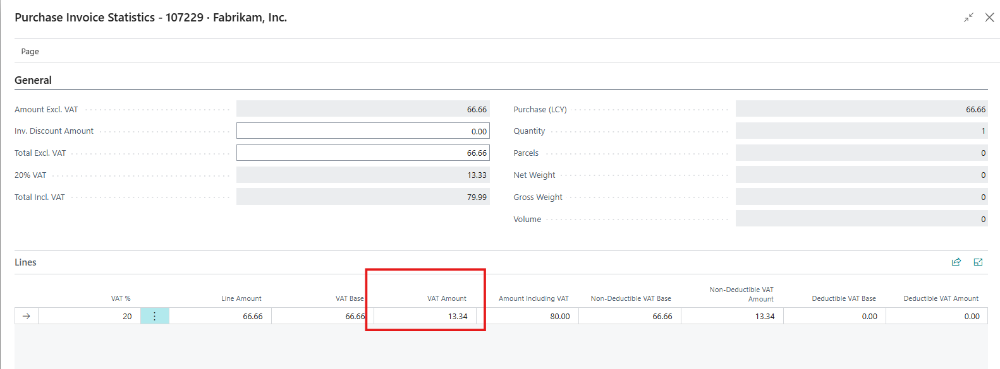
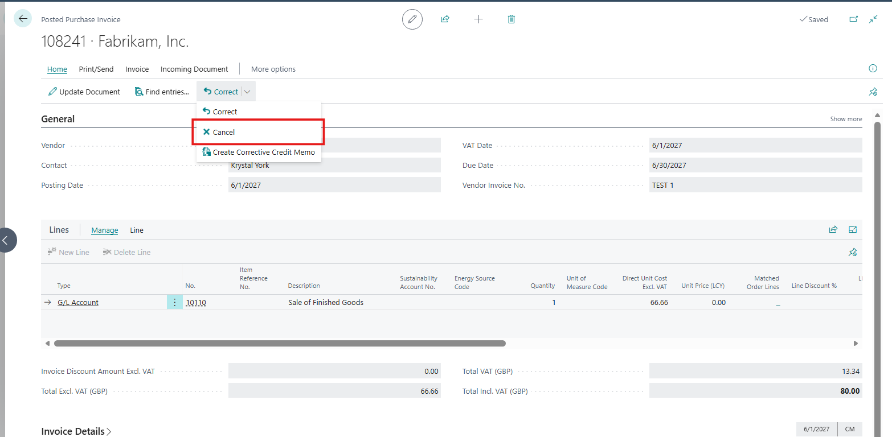
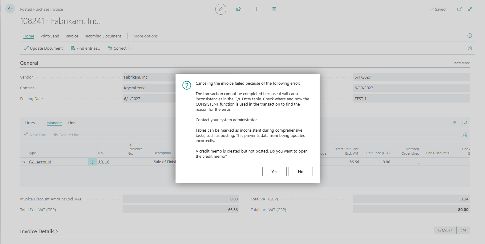

# [master] [all-e]"The transaction cannot be completed because it will cause inconsistencies in the G/L Entry table." error message if you Cancel a Posted Purchase Invoice with Non-Deductible VAT after adjusting the VAT amount in Statistics..

## Repro Steps

1- Open the VAT setup and enable the non deductible VAT:

2- Open the VAT posting group and add the following setup:

3- Go to Purchases and Payables Setup and mark Allow VAT Difference to TRUE.

4-Go to General Ledger Setup and set Max. VAT Difference Allowed to 0.10

5- Open a purchase invoice add the VAT bus. & prod. posting groups to the lines through personalization. Add a G/L line as follows:

 

6- Open the Statistics and adjust the VAT amount to 13.34:

7- Enter Vendor Invoice No. and Post the invoice.
Open the posted invoice.

8- Cancel the posted invoice: (click yes to the first message)

9- We get the following error message:

Canceling the invoice failed because of the following error: The transaction cannot be completed because it will cause inconsistencies in the G/L Entry table. Check where and how the CONSISTENT function is used in the transaction to find the reason for the error. Contact your system administrator. Tables can be marked as inconsistent during comprehensive tasks, such as posting. This prevents data from being updated incorrectly. A credit memo is created but not posted. Do you want to open the credit memo?

**Expected Outcome:**
When Cancel is used on a posted purchase invoice, Business Central should automatically create and post a corrective purchase credit memo that fully reverses the original invoice, including all related G/L and VAT entries, regardless of VAT rounding applied during posting.

**Actual Outcome:**
When attempting to cancel the posted purchase invoice, BC raises a CONSISTENT / G/L Entry table inconsistency error, and the cancellation process stops.
This issue only occurs when the direct cost excluding VAT is not a round number, leading to VAT rounding differences.

**Troubleshooting Actions Taken:**
I was able to repro the same scenario

**Did the partner reproduce the issue in a Sandbox without extensions? **Yes

## Description

"The transaction cannot be completed because it will cause inconsistencies in the G/L Entry table." error message if you Cancel a Posted Purchase Invoice with Non-Deductible VAT after adjusting the VAT amount in Statistics.
