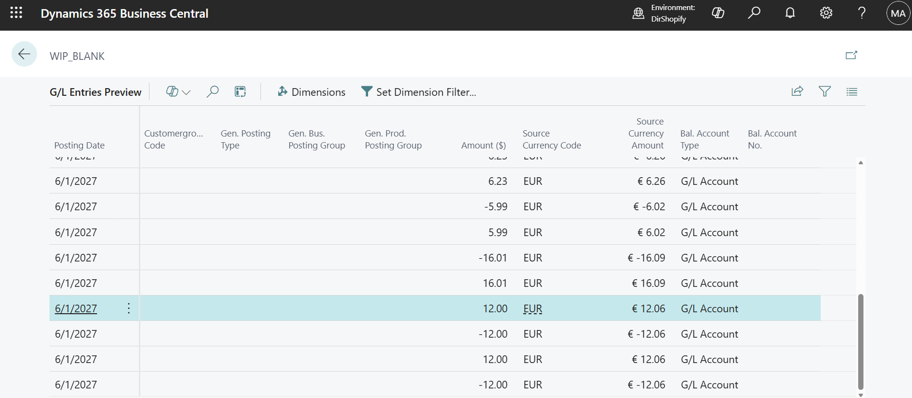

# Unexpected currency EUR in posting preview of production order

## Repro Steps

28.0, US
create released prod order for item SCM-1009, location main
navigate to production journal.

choose posting preview
explore GL entries.
See the Source Currency Code has EUR. And Source Currency amount shows EUR symbol.
Where is coming from? I don't expect currency to be involved in production posting

