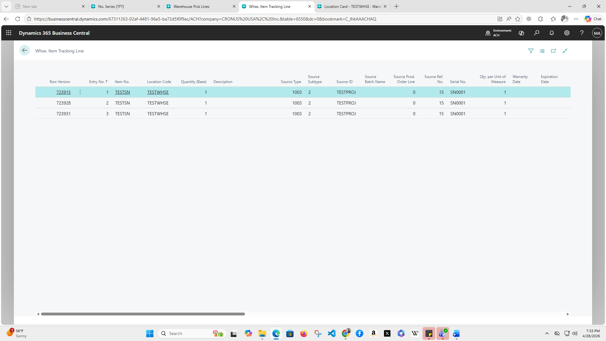
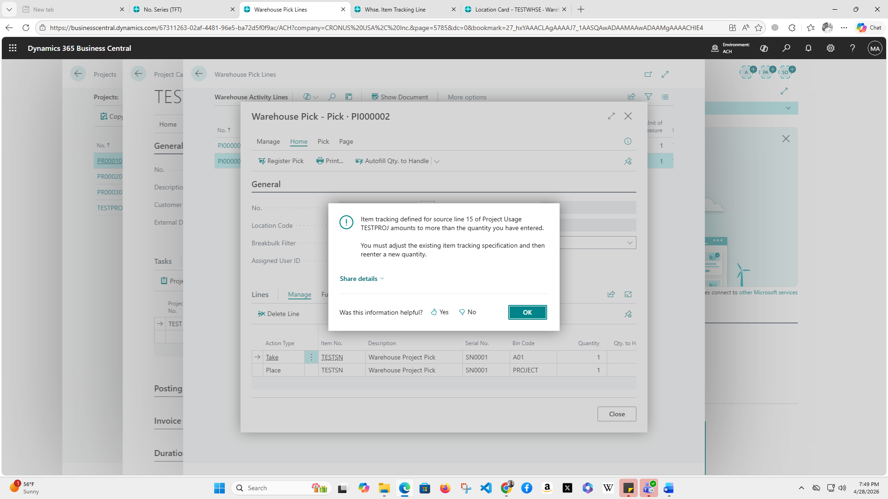
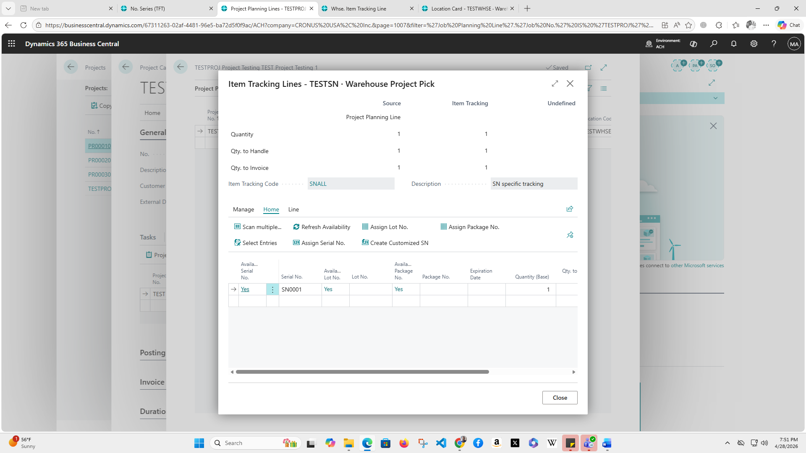

# [master] [ALL-E] [FTE][SaaS] Error message when registering warehouse pick for project planning line with serial number tracking

## Repro Steps

****

**Steps to Reproduce:
**
Using a standard v27 CRONUS sandbox:

1. Create an Item with the following settings:

• No.: **TESTSN**

• **Item Tracking Code:** SNALL (Serial Number specific tracking)

• Serial Nos.  Create a Serial No/Assign a Serial No

2. Create a Location with the following settings:

• Code: **TESTWHSE**

• Bin Mandatory:** true**

• Project Consump. **Whse. Handling: Warehouse Pick (mandatory)**

3. Create a Bin record with the following settings:

• Location Code: **TESTWHSE**

• Code: **A01**

4. Create a Bin record with the following settings:

• Location Code: **TESTWHSE**

• Code: **PROJECT**

5. Create an Item Journal Line with the following settings:

• Entry Type: Positive Adjustment

• Item No.: **TESTSN**

• Location Code: **TESTWHSE**

• Bin Code: **A01**

• Quantity: **2**

6. Open the Item Tracking Lines and add the following lines:

• Serial No.: 00001, Qty.: **1**

• Serial No.: 00002, Qty.: **1**

7. Post the Item Journal Batch

8. Create a new Project with the following settings:

• No.: **TESTPROJ**

• Bill-to Customer No.: **10000**

9. Create a new Project Task with the following settings:

• Project No.: **TESTPROJ**

• Project Task No.: **TEST**

10. Create a new Project Planning Line with the following settings:

• Project No.: **TESTPROJ**

• Project Task No.: **TEST**

• Line Type: Budget

• Type: Item

• No.: **TESTSN**

• Location Code: **TESTWHSE**

• Bin Code: **PROJECT**

• Quantity: 1

11. Open the Item Tracking Lines and add the following line:

•** Serial No.: 00001, Qty.: 1**

12. From the Project Card, run the** Create Warehouse Pick **action and click **OK **to create the pick.

13. Open the newly created **Warehouse Pick**

14. **Personalize page** to make Serial No. visible on Warehouse Pick Line

15. Change Serial No. on Warehouse Pick Line to** 00002**

16. Click on **Register Pick**

The following error message should appear:

Item tracking defined for source line ### of Project Usage TESTPROJ amounts to more than the quantity you have entered. You must adjust the existing item tracking specification and then reenter a new quantity.

**Observation:
**

1. After the error is displayed, kindly navigate to the Whse. Item Tracking Line table

From my end it added line table which is **723931 **showing serial no 0001

2. I deleted the warehouse pick line I created, then click on create warehouse pick and clicked on **Cancel**, it created line table which is 723928 with same serial No

3. I went back and create warehouse pick, In the warehouse line page allowing serial no **0001**, clicked on Okay, then click on Register Pick, I got error message,

navigate to whse line table, it created line table **723915**

In the Project Planning > item tracking line still shows serial No. 0001

• If the Serial No. is changed on the Warehouse Pick Line, it does not update the corresponding Whse. Item Tracking Line record.

• If the Warehouse Pick Line is deleted, the Whse. Item Tracking Line records are deleted only if the Serial No. matches.

• Changing the Serial No. in the Item Tracking for the Project Planning Line does not affect the existing Whse. Item Tracking Line records

**Expected Outcome:**
Warehouse Pick should register successfully for the selected Serial No.

**Actual Outcome:**
If user changes the Serial No. on the Warehouse Pick Line, they receive the following error message when registering the Warehouse Pick:
Item tracking defined for source line ### of Project Usage ####### amounts to more than the quantity you have entered. You must adjust the existing item tracking specification and then reenter a new quantity

**Troubleshooting Actions Taken:**
This issue has been reproduced in a standard 27.3 CRONUS sandbox without any additional extensions installed.

**Did the partner reproduce the issue in a Sandbox without extensions? **Yes
