# [master][ALL-E] Negative Shipped and Invoiced Quantities appear on Sales Order Lines after using the Copy Document from a Sales Credit Memo.

## Repro Steps

Tested in different 28.x versions, even 28.3 and still happens.

Started to happen in 27.x.

Negative shipped quantity and invoiced quantity in sales line due to credit/return process using copy document function in the case when you have same item into different lines

1. Create a 2 different Sales Orders using same item on the first line for both (1896-S):

a) First Sales Order. Use Quantity 3 for Item 1896-S and Quantity 1 for Item 1900-S.

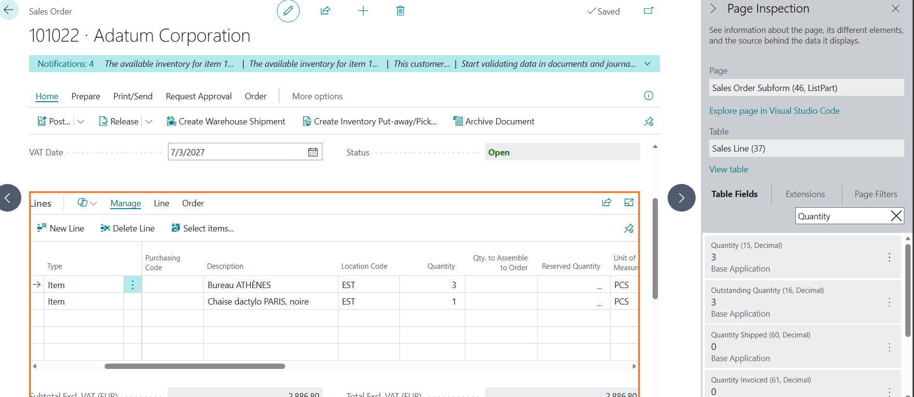

b) Second Sales Order, Use Quantity 2 for Item 1896-S and Quantity 1 for Item 1900-S.

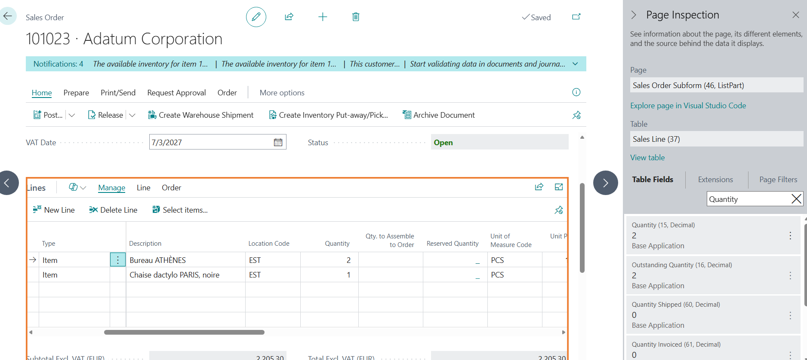

2. Post ONLY shipment on the first line in each sales order

a) Qty to Ship 3 for first line. 0 for the second line.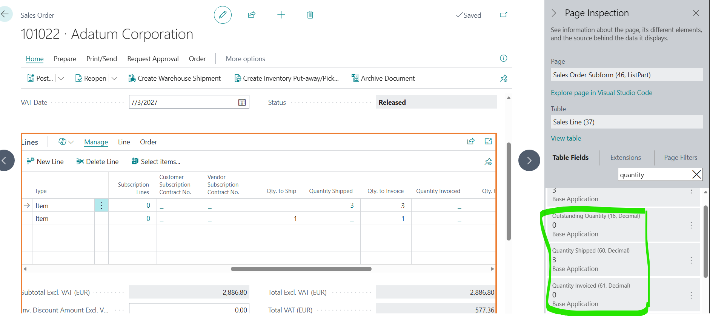

b) Second Sales Order. Qty to Ship 2 for the first line. 0 for the second line.

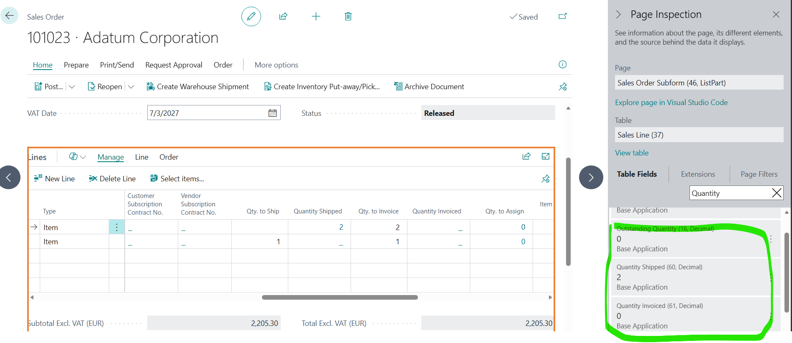

3. Open a New Sales invoice , use “get shipment Lines” to call both shipment”

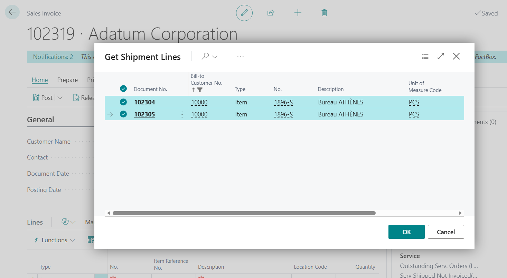

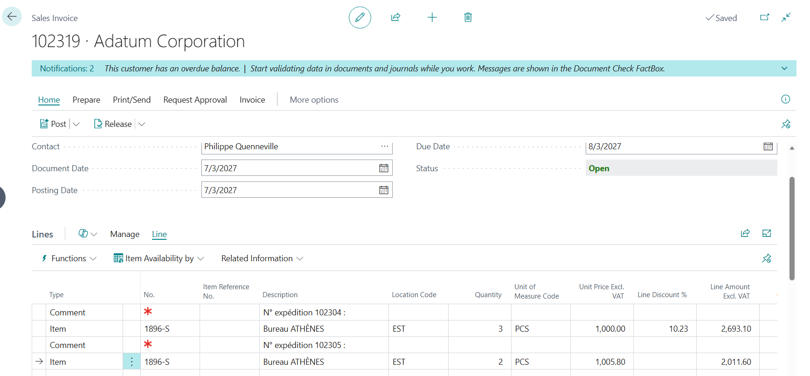

4. Post the Invoice

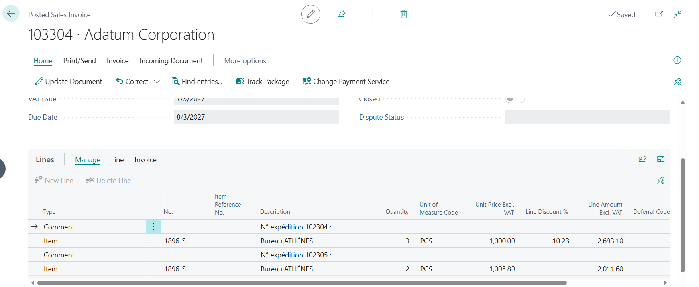

**N:B, Result on the sales order lines**

a) First Sales Order. Quantity Invoice 3. OK.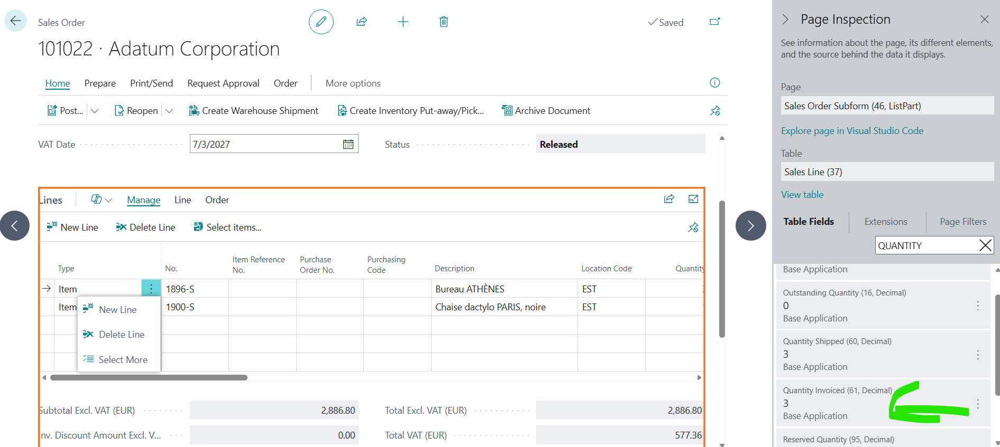

b) Second Order. Quantity Invoiced 2. OK!

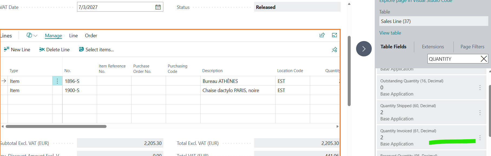

5.  I decide to do a Sales Credit Memo from the Posted Sales Invoice but instead of using “get Posted Document Lines to reverse” function, I will use

-“Copy Document function from the posted sales invoice”

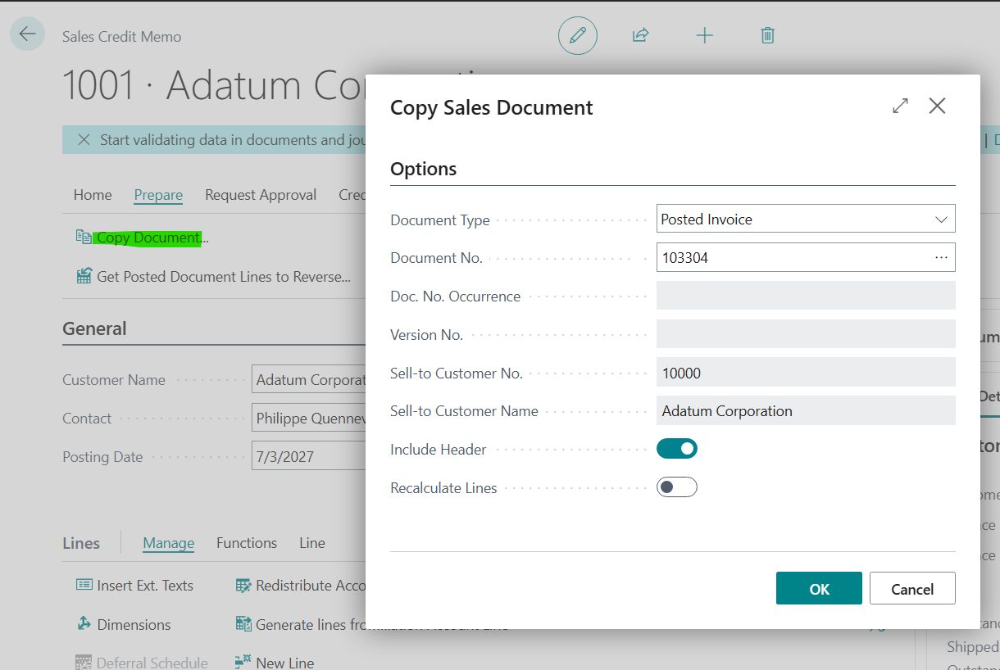

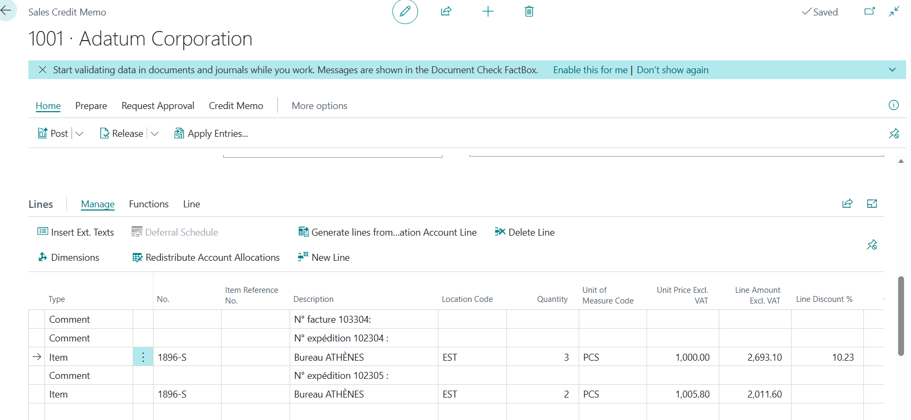

-Link generated automatically by the system to be applied to the copied invoice.

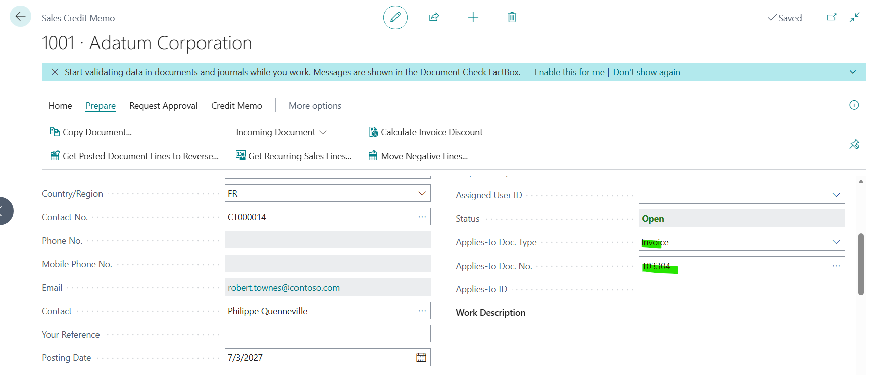

**When**

I post this document:

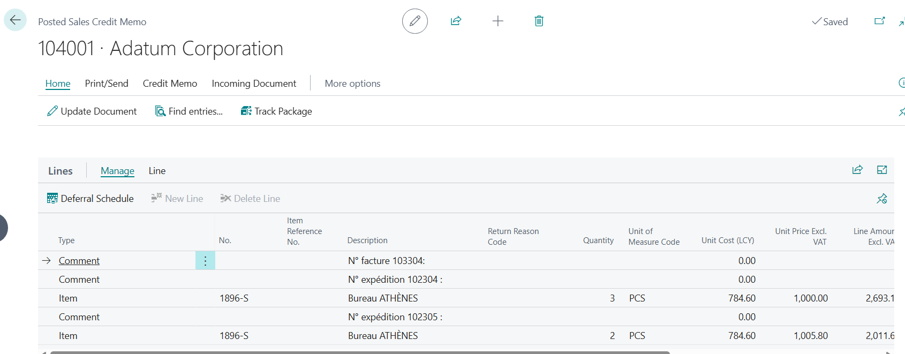

**Then :**

Result on the sales lines :

On the first Sales Order line : quantity shipped got decreased twice :

so we have a negative quantity shipped

same for quantity invoice.

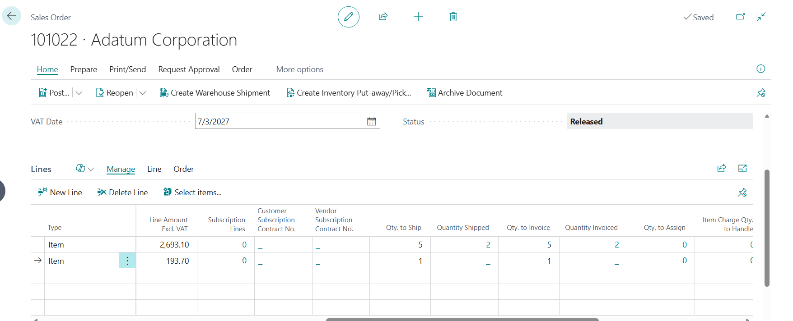

On the second Sales Order line : quantity shipped not decreased !

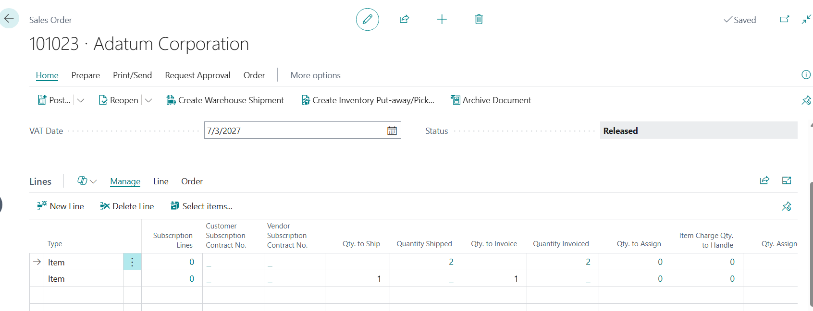

Impact :

We can see clearly with this example where same item is in two different sales order lines but invoiced in the same invoice, when we credit , system has difficulty to match each invoice line with original sales order line, causing applying twice the decrease on the same line

 

NB :  on other example I did, system decreased twice from the first SO and not the second SO. We have clearly an issue with this use case.

 

Note from developer ( Sylvain) on the business rules that the system uses :

When the cr. memo is posted, after posting is done there is an additionnal procedure to correct the sales order: for each posted cr. memo line, search the corresponding sales invoice line, then update the order sales line with the previous sales invoice line.

 

The important part here is finding the sales invoice line, let's divide it in two parts:

**first, the code that was always there**

1. look for item ledger entries with "Appl.-from Item Entry" from sales cr memo lines
2. if it is empty, look into the "value entry relation" with the posted cr memo "No."
3. if an item ledger entry has been found in the 2 previous points, then filter the value entries on "item edger entry no." with itemLedgerEntry."Entry No."
4. if a value entry has been found, filter the sales invoice lines with valueEntry."document no." and "document line no."
5. with salesInvoiceLine we have the link to the exact order line

 

**then, the code that was added in 27.4 or 27.5**

1. if nothing was found with the previous step, and only if "applies-to doc type" is an invoice on the cr memo
2. filter sales invoice lines with postedCreditMemo."Applies-to doc. No." and postedCreditMemoLine."No."
3. with this sales invoice line, if the item is unique it finds the right line, if there are multiple identical items it always finds the first

 

so, i suspect that before this change in 27.5 the sales order lines where not updated and kept their quantity shipped when using copy document (unless it was update by another way)

**Expected Outcome:**
Expected Outcome

**Actual Outcome:**
Actual Outcome

**Troubleshooting Actions Taken:**
I was able to reproduce the issue

**Did the partner reproduce the issue in a Sandbox without extensions?**Yes

## Description

Negative Shipped and Invoiced Quantities appear on Sales Order Lines after using the Copy Document from a Sales Credit Memo.
