# [Master][ALL-E]Issues with Service Contract Invoicing and Retrospective Billing--when the second unposted Service Invoice is deleted the values on the Service Contract are no longer reset--The "Invoiced to Date" field does not reset

## Repro Steps

Repro steps – Service Contract invoicing issue (BC
28.3, CH)

1. Create a new
   SaaS sandbox on Business Central 27.3, localization Switzerland
   (CH), using the Cronus demo data.
2. In Company
   Information,
   change User Experience from Essential to Premium.
3. Open Service
   Contract Templates and update template TEMPL0002 with the required values
   as per

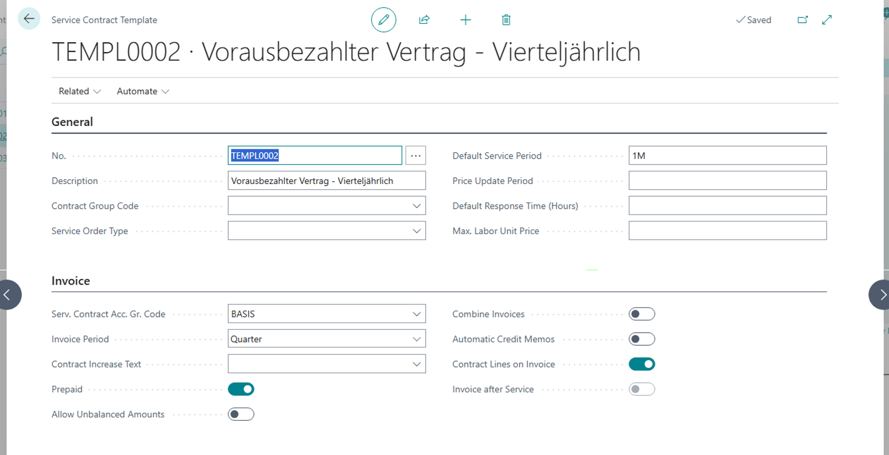

1. Create three
   Service Items for Customer 10000, all using Item No. S‑100.  
   These will later be referred to as Service Item A, B, and C.

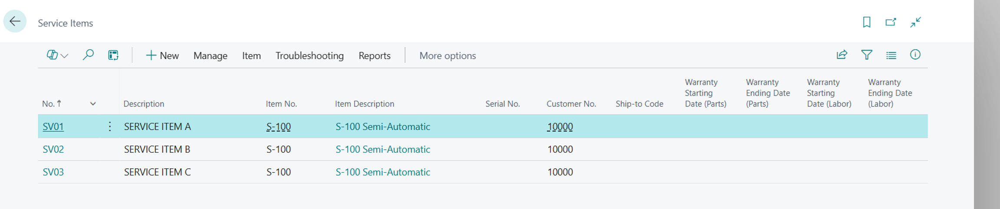

5.  Set
Work Date = 01/01/2026.

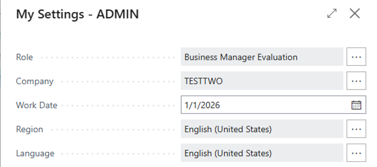

1. Create a new
   Service Contract for Customer 10000 using template TEMPL0002.  
   Add Service Item A to the Service Contract Lines with the
   specified values.

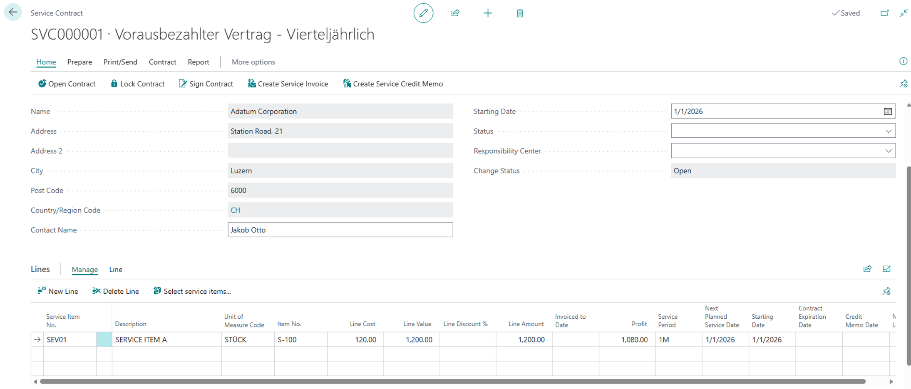

7.   Run
first action «Sign Contract», afterwards action «Create Service Invoice» and
then open the Service Invoice

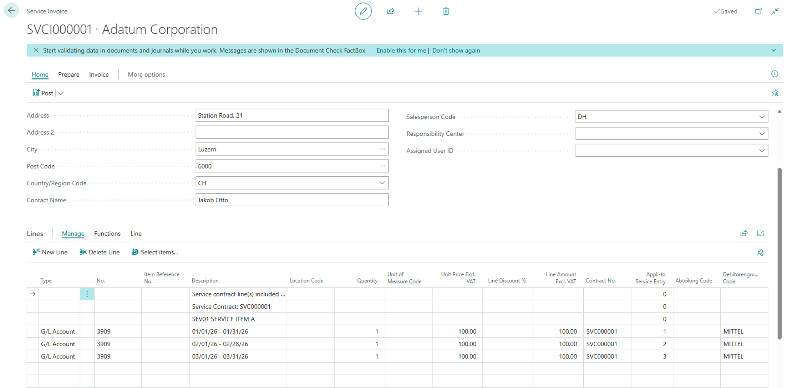

Since the Service
Invoice shows the expected values (one line for each month of the first
quarter), the invoice can be posted.

Add column «Invoiced
to Date» in Service Contract Lines via Profile Configuration.

8.   Change
Work Date to 02/01/2026

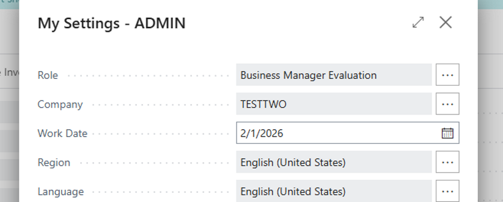

9.   Open
the Service Contract, run action «Open Contract» and insert Service Item B into
the Service Contract Lines with the following values

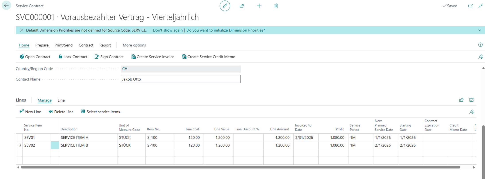

10.    Run
action «Lock Contract» and answer the two questions as follows

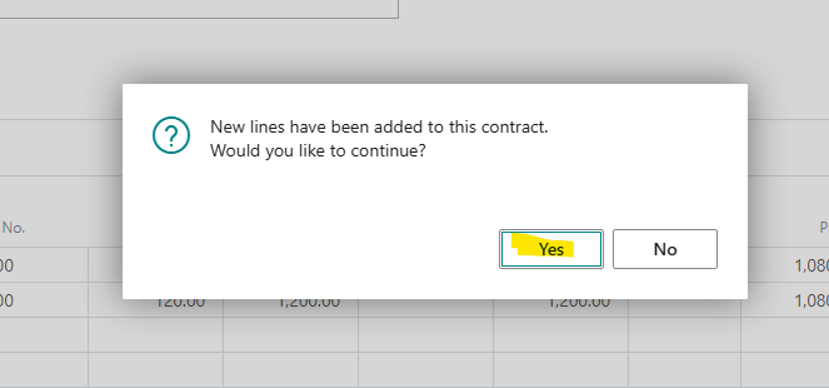

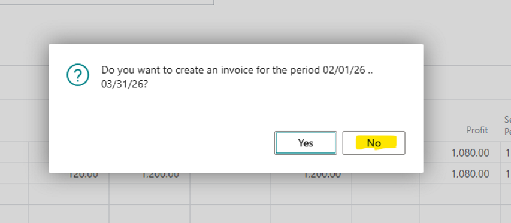

1. Change Work Date to
   03/01/2026

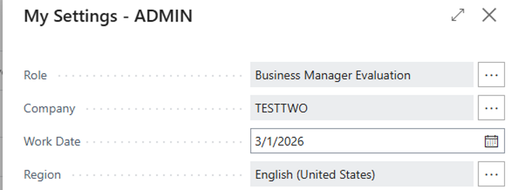

1. Open the Service Contract,
   run action «Open Contract» and insert Service Item C into the Service
   Contract Lines with the following values

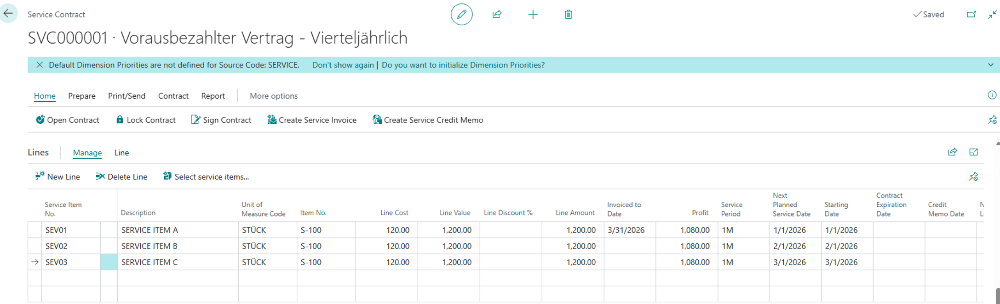

1. Run action «Lock Contract»
   answer the two questions as follows

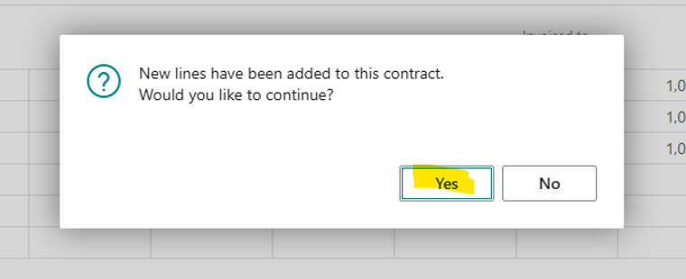

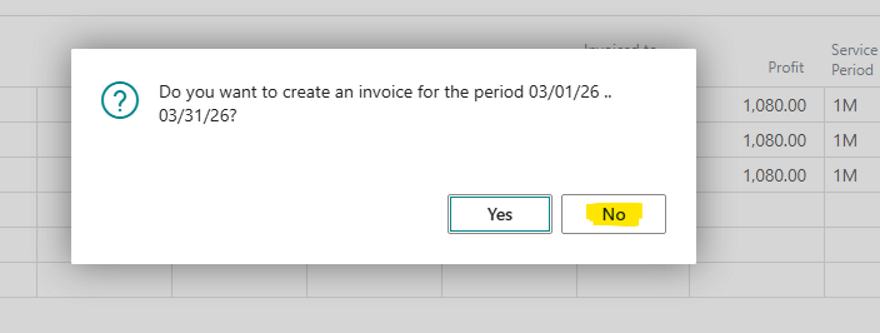

1. Change Work Date to
   04/01/2026

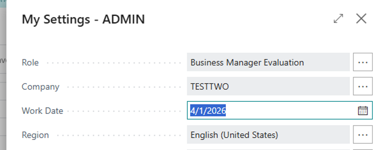

We are now ready to
invoice the service contract for the second quarter for all three service
items.

In addition, the
months of February and March of the first quarter are to be invoiced
retrospectively for Service Item B. Furthermore, the month of March of the
first quarter is to be invoiced retrospectively for Service Item C.

1. Run action «Create Service
   Invoice», answer the two questions as follows and then open the Service
   Invoice

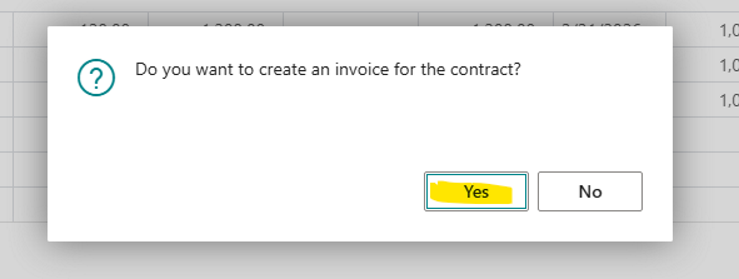

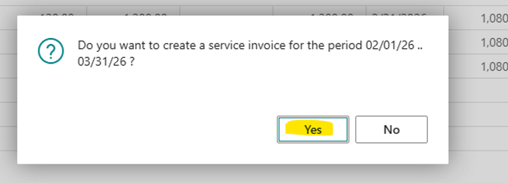

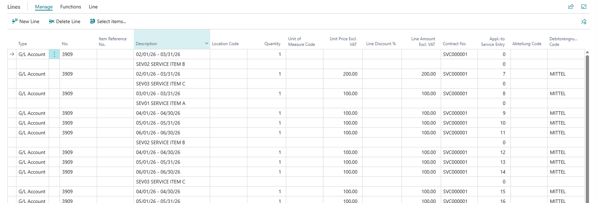

When the service invoice is deleted
for the first time instead of being posted, the previous invoice dates are be
restored according to the following message which works correctly.

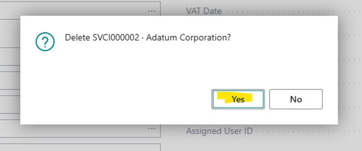

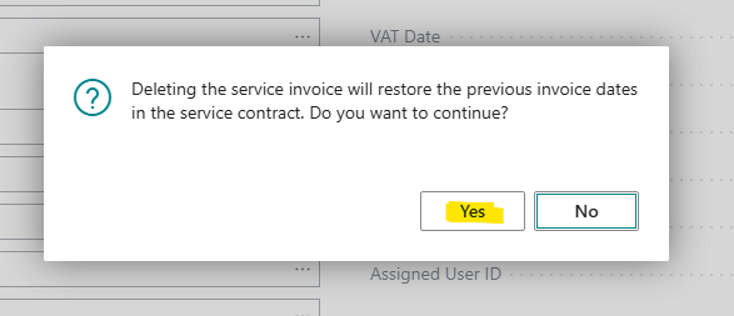

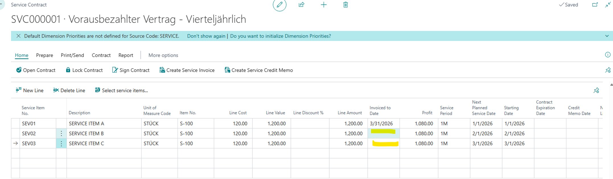

**PROBLEM:** If
the “Create Service Invoice” action is then executed again,

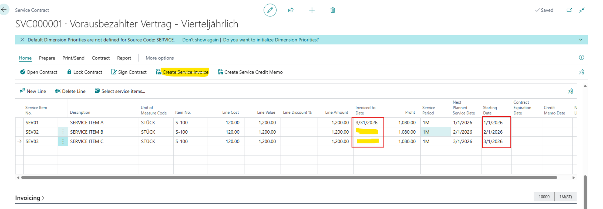

the months of
February and March are retrospectively recalculated for Service Items B and C.

However, when this
second unposted Service Invoice is also deleted, the values on the Service
Contract are no longer reset. The "Invoiced to Date" field remains
stuck at 3/31/2026 for Service Item B and Service Item C, which then prevents a
new Service Invoice from being created correctly (see screenshot below).

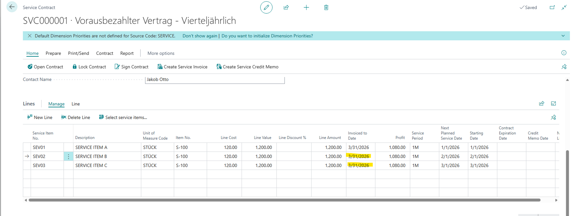

  
**Expected Outcome:**  
when this second unposted Service Invoice is also deleted, the values on the Service Contract should reset  
  
**Actual Outcome:**  
when this second unposted Service Invoice is deleted, the values on the Service Contract are no longer reset. The "Invoiced to Date" field remains stuck at 3/31/2026 for Service Item B and Service Item C, which then prevents a new Service Invoice from being created correctly   
  
**Troubleshooting Actions Taken:**  
Issue has been reproduced.  
  
**Did the partner reproduce the issue in a Sandbox without extensions?** Yes
