# [master] [All-e][FTE][SaaS] Inconsistent Non-Deductible VAT calculations on Purchase & Sales Invoices containing lines with Full VAT calculation type

## Repro Steps

1) VAT Setup > Enable the 'Non-Deducible VAT' option.

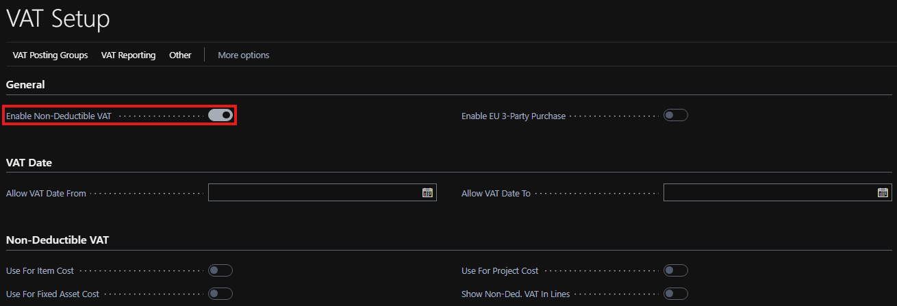

2) VAT Product Posting Groups > Create three 'Product Posting Groups'.

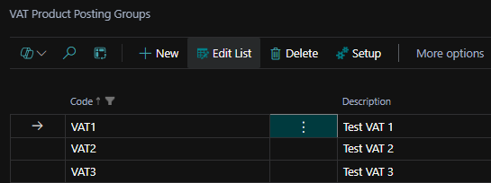

3) VAT Posting Setup > Assign the 'Product Posting Groups' to a 'Business Posting Group' > Set is as below.

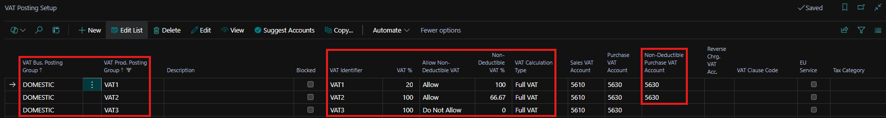

4) Chart of Accounts > Open '5630' > Make sure 'Direct Posting' is enabled > Set its 'Posting Groups'.

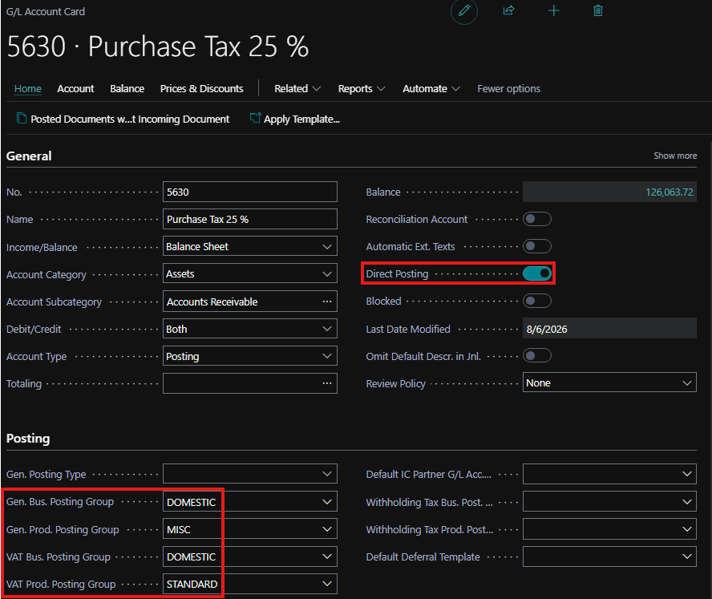

5) Create a Purchase Invoice > Select our 'G/L Account' > Select a different 'VAT Product Posting Group' for each line > Preview Posting.

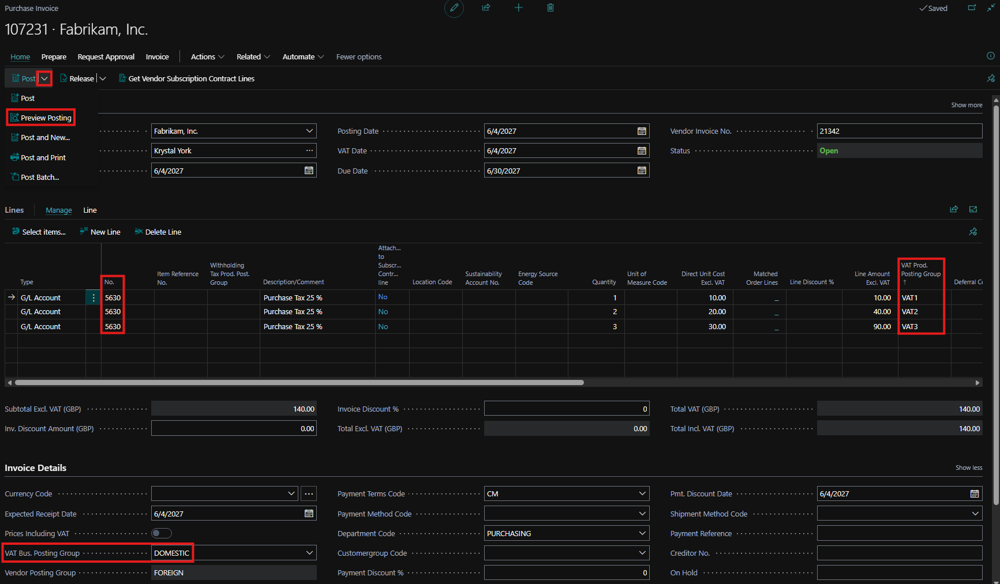

6) G/L Entry > The 'G/L Entries' aren't balanced out.

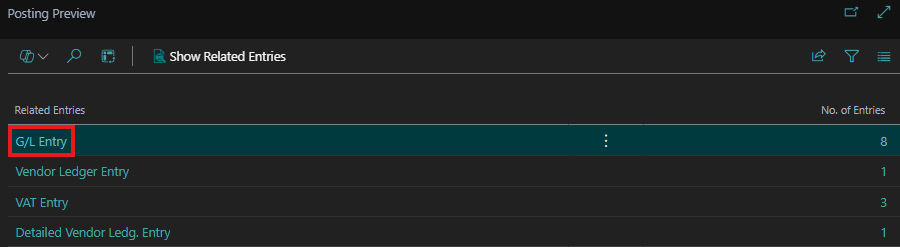

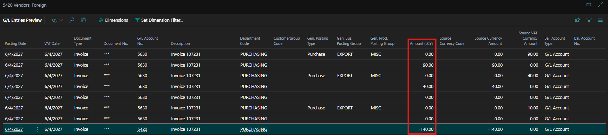

7) VAT Entry > The 'Non-Deductible VAT' is incorrect.

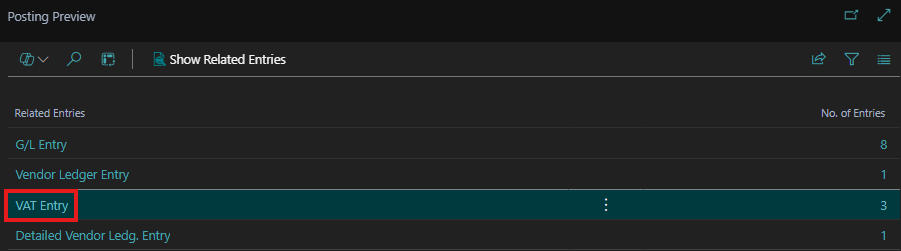

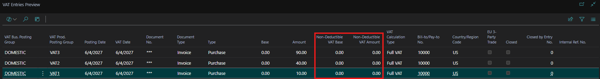

8) Post the Invoice > We get the below error.

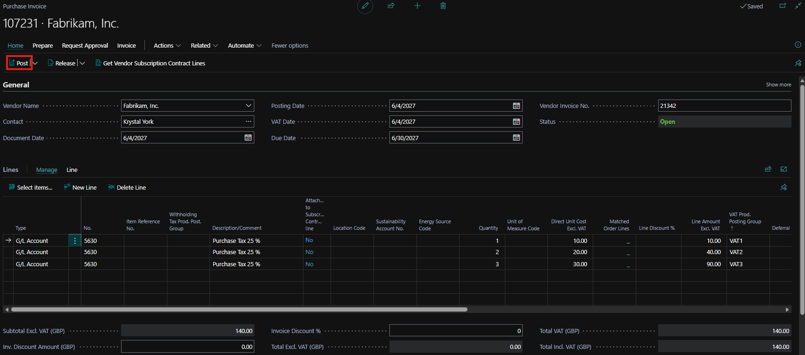

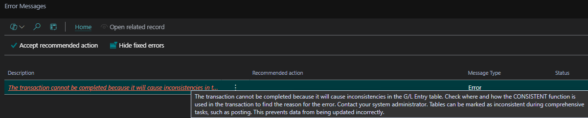

9) Error message: The transaction cannot be completed because it will cause inconsistencies in the G/L Entry table. Check where and how the CONSISTENT function is used in the transaction to find the reason for the error. Contact your system administrator. Tables can be marked as inconsistent during comprehensive tasks, such as posting. This prevents data from being updated incorrectly.

10) This issue partially occurs for 'Sales Invoices' as well.

11) Create a Sales Invoice > Select the 'Sales G/L Account' > Select a different 'VAT Product Posting Group' for each line > Preview Posting.

12) The 'G/L Entries' are balanced.

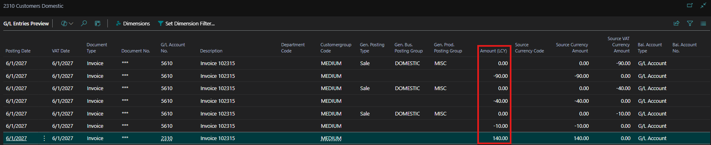

13) The 'VAT Entries' are showing incorrect 'Non-Deductible VAT'.

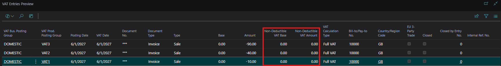

14) This issue doesn't occur when we set 'VAT Calculation Type' to 'Normal VAT'.

**Expected Outcome:**

The customer expects the Non-Deductible VAT to get calculated properly when the 'VAT Calculation Type' is set to 'Full VAT'.

**Actual Outcome:**

The Non-Deductible VAT doesn't work when 'VAT Calculation Type' is set to 'Full VAT'.

**Troubleshooting Actions Taken:**
Tried the same flow in an extension free environment and faced the same outcome.

**Did the partner reproduce the issue in a Sandbox without extensions?** Yes
