# [master] [all-e]Adjustment Amount is not accurate in the Exch. Rate Adjmt. Ledger Entries page if an Unrealized Gain gest registered and a second adjustment turns into a Loss.

## Repro Steps

Reproduced in CRONUS at W1 level and local versions 28.4

(next repro tested in ES 28.4)

**REPRO STEPS:**  
  
Local Currency = EUR  

1-Go to Currencies and select USD

Currency Exchange Rates

04/07/2026     EUR 1 : USD 1.1525

05/31/2026     EUR 1 : USD 1.1628

07/31/2026     EUR 1 : USD 1.1522

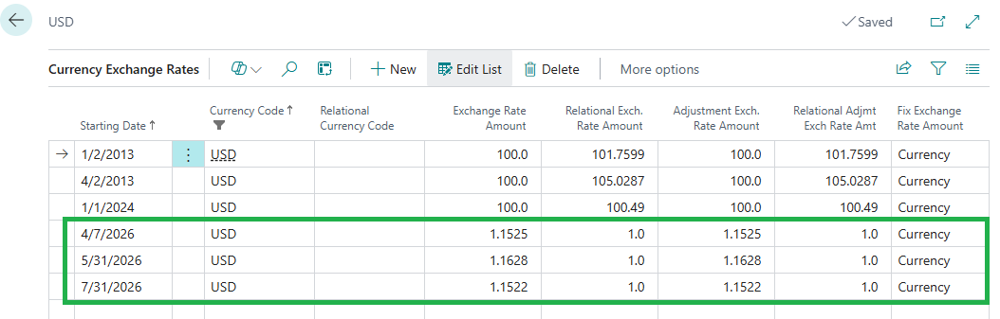

Also fill the Unrealized Gains Acc. / Unrealized Losses Acc.  
  
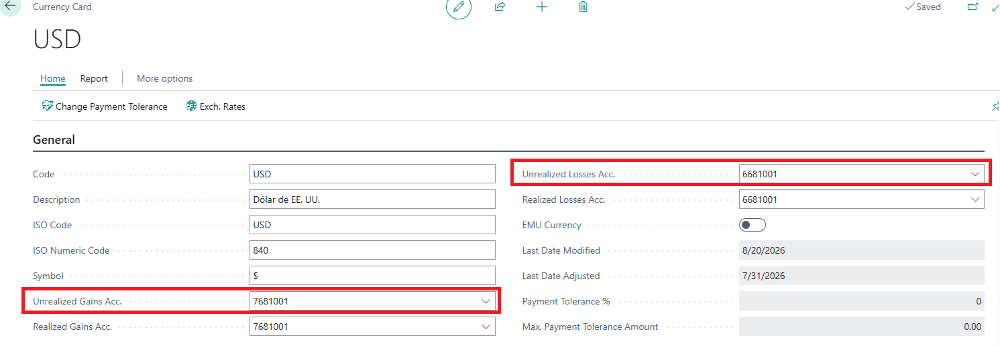

2.Go to Purchase Invoices and create a new one:  
-Vendor 5000  
-Posting Date = 04/07/2026

-Currency Code: USD

-VAT Prod. Posting Group: NO VAT  
-USD Amount = 3.300  (EUR Amount = 2.863,34)

Post it.  
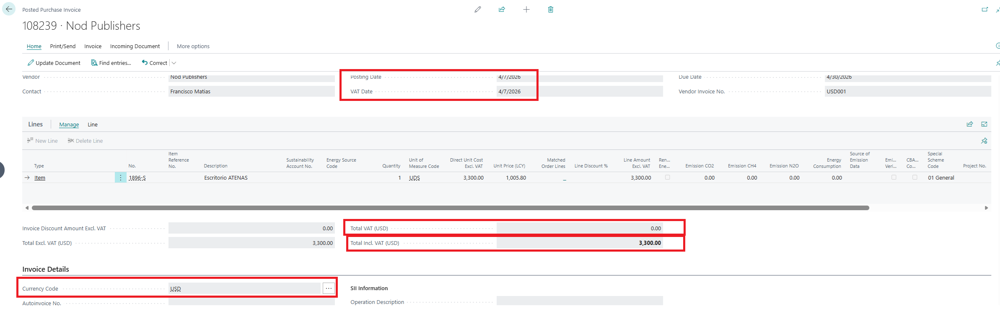

3.Go to Exchange Rate Adjustment:  
-Starting Date, Ending Date, Posting Date: 05/31/2025

-Document No.: ADJ001

-Filter on Currency: USD

Unrealized Gain           25,36

Entry No. 612 on the Detailed Ledger Entries.

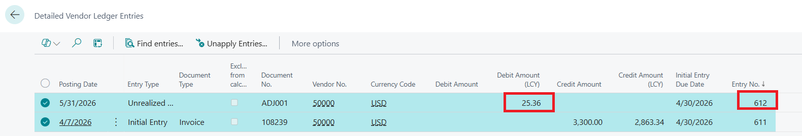

4. Go to the Exch. Rate Adjmt. Ledger Entries page and check the entry created:  
  
SOME ISSUES in RED:  
  
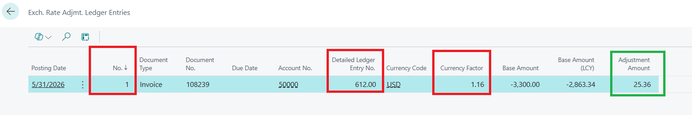

- “No.”

One might think this is the number of the Exchange Rate Adjustment Ledger Entries. In fact, however, it is the record number from the Exchange Rate Adjustment Register.

Therefore the caption of “No.” should be changed or clarified.

- “Detailed Ledger Entry No.”

This value appears as a decimal, but should appear as an integer (without decimal places).  
Check Detailed Ledger Entries in previous step. It is just 612, not 612,00

- “Currency Factor”

The currency factor should be shown with 4 or 5 decimals, like it is shown in page inspection

Adjustment Amount 25.36 is okey!

Also the Exchange Rate Adjustment Register is okey:  
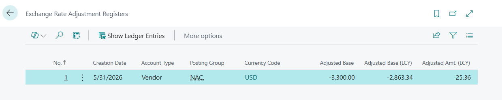

4.Go to Exchange Rate Adjustment again:  
-Starting Date, Ending Date, Posting Date: 07/31/2025

-Document No.: ADJ002

-Filter on Currency: USD

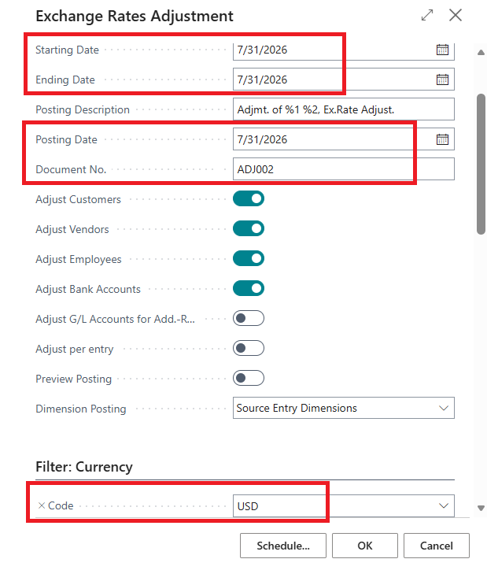

Unrealized Loss           26.11  (25.36 + 0.75)  
  
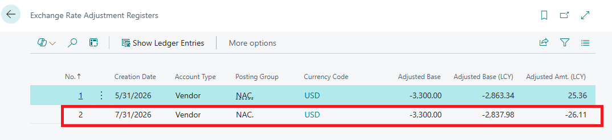

Entry Nos. 613 and 614 on the Detailed Ledger Entries.

Since the exchange rate adjustment amount changes from a total gain resulting from the exchange rate adjustment as of May 31, 2026, to a total loss (as of July 31, 2026), the gain of 25,36 originally recorded is first reversed (with the amount of -25,36), and then, in a subsequent step, the remaining loss is recorded in a separate entry (with the amount -0,75).

The Detailed Vendor Ledger Entry and also the G/L Entries are correct !!!

5. Go to the Exch. Rate Adjmt. Ledger Entries page.

=================  
ACTUAL RESULTS

=================

Adjustment Amount is not accurate in the Exch. Rate Adjmt. Ledger Entries page if an Unrealized Gain gest registered and a second adjustment turns into a Loss.

The issue here is, that the first Exchange Rate Adjustment Ledger Entry of the second adjustment shows an incorrect Adjustment Amount.

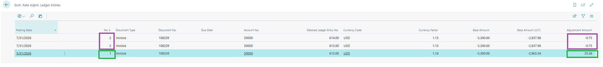

(NOTE that Detailed Ledger Entry 613 shows -25.36 and not -0.75, too)

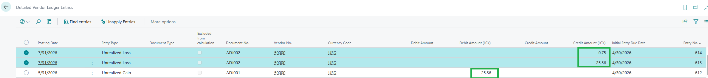

=================  
EXPECTED RESULTS

=================

Instead of -0,75 the Adjustment Amount must be shown as -25,36

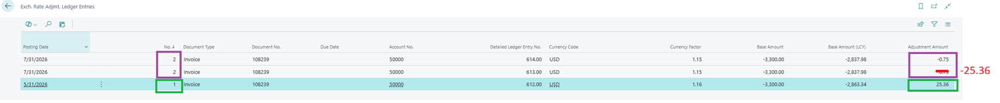

## Description

Adjustment Amount is not accurate in the Exch. Rate Adjmt. Ledger Entries page if an Unrealized Gain gest registered and a second adjustment turns into a Loss.
