# [master] [All-e]Subscription Contract Price Update applies the lowest sales price across all Unit of Measure codes instead of respecting Unit-Specific Price List entries in Subscription Billing.

## Repro Steps

Tested at W1 level.

1.Navigate to Feature Management and enable New sales pricing experience.

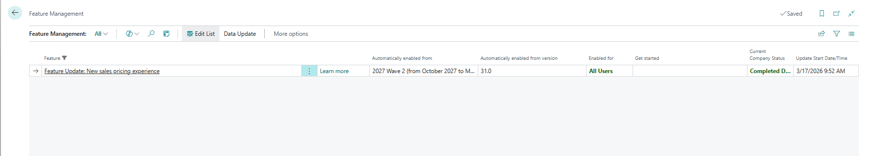

2.Navigate to Extension Management >
Subscription Billing

Subscription Billing Demo Data are installed.

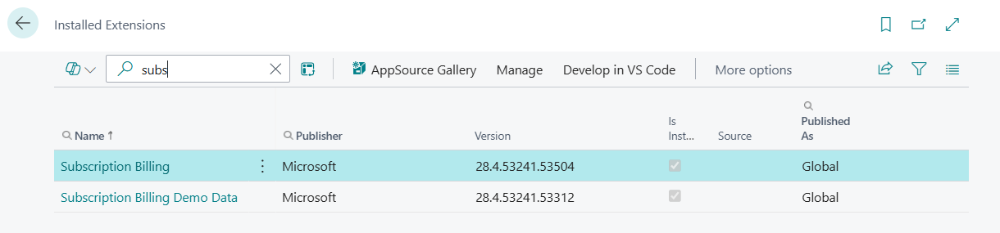

3.Create the required Subscription Contract Nos (new No Series. or valid existing ones) and assign them under Subscription Contract Setup - Number Series tab:

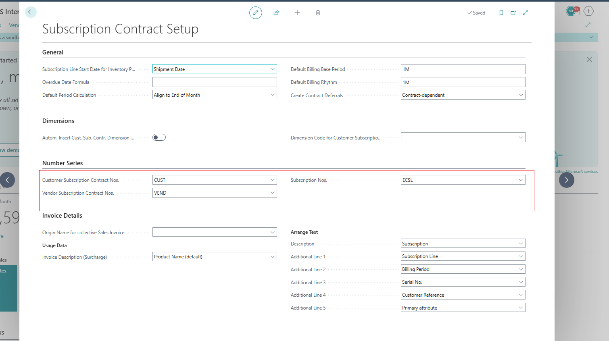

4.Navigate to Items and create a new Non-Inventory Item configured as a Subscription Item.

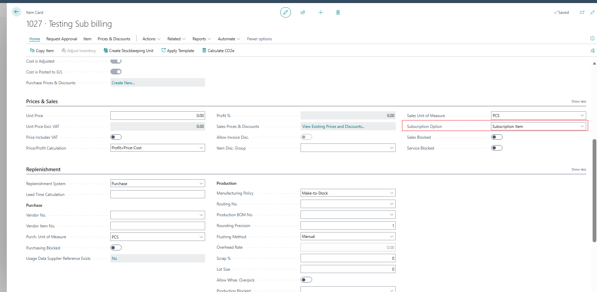

5,Open Related > Item > Units of Measure and create two Unit of Measure codes.
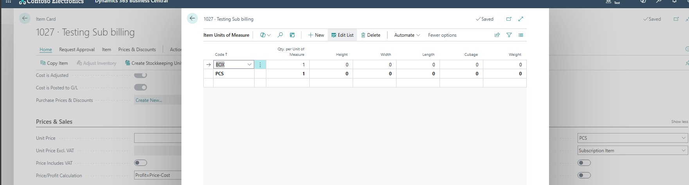

6. Navigate to Sales Price Lists and create a new Sales Price List.

7. Enable Allow Updating Defaults

8.Add two price list lines for the same item using different Unit of Measure codes.

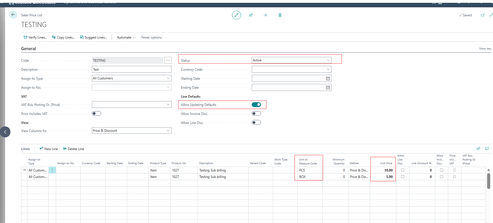

9.Create a new Customer Subscription Contract.

10. Add one contract line for each Unit of Measure and ensure the correct Unit of Measure is selected on each line.

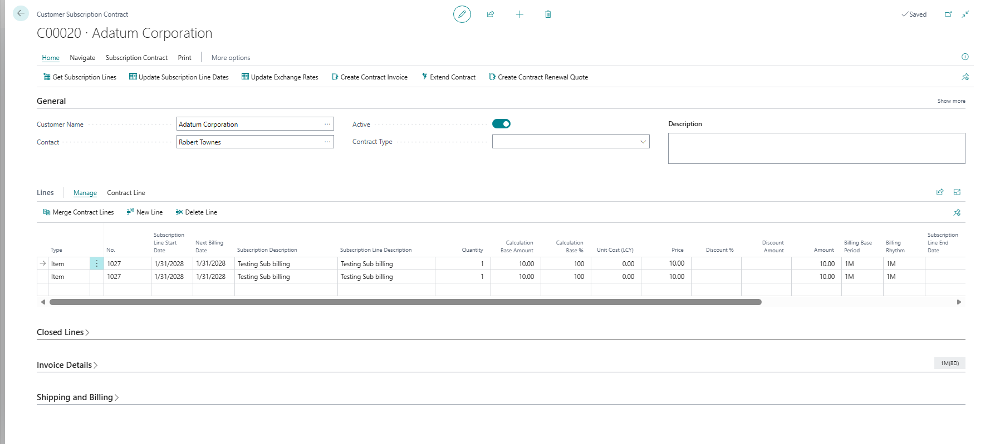

To modify the Unit of Measure for the second line, click on the Subscription Description assist edit button and modify the Unit of Measure to BOX in there:

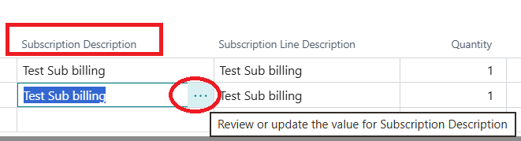

11.Search for Subscriptions and verify that two subscriptions are created.
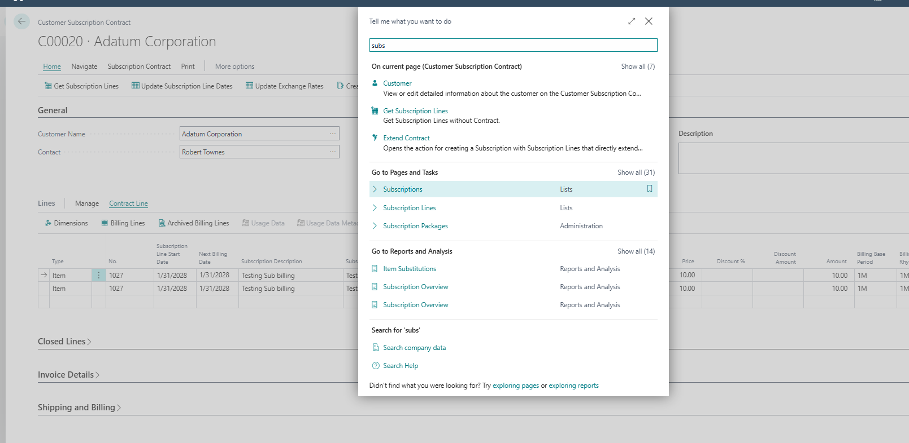
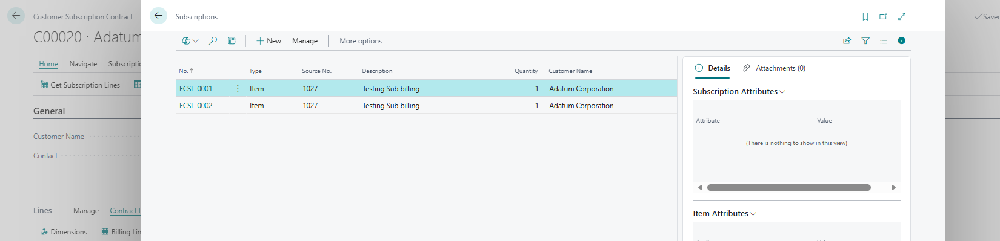

12. Confirm that each subscription has a different Unit of Measure.
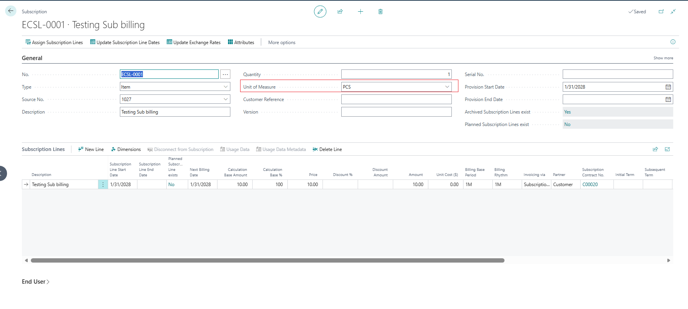
For the Other one:
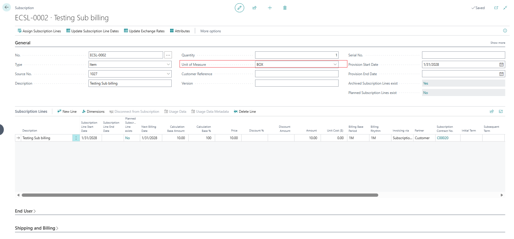

13.Navigate to Subscription Contract Price Update.
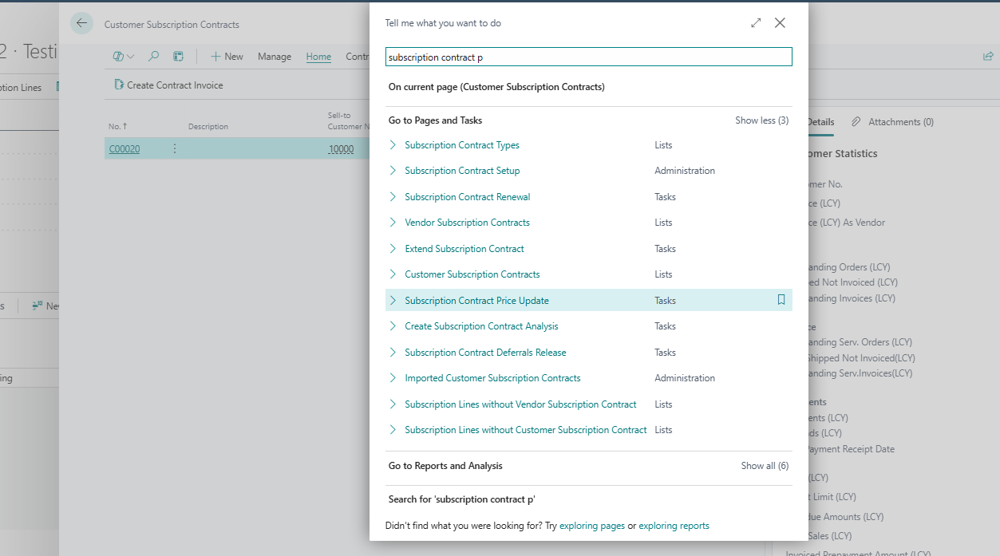

14.Create a Price Update Template.
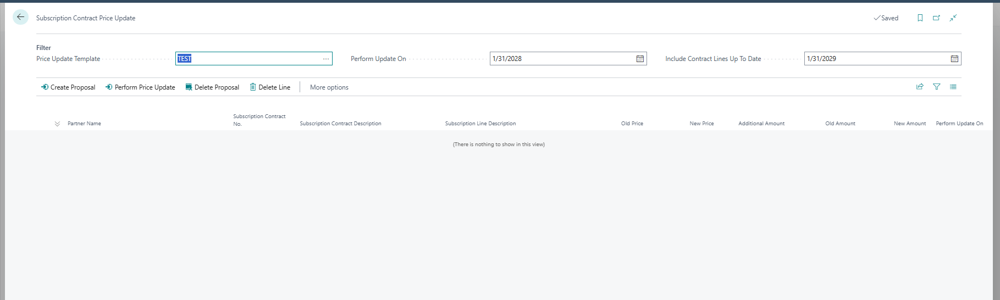

Assign to the Price Update Template the Method: Recent Item Prices:

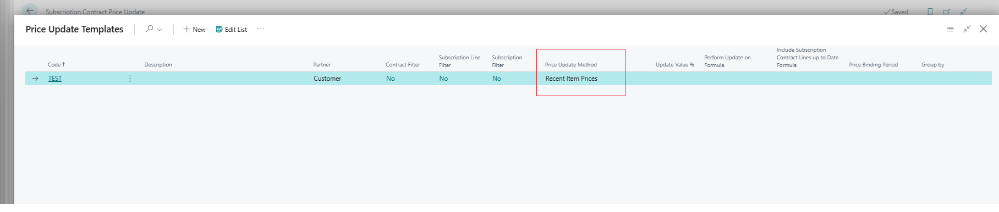

15.Now return to the lines and make sure to match the subscription date when making the perform Update on date I've made it as 1/31/2028 and Include Contract Lines Up To Date 1/31/2029 and create proposal.
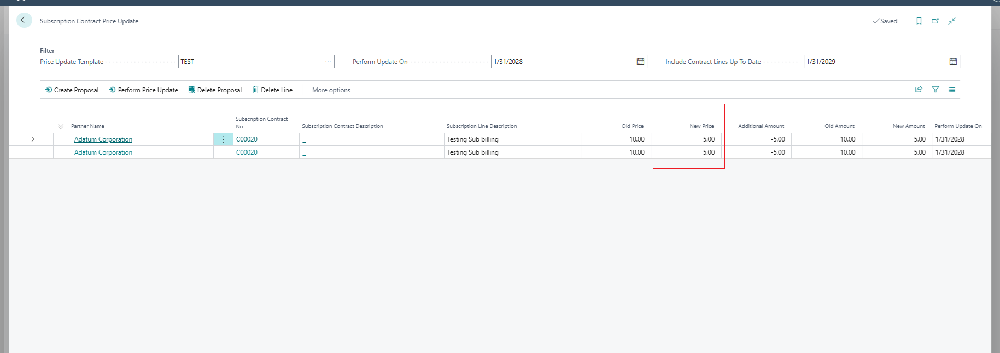

**Expected Outcome**

1. The Subscription Contract Price Update proposal should evaluate the Sales Price List entry that matches the Unit of Measure assigned to each subscription line.
2. Each subscription line should receive the corresponding price from its matching Unit of Measure price list entry.

**Actual Outcome**

1. The Subscription Contract Price Update proposal applies the lowest available price to all subscription lines.
2. Unit of Measure-specific prices are ignored.
3. All subscription lines receive the same lowest price regardless of the Unit of Measure assigned to them.

## Description

The issue occurs when Subscription Contract Price Update is executed using the "Recent Item Prices" method. Although separate prices exist for different Units of Measure on the same item, the proposal generation process applies a single price to all contract lines. The selected Unit of Measure on the contract line is not considered during price determination, resulting in all lines receiving the same price, typically the lowest available price.
