# [For AI fix] Matched Order Lines functionality could lead to inconsistent information if we deal with very similar Purchase Orders.

## Repro Steps

1- Post 'Receive' two exact purchase orders with the same Vendor, location, item and quantity:

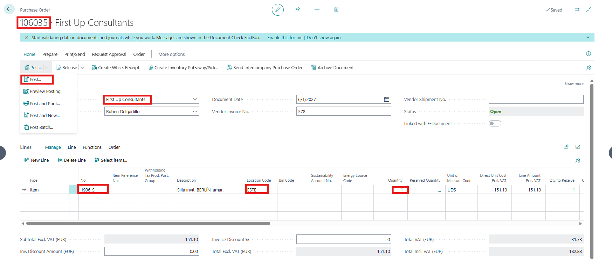

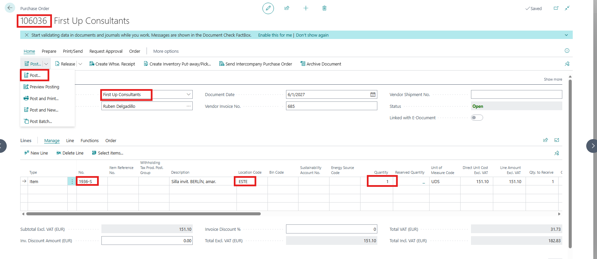

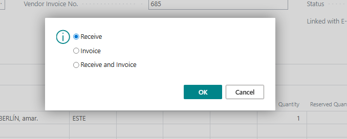

2- Open the Posted Purchase Receipt lines and you will see that there is two Receipts document '107245' that is related to the Purchase order '106035' and '107246' that is related to purchase order '106036'

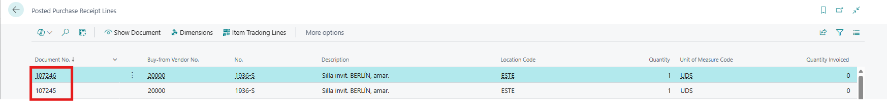

3- Open a new Purchase Invoice and select the vendor that has been used in the Purchase Orders and then click on 'Line' > 'Functions' > 'Get Receipt Lines':
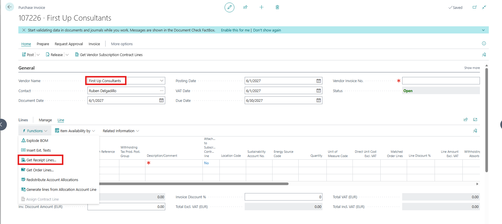

4- Select one of the two posted purchase receipt. In this example I have selected '107245'
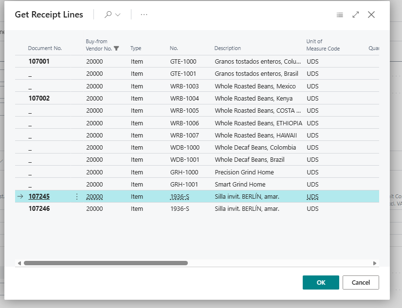

5- Click on 'Related Information' > 'Matched Order Lines'
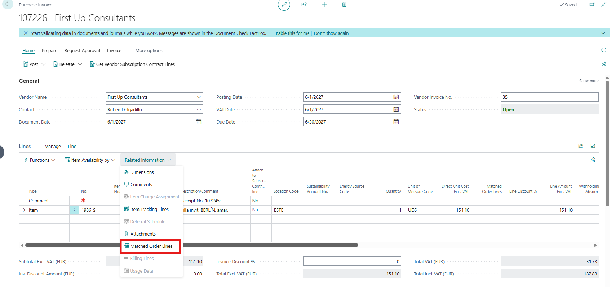

6- Click on 'Get Order Lines':
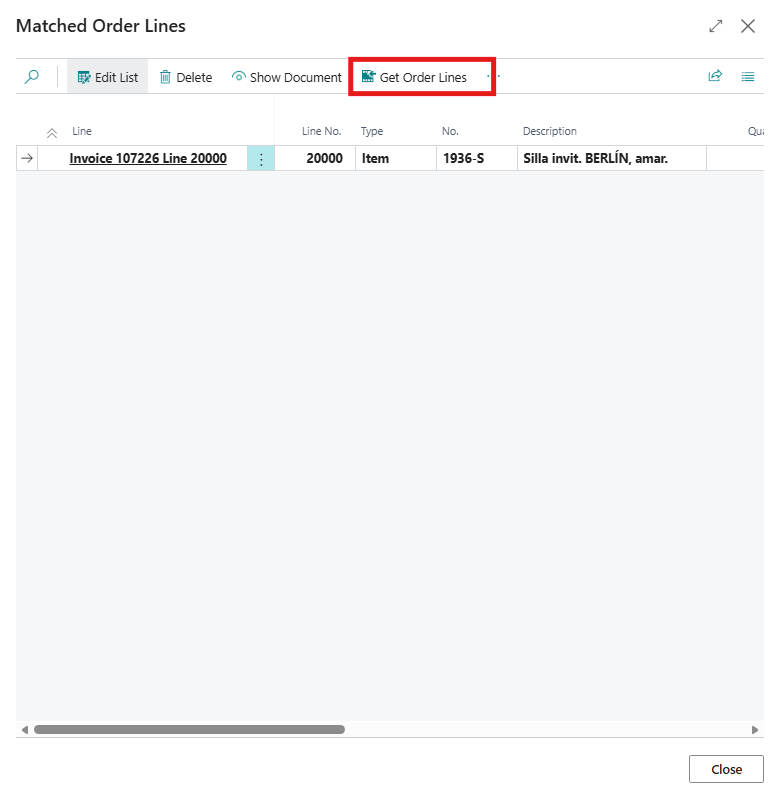

7- Select the order that is **not** related to the previously selected Posted Purchase Receipt. Since receipt **107245** is linked to order **106035**, so select order **106036** in this step. (The user is not doing this intentionally. However, this mistake can occur because the two purchase orders are identical.)
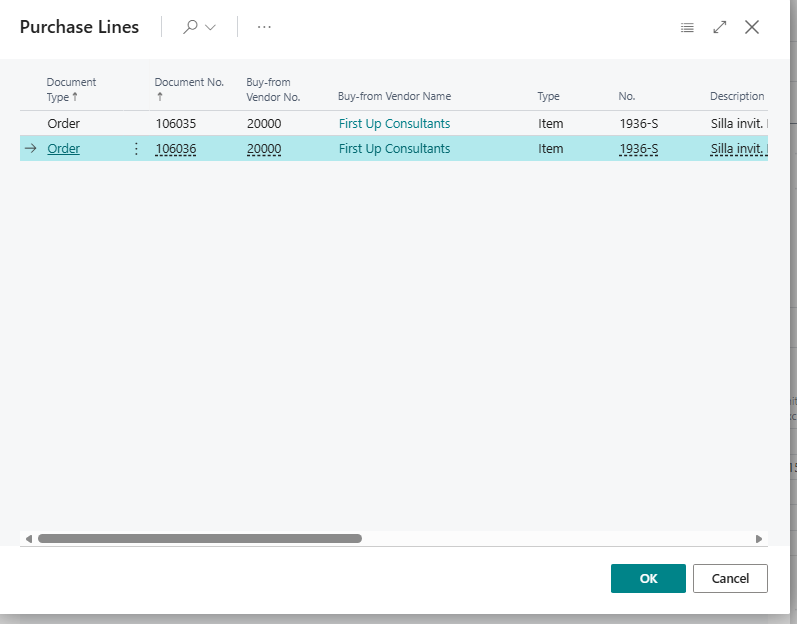

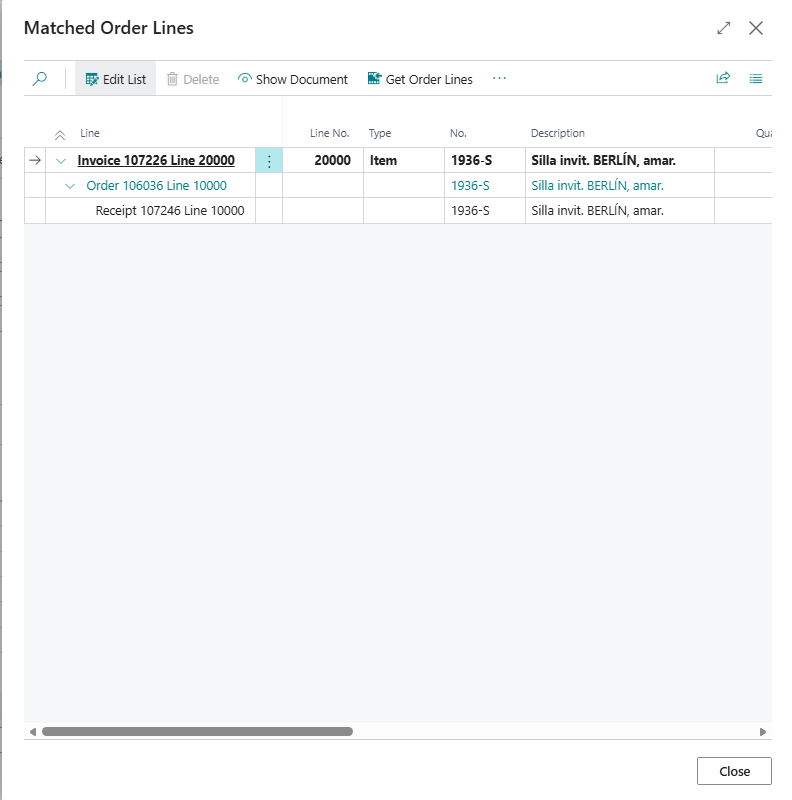

8- Post this purchase invoice.

9- Open the two purchase orders that were created in the first step:
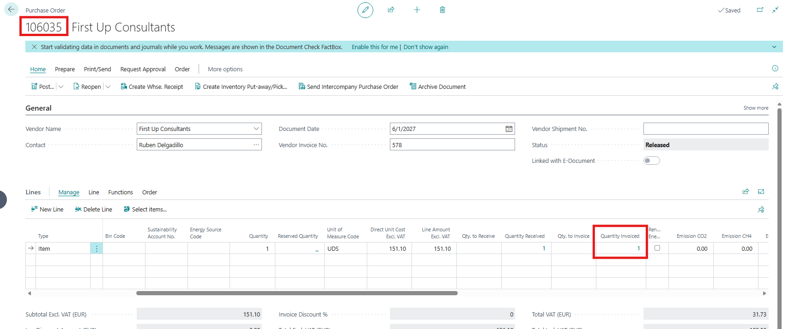

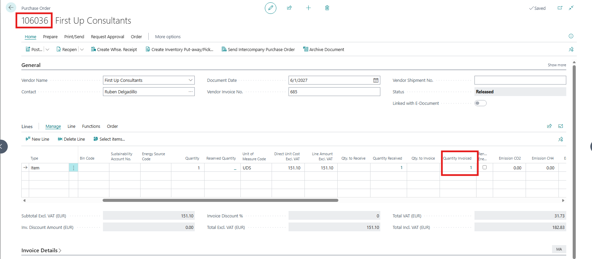

As you can see, both items appear as invoiced, even though only one item has actually been invoiced.

10- Open the 'Posted Purchase Receipt Lines':
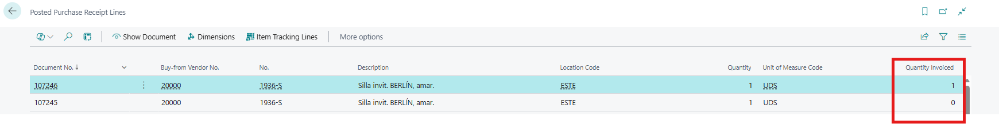

As shown, only one item has been invoiced, despite the purchase order indicating that both items were invoiced.

**Expected Outcome:**

The system should prevent the user from selecting a purchase order that is not related to the Posted Purchase Receipt that was selected on the Purchase Invoice.

**Actual Outcome:**
The system is not preventing the user from selecting a purchase order that is not related to the Posted Purchase Receipt that was selected on the Purchase Invoice.

**Troubleshooting Actions Taken:**
We have replicated the issue on our side and we couldn't find any similar reported issues

**Did the partner reproduce the issue in a Sandbox without extensions?**Yes

## Description

Matched Order Lines functionality could lead to inconsistent information if we deal with very similar Purchase Orders.
