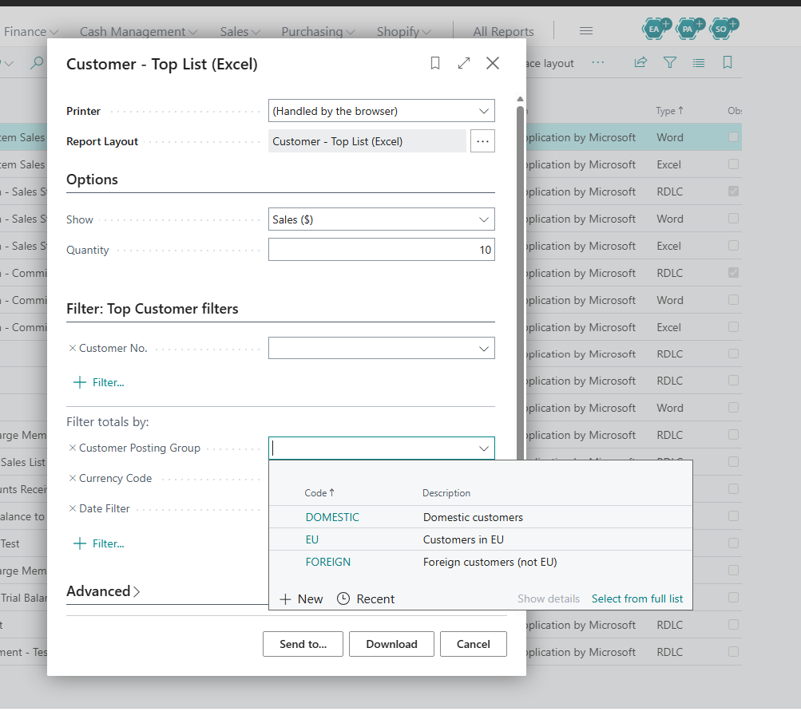

# DCLE "Posting Group" shouldn't be the one that Excel reports use to filter (top customers, top vendors)

## Description

yammer reported, the filter should use the customer and get the ones affected as a first pass.

"Posting Group" was a column added in v20.0. We can't ensure that it will have the right values. If you try to run 

the filter won't work for some cloud migrated companies, because this column was not backfilled, the idea in this bug is that we can handle the filter on the buffer by first filtering the applicable customers, and then setting such customers directly as filters
