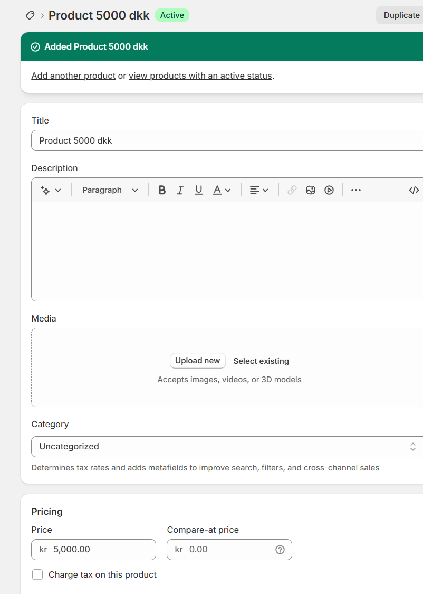
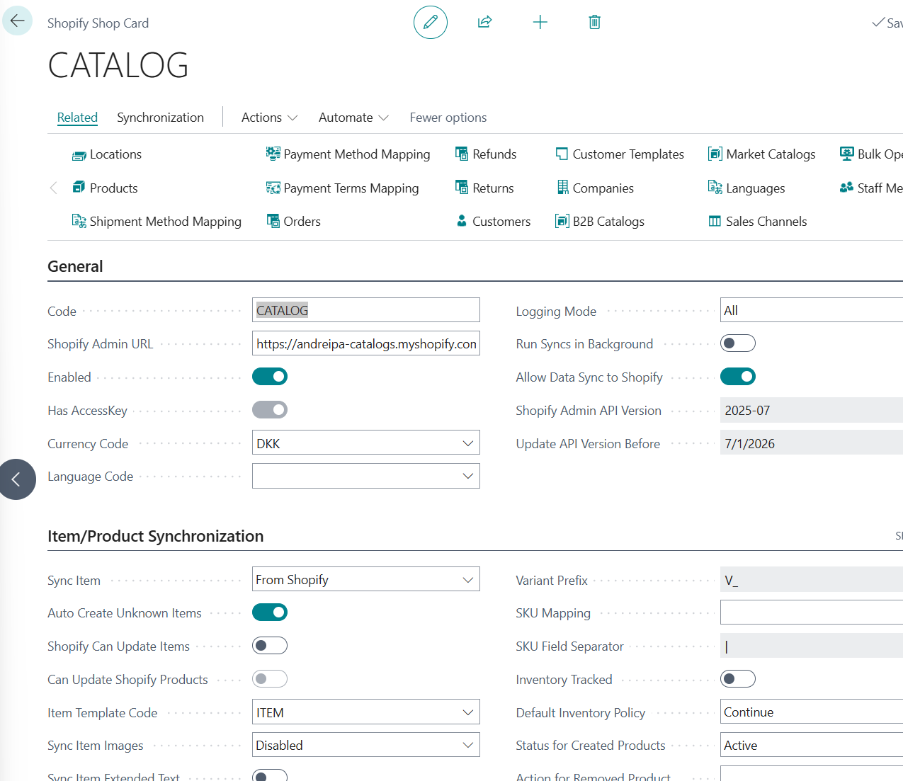
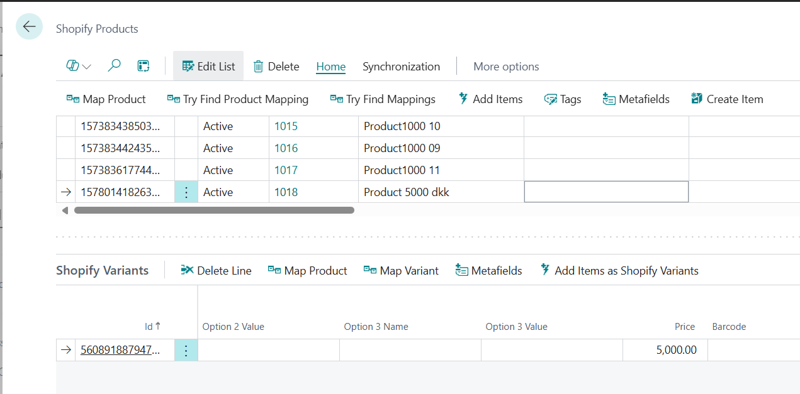
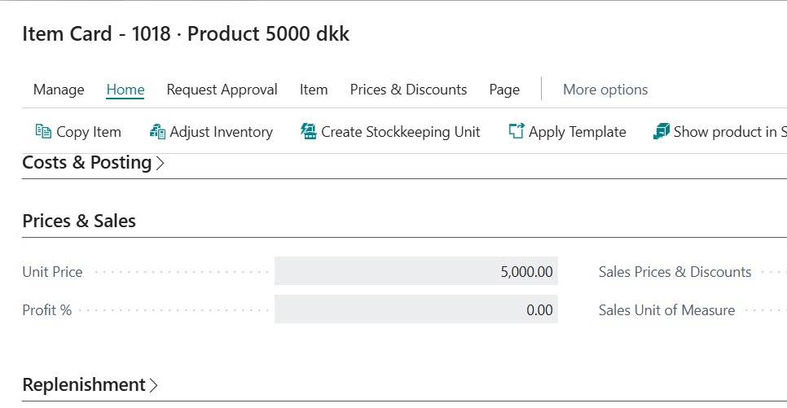
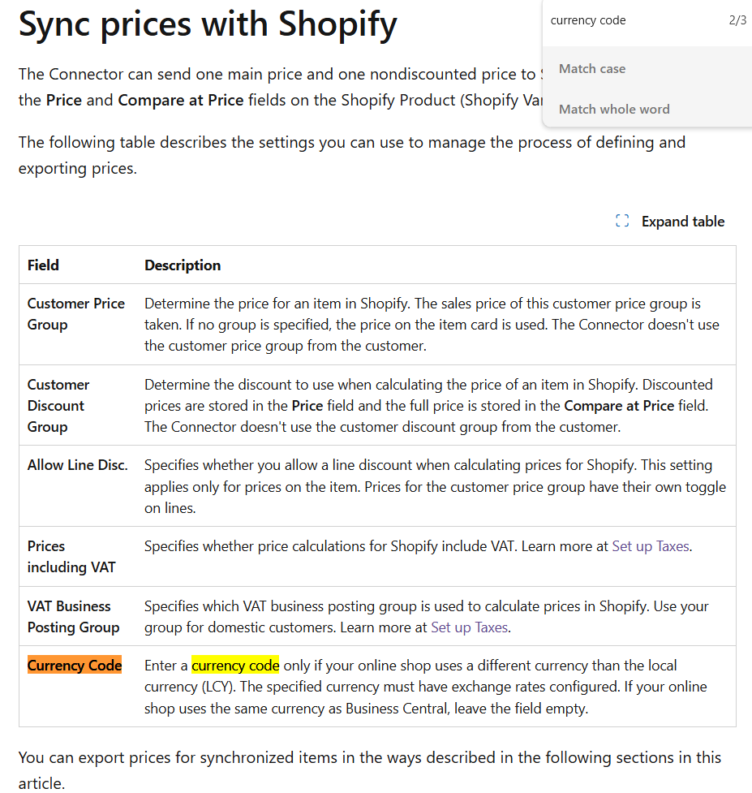

Title: Shopify - import from Shopify and create Item logic ignores Shopify Shop currency
Repro Steps:
Shopify store with currency DKK (andreipa-catalogs)
create product with price 5000 (or any other item)

In BC
Currency Code = DKK.
Sync Item = From Shopify
Auto Create Unknown Items = Yes
Item Template Code = ITEM (something)

Run Sync ITems. Explore created items.
Notice that Price in the item card is 5000, but it should be 5000 converted from DKK to USD with exchange rate.

(this is correct as this is price we imported)
but in created item it is also 5000

Also when export items, the price is not recalculated.
I see same behavior in 26.4 so it is not recent regression.  But I'm pretty sure it worked differently in the past:
Synchronize items and inventory - Business Central | Microsoft Learn
[Sync prices with Shopify](https://learn.microsoft.com/en-us/dynamics365/business-central/shopify/synchronize-items#sync-prices-with-shopify)

Description:

## Hints

I mean this part:
src/Apps/W1/Shopify/App/src/Products/Codeunits/ShpfyCreateItem.Codeunit.al

if ShopifyVariant."Unit Cost" <> 0 then
            Item.Validate("Unit Cost", ShopifyVariant."Unit Cost");

if ShopifyVariant.Price <> 0 then
            Item.Validate("Unit Price", ShopifyVariant.Price);

We need to wrap it with currency exchange

should be "1 liner"
App/Layers/W1/BaseApp/Finance/Currency/CurrencyExchangeRate.Table.al
    procedure ExchangeAmtFCYToLCY(Date: Date; CurrencyCode: Code[10]; Amount: Decimal; Factor: Decimal): Decimal

I would check usages in BaseApp like this:
BankAccCurrentBalanceLCY :=
                      Round(
                        CurrExchRate.ExchangeAmtFCYToLCY(
                          WorkDate(), Currency.Code, "Balance at Date",
                          CurrExchRate.ExchangeRate(
                            WorkDate(), Currency.Code)));
