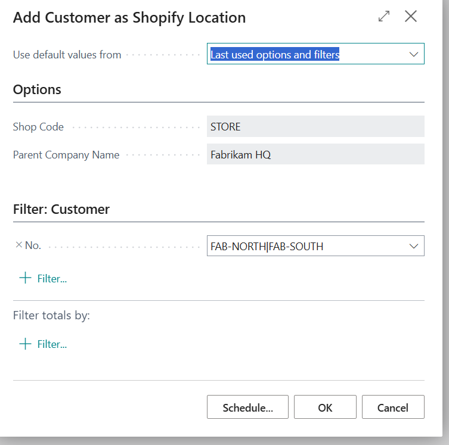
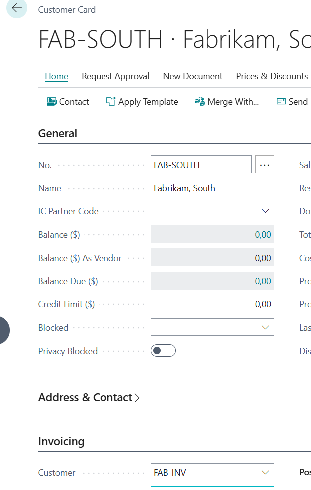
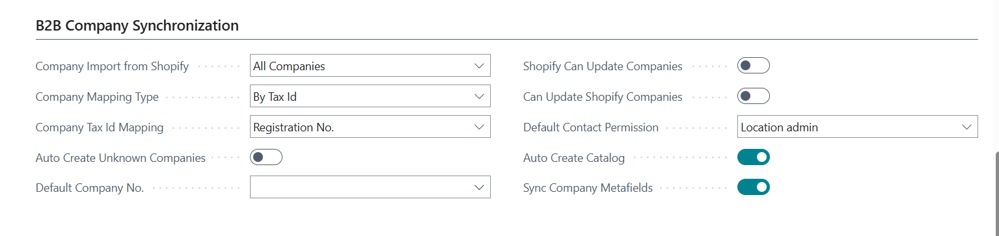

# Title: Shopify - Export customer as location - Sell-to and Bill-to are missing
## Repro Steps:
repro - not  sure, please assign back if you cannot repro

I exported two companies.
One is normal and another one has another (third) defined as bill-to.

Shopify Shop

## Description:
