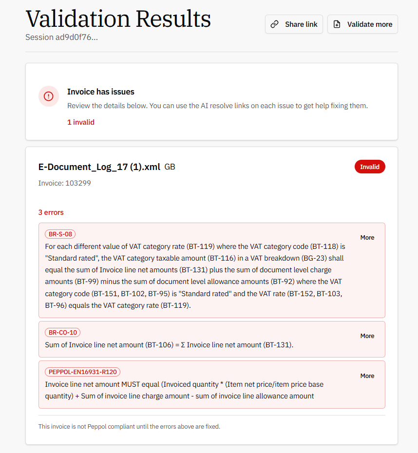

# Title: [master][All-e]Peppol E-Invoice  cannot be validated when price incl VAT is used in a document
## Repro Steps:
1.  Go to Company Information and add a SWIFT Code (you need to created a new one, but it can be any number)
2.  Go to E-Document Services and open the E-DOCUMENTS
    Document Format should be PEPPOL BIS 3.0
3.  In the E-Document Service use buton "Configure documents to export" and add the sales invoice
4.  Go to Electronic Document Formats and make sure you have the setup for PEPPOL BIS3 / Sales Invoice / Codeunit 1610
5.  Go to Workflows and make sure you have the default workflow for "Send E-Documents to one Service" enabled
6.  Go to Document Sending Profiles, check E-DOCUMENTS and make sure this uses
    Electronic Document = E-Document Workflow
    E-Document Workflow = MS-EDOCSTOS-01 (the one from step 5)
7.  Open Customer Card 10000 and change the following:
    Document Sending Profile = E-DOCUMENTS
    VAT Registration No = GB123456789
8.  Create a new Sales Invoice for customer 10000
    Posting / Document Date = (use the suggested ones)
    Your Reference = TEST
    Price Incl VAT = YES
9.  Now add a new line to the sales invoice:
    1x item 1896-S
10.  Post the Sales invoice with option Post and Send
11.  Go to E-Documents 
    The newest entry should be the one that we just created by posting the sales invoice with post and send
    Highlight that entry, then go to Actions -> E-Document Logs
12.  From the E-Document Logs you can download the e-invoice with button Export File, an XML file is now exported
13.  Open a Peppol Validator (e.g. [Free Online Peppol Validator. Validate UBL & XML Invoices Instantly](https://peppolvalidator.com/)), upload and validate the e-invoice downloaded in step 12

**Expected Outcome:**
The file should validate without error messages

**Actual Outcome:**
The file cannot be validated without error messages:

**Troubleshooting Actions Taken:**
When you post a sales invoice that does not have option Price incl VAT enabled, the created e-document can be validated without error message.

## Description:
