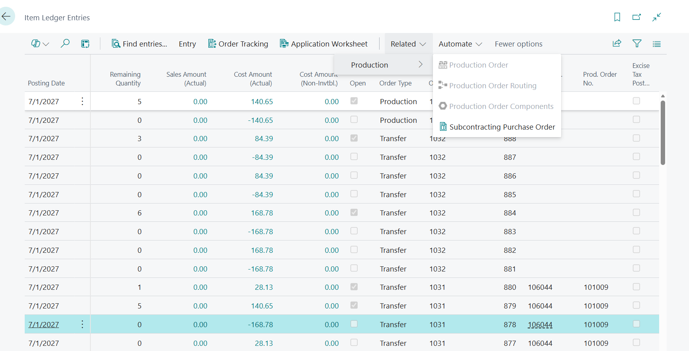

# [Subcontracting] Production Order action in the Item Ledger Entry page is not clickable for lines of type Tranfer linked to Production order

## Repro Steps

## Copied from [#640249](https://dynamicssmb2.visualstudio.com/Dynamics%20SMB/_workitems/edit/640249/) Now Prod ORder action is not active for transfer lines linked to production orders Repro: Prod Order

Create purchase order

create transfer, post transfer.

Navigate to ILE

you can see that Purch Order and Order and Prod Order are all populated.

But actions are not available. I think it should be [(OrderType=prod)AND(Order NO <>empty) OR (PRod Order No <> empty)] and the logic that finds prod order should check both fields

