# [Master][ALL-E] Error when creating a Pick "Nothing to handle. The quantity to be picked is in bin W-09-0002, which is not set up for picking."

## Repro Steps

**Step 1:
Create Item with Tracking**

1. Create a new Item with Item
   Tracking Code = LOTALL, be sure Lot Warehouse Tracking is marked.

---

**Step 2:
Configure Location & Bins**

1. Ensure the Location (WHITE) is
   configured with below Bins
   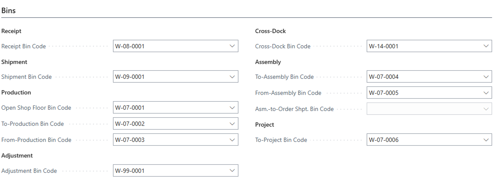
2. Pick According to FEFO = Enabled

---

**Step 3:
Assign Warehouse Employee**

1. Open Warehouse Employees.
2. Assign the current user to
   Location WHITE.
3. Mark it as Default Location.

---

**Step 4:
Create Initial Inventory (200 Qty)**

1. Open Warehouse Item Journal.
2. Create a line:

* Item: Created Item
* Bin Code: W-01-0001 (Pick Bin)
* Quantity: 200
  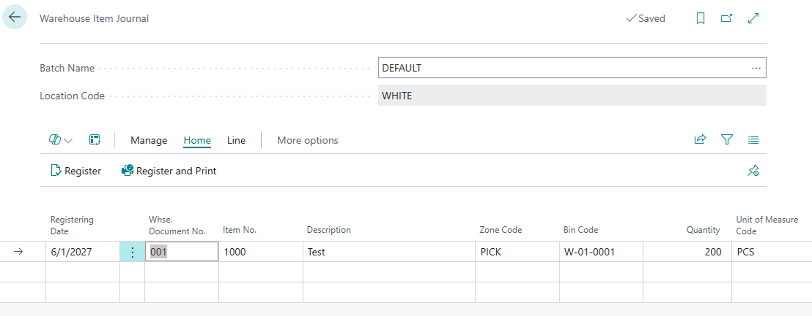

3. Open Line → Item Tracking
   Lines:

* Assign LOT number (e.g.,
  LOT0001)
* Define expiration date and Quantity(Base)
  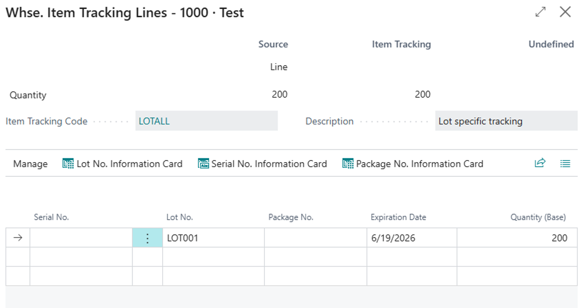

4. Register the Warehouse Item
   Journal.

---

**Step 5:
Sync Inventory via Adjustment**

1. Open Item Journal.
2. Run Calculate Warehouse
   Adjustment:

* Filter on the created Item
  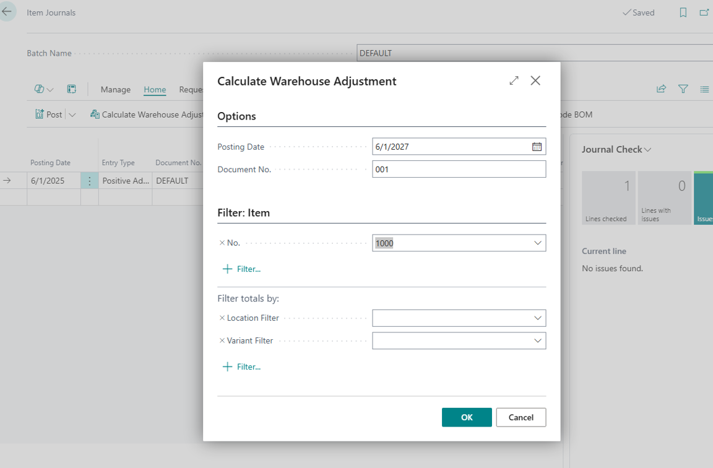

3. Post the journal.

---

**Step 6:
Create First Sales Order (160 Qty)**

1. Create a new Sales Order:

* Customer: Any
* Item: Created Item
* Location: WHITE
* Quantity: 160
  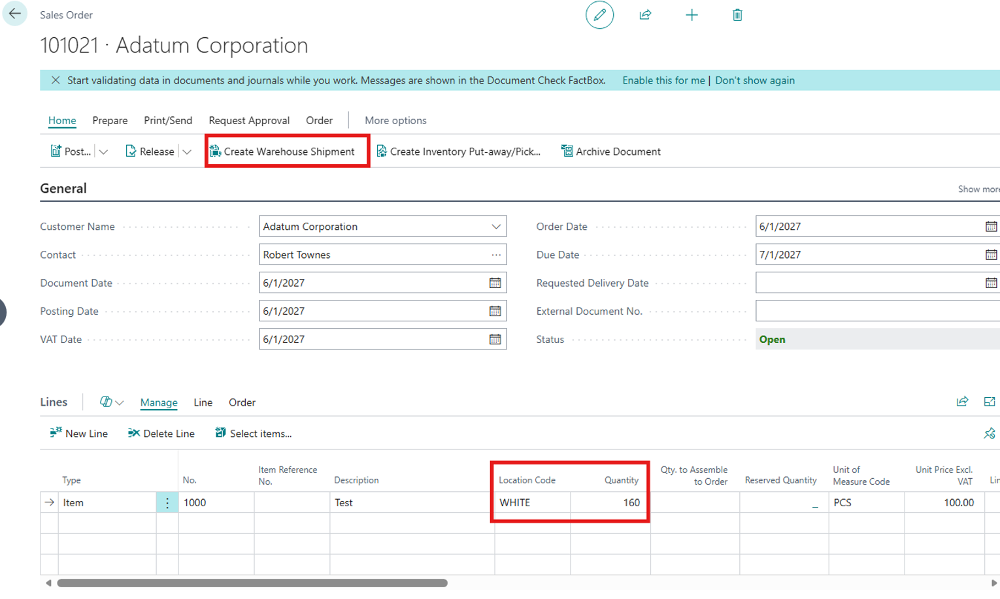

2. Create Warehouse Shipment.

---

**Step 7:
Modify Bin**

1. Open the created Warehouse
   Shipment.
   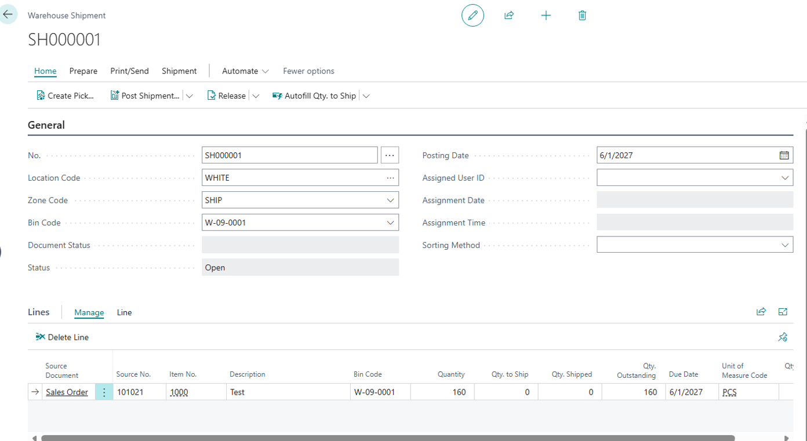
2. Change Shipment Bin Code:

* From: W-09-0001
* To: W-09-0002
  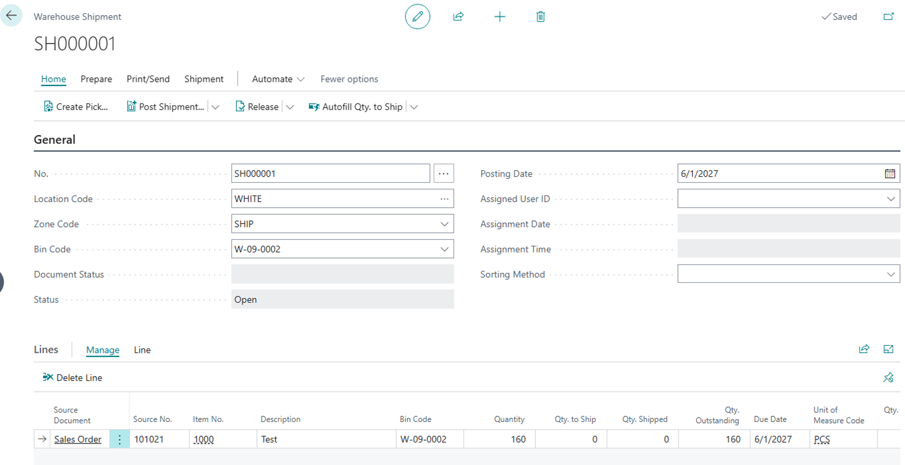

---

**Step 8:
Create and Register Pick**

1. Create Pick.
2. Open Pick Lines
   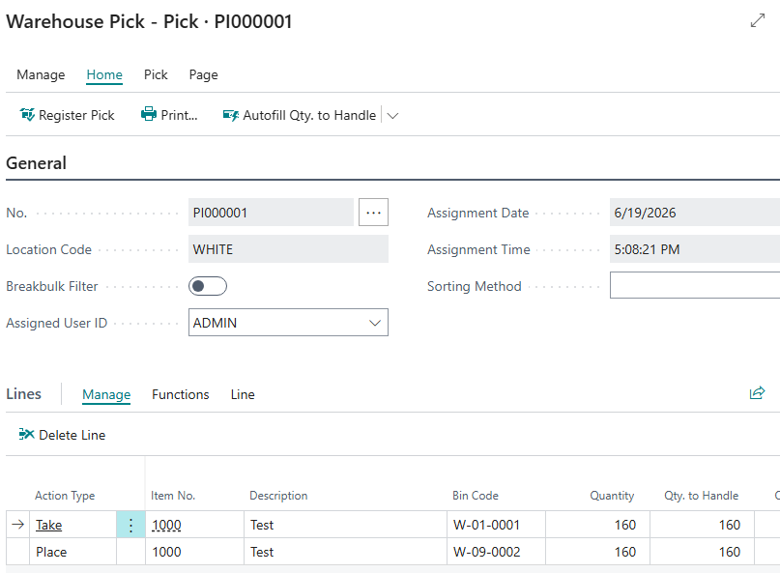
3. **Register the Pick.**

---

**Step 9:
Create Second Sales Order (40 Qty)**

1. Create another Sales Order:

* Same Item & Customer
* Location: WHITE
* Quantity: 40
  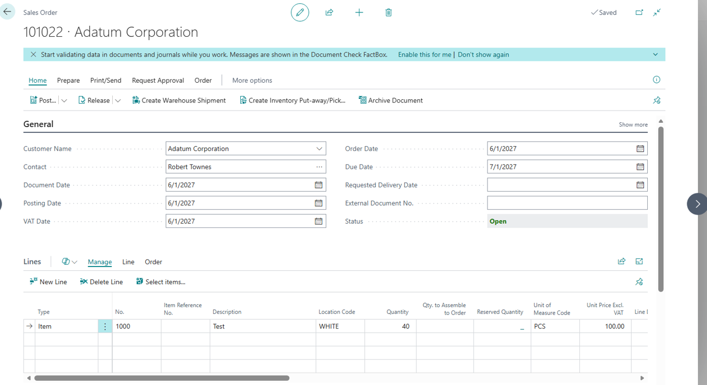

2. Create Warehouse Shipment.

---

**Step
10: Attempt Pick Creation (Failure Scenario)**

1. Keep Shipment Bin Code as **W-09-0001**.
2. Attempt to create Pick.
3. System throws below error:**"Nothing
   to handle."**

 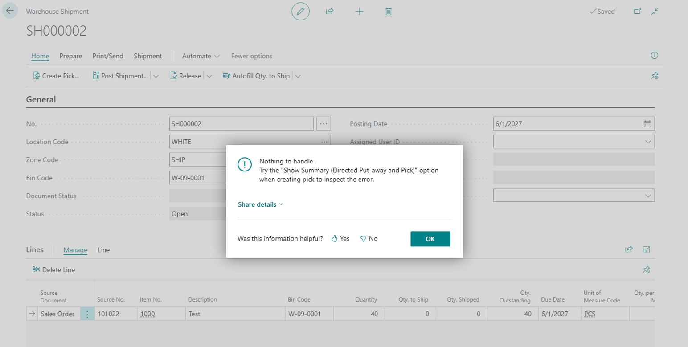

---

**Expected Outcome:**

* Pick creation should succeed
* System should correctly
  calculate availability:

+ 200 total
+ 160 picked (not shipped)
+ = 40 remaining

* All picked but unshipped
  quantities, regardless of bin, should be considered in availability logic

---

**Actual Outcome:**

Error
message 

"Nothing
to handle." or
"Nothing to handle. The quantity to be picked is in bin W-09-0002, which is not set up for picking.
Try the "Show Summary (Directed Put-away and Pick)" option when creating pick to inspect the error."

* System incorrectly evaluates
  available quantity
* Remaining 40 units are not
  considered available

Also if you try to create the pick again and choose the "Show Summary" option, you will see this is incorrect.  The fact box shows 'Qty in Pickable' Bins as 200.  That is not correct.  There is 160 in a Shipment Bin type, that is not a pickable bin.

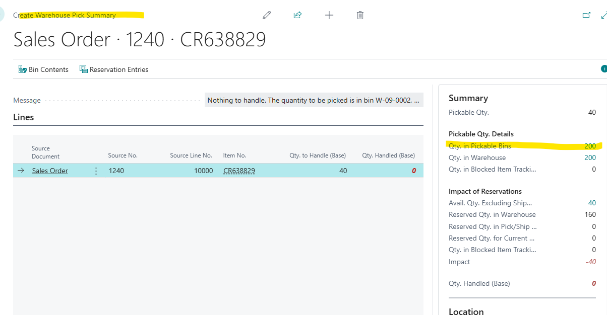

I tested this back in NAV2018 CU40, I get a similar message, but it actually creates the pick and pulls it from the bin I still have 40 in.  So the message is strange here, but it does create the pick.

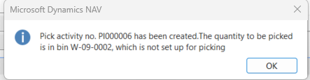

## Description

Derived and copied from Internal Support Case Review <https://dynamicssmb2.visualstudio.com/Dynamics%20SMB/_workitems/edit/638829>

We should not be trying to pull quantity out of a Bin that is designated as a SHIP bin.  As you can see at end of Repro, this worked in NAV2018 CU40...so something broke since.
