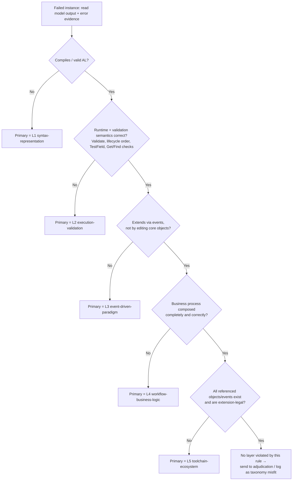

# Failure-Layer Annotation Handbook (AL Counterfactual Diagnosis)

Draft framework — sections marked **⟨FILL⟩** need real examples drawn from the
annotated dataset before the protocol is frozen. Everything else is ready to use.

This handbook governs the **post-hoc** assignment of a *primary failure layer* to
each failed model output in the counterfactual evaluation. It is the reference that
annotators consult while filling the CSV produced by
`bcbench.analysis.annotation.sample_failures` / `write_annotation_csv`.

---

## 1. Purpose and scope

- **Unit of annotation:** one *failed instance* (a base or CF run whose
  `FAIL_TO_PASS` tests did not all pass), not a family.
- **Goal:** record the single abstraction layer at which the model's solution
  *first* breaks, so we can test H3 (AL failures concentrate in higher layers).
- **What we do NOT do here:** we do not score correctness (that is the execution
  pipeline's job), and we do not label passing instances.

### Core principles

1. **Post-hoc only.** The layer label is assigned *after* runs exist, from the
   model's actual output and error evidence. Layer labels never live in the
   dataset and are never shown to the model. (The `failure_layer` field in the
   dataset is nulled for exactly this reason.)
2. **Earliest-violation rule.** When a single output violates several layers,
   the **primary** layer is the *lowest-numbered* (most fundamental) layer that
   is violated. Everything above it is treated as a downstream symptom and may be
   recorded in `annotator_notes` as secondary, but does not change the primary.
3. **Evidence-grounded.** Every label must cite concrete evidence in
   `error_evidence` (a compiler message, a failing assertion, a diff hunk, etc.).
   No evidence → the instance goes to adjudication, not a guessed label.
4. **Refinement-permissive.** The taxonomy is a falsifiable instrument. If a
   cluster of instances does not fit any layer, log it (Section 7) — do not force
   a label. Persistent misfits trigger a taxonomy revision, not silent coercion.

---

## 2. The five-layer taxonomy

Layers are ordered from most fundamental (L1) to most ecosystem-dependent (L5).
The enum values are the canonical strings written into the CSV
(`bcbench.types.FailureLayer`).

| Layer | Canonical value | Structural focus | The question it answers |
|-------|-----------------|------------------|-------------------------|
| L1 | `L1-syntax-representation` | Syntax, object declarations, types, signatures | *Is it even valid AL that compiles?* |
| L2 | `L2-execution-validation` | Record lifecycle, validation order, runtime state | *Does it use the runtime/validation model correctly?* |
| L3 | `L3-event-driven-paradigm` | Publisher–subscriber, trigger responsibilities | *Does it extend via events instead of editing core objects?* |
| L4 | `L4-workflow-business-logic` | Multi-step validation / posting / approval composition | *Is the business process composed correctly and completely?* |
| L5 | `L5-toolchain-ecosystem` | Object/event availability, extension architecture | *Does it respect what actually exists and is allowed?* |

### L1 — Syntax / Representation

**Assign L1 when** the output is not valid AL or does not compile: malformed
object declarations, illegal triggers, wrong/typoed type or member names, broken
procedure signatures, unbalanced blocks.

- **Decision rule:** if the compiler rejects the code for a *well-formedness*
  reason (malformed syntax, illegal declaration, broken signature), it is L1.
  **A compile failure is not automatically L1:** well-formed code that the
  compiler rejects because a referenced object/member is *missing or inaccessible*
  is **L5**, and a wrong *event* signature may be **L3** (see Section 3 callout).
- **Positive examples (failure *is* L1):**
  - Declaring a `trigger OnFooBar()` that does not exist on the object.
  - Calling a procedure with the wrong number/type of parameters.
  - ⟨FILL: one real compiler-error instance_id + the exact error line⟩
- **Boundary / NOT L1:**
  - Code compiles but assigns a field directly instead of validating → that is
    **L2**, not L1.
  - Code references an object that does not exist in the extension surface →
    prefer **L5** (availability) unless the failure is a pure syntax error.

### L2 — Execution / Validation Semantics

**Assign L2 when** the code compiles but misuses the BC runtime model: writing a
field with direct assignment where `Validate` is required, calling `Modify`/
`Insert` in the wrong lifecycle position, ignoring `Get`/`Find` return values,
missing `TestField` before a state transition, or ordering validations wrongly.

- **Decision rule:** compiles (passes L1) but the *runtime/validation contract*
  is violated.
- **Positive examples:**
  - `Rec."No." := X;` instead of `Rec.Validate("No.", X);` when validation logic
    must fire.
  - `InteractionLogEntry.Modify();` before the dependent field is set, so the
    persisted state is wrong (cf. NAV-174087 family pattern).
  - ⟨FILL: one real validation-order instance_id + failing assertion⟩
- **Boundary / NOT L2:**
  - The validation is *present and correct* but the model patched the core object
    directly instead of subscribing to an event → **L3**.
  - All single-step semantics are correct but a required *step in the process* is
    missing → **L4**.

### L3 — Event-Driven Paradigm

**Assign L3 when** the failure concerns *publisher–subscriber model or trigger
responsibility* — the model put the **logic in the wrong trigger / event**, or
directly modified a core/base object instead of subscribing to events
(thesis taxonomy: *event placement*; Appendix indicator: "modifying core objects
instead of subscribing to events; **logic in wrong trigger**").

- **Decision rule:** the defect is *where* the logic is hooked — which
  trigger / event / flow runs it — or the *mechanism of extension*, **not** whether
  the business steps themselves are complete. Each operation may be locally valid;
  the problem is that it lives at the wrong event/trigger site.
- **This is the key L3-vs-L4 distinction:** if the CF moved/placed logic into a
  **different trigger, event, or processing flow** (e.g. "moved validation out of
  the `OnValidate` trigger", "validation moved from the report to the creation
  flow", "fallback triggered after retrieval instead of during calculation",
  "filtering deferred to post-processing instead of at the source") → **L3**, not
  L4. L4 is about *missing/extra/mis-ordered business steps*, not relocating logic
  across triggers/events.
- **Positive examples:**
  - `NAV-176194__cf-3` — "validation moved out of the `OnValidate` trigger to the
    processing flow": correct logic, wrong trigger site → L3.
  - `NAV-201169__cf-3` — "move empty-description validation from the report to the
    product-creation flow": event/trigger placement → L3.
  - Editing a base-app codeunit body instead of writing an `[EventSubscriber]` for
    the relevant published event.
- **Boundary / NOT L3:**
  - The logic is at the right trigger/event but a business *step* is missing or a
    branch is wrong → **L4**.
  - The chosen event/trigger simply does not exist in the toolchain → **L5**.
  - A single-field assignment skips `Validate` at the same site → **L2**.

### L4 — Workflow / Business-Logic Composition

**Assign L4 when** the individual operations are valid (passes L1–L3) but the
*composition* of the business process is wrong: a missing validation/posting/
approval step, an incorrect branch, an incomplete multi-step flow, or steps in
the wrong business order (as opposed to the runtime ordering of L2).

- **Decision rule:** each step is locally correct, but the *process as a whole*
  does not implement the required behaviour.
- **Positive examples:**
  - Posting without the preceding approval/validation step the spec requires.
  - Handling the happy path but dropping a required conditional branch.
  - ⟨FILL: one real missing-step instance_id + which step is absent⟩
- **Boundary / NOT L4:**
  - The process is complete but invokes an object/event that is unavailable in
    the extension surface → **L5**.
  - A single validation is misused at the API level (e.g. no `Validate`) → **L2**.

### L5 — Toolchain / Ecosystem Constraints

**Assign L5 when** the failure is about the *ecosystem surface*: referencing an
event, object, field, or API that does not exist or is not accessible from the
extension, or violating extension-architecture constraints (e.g. modifying
something the extension model forbids).

- **Decision rule:** the code's intent could be valid, but it assumes a toolchain
  reality that does not hold.
- **Positive examples:**
  - Subscribing to a non-existent event, or calling a method not exposed to
    extensions.
  - Assuming a table/field that the target app version does not provide.
  - ⟨FILL: one real non-existent-object instance_id⟩
- **Boundary / NOT L5:**
  - The object exists and is accessible, but is edited directly rather than via
    an event → **L3**.
  - The reference is simply a typo of an existing member → **L1**.

---

## 3. Primary-failure decision procedure (flowchart)

Apply the checks **in order, L1 → L5, and stop at the first failure**. The layer
where you stop is the **primary failure layer**. Continue scanning only to record
*secondary* observations in notes.



> Tie-breaking: if two violations appear at the *same* layer, the primary is still
> that layer; pick the one with the strongest evidence for `error_evidence`.
> If you cannot determine whether L_n is satisfied, do **not** skip ahead — mark
> the instance for adjudication.

> **⚠️ A compile failure is not automatically L1.** L1 means the code is
> *malformed*. Well-formed AL that the compiler still rejects is classified by the
> *reason*, decided by the error code / message:
> - Pure syntax/declaration errors (e.g. `AL0104`, `AL0107`, `AL0110`, `AL0198`,
>   `AL0305` name-length) → **L1**.
> - Missing or inaccessible object/member (e.g. `AL0185` "codeunit is missing",
>   `AL0161` "inaccessible due to protection level", `AL0842` "Internal
>   accessibility") → **L5** (the code is well-formed; the *ecosystem surface*
>   does not provide it).
> - Wrong **event** subscriber signature (e.g. `AL0749` on an event method) → may
>   be **L3** if the root cause is mis-wiring the event paradigm rather than a typo.
> - `AL0118` "name does not exist in current context" straddles L1 (typo) and L5
>   (real but unavailable object) — decide from the referenced name.

---

## 4. Filling the annotation CSV

Columns are produced by `bcbench.analysis.annotation.ANNOTATION_COLUMNS`:

| Column | Who fills | Meaning |
|--------|-----------|---------|
| `family_id`, `instance_id` | pre-filled | identifiers |
| `family_type`, `pattern` | pre-filled | execution outcome context |
| `failure_layer` | pre-filled (blank) | legacy dataset field — leave blank |
| `base_passed`, `cf_passed` | pre-filled | pass/fail context |
| `primary_failure_layer` | **annotator** | one canonical value from Section 2 |
| `error_evidence` | **annotator** | quoted compiler line / assertion / diff hunk |
| `annotator_notes` | **annotator** | secondary layers, doubts, misfit flags |

Rules: `primary_failure_layer` must be exactly one of the five canonical strings.
`error_evidence` must be non-empty for every labelled row.

---

## 5. Double-annotation and inter-annotator agreement (IAA)

1. **Sample:** draw a shared subset of **50–80 failed instances** for independent
   double annotation (priority order: fragile → unsolved → inconsistent, as
   `sample_failures` already sorts).
2. **Independence:** the two annotators label without seeing each other's labels.
3. **Compute IAA** with `bcbench.analysis.annotation.inter_annotator_agreement`,
   which returns the raw agreement rate and **Cohen's kappa** over the shared,
   non-empty labels.
4. **Interpretation targets (Landis & Koch):** κ ≥ 0.80 excellent, 0.60–0.79
   substantial, 0.40–0.59 moderate, < 0.40 → the rules are too ambiguous; revise
   the handbook (Section 2 decision rules) before continuing.
5. **Disagreement resolution:** adjudicate each disagreement, record the final
   label, and add the clarified rule/example to this handbook. Re-running IAA
   after refinement is encouraged; report the *pre-adjudication* κ in the thesis.

Example:

```python
from bcbench.analysis.annotation import inter_annotator_agreement

result = inter_annotator_agreement(annotator_a, annotator_b)  # dict: instance_id -> layer
print(result.n, result.agreement_rate, result.cohen_kappa)
```

---

## 6. Worked examples

### 6.1 Prefilled candidates — ⚠️ VERIFY layer attribution

Sampled across **all four models** (Claude Opus 4.6, Sonnet 4.6, GPT-5.3-Codex,
GPT-5.4) via `sample_failures` and the build logs. Evidence is real — the quoted
`error AL####` is the model's *own* error. The **Tentative layer** is a suggestion
under the earliest-violation rule, **not a confirmed label** — confirm or correct
each before freezing.

> **⚠️ Read past the noise.** Build logs recurringly include base-app
> *warnings-as-errors* — `AL0749` ("...has 'Internal' accessibility") and `AL0842`
> ("...will not be usable outside of this module") — in core files the model never
> touched. These are **not** the model's failure. Always locate the `error AL####`
> line in a file the model actually modified and use that as `error_evidence`.

#### L1 candidates (malformed code — real `error AL`)

- **`microsoftInternal__NAV-183399__cf-2`** (Opus) — `error AL0104: Syntax error,
  ';' expected` in `PurchaseJournal.Page.al`. **Tentative: L1**, not confusable.
- **`microsoftInternal__NAV-176082__cf-1`** (Sonnet) — `error AL0110: Orphaned
  ELSE statement` (stray semicolon before `ELSE`). **Tentative: L1.**
- **`microsoftInternal__NAV-188438__cf-1`** (GPT-5.4) — `error AL0104: Syntax
  error, '}' expected`. **Tentative: L1.**
- **`microsoftInternal__NAV-176082__cf-2`** (GPT-5.3-Codex) — `error AL0118: The
  name 'continue' does not exist in the current context`. The model emitted a
  Python/C-style `continue`, which is not AL. **Tentative: L1** (cross-language
  hallucination — a clean, distinctive L1 case).
- **`microsoftInternal__NAV-174087__cf-2`** (GPT-5.4) — `error AL0305: object
  identifier ... cannot exceed 30 characters`. Declaration-rule violation.
  **Tentative: L1** (representation).

#### L5 candidates (well-formed but ecosystem-illegal — real `error AL`)

- **`microsoftInternal__NAV-185488__cf-1`** (GPT-5.3-Codex) — `error AL0185:
  Codeunit 'Data Type Management' is missing`. **Tentative: L5** (availability —
  *not* L1; the code is syntactically valid).
- **`microsoftInternal__NAV-218062__cf-1`** (GPT-5.3-Codex) — `error AL0185:
  Codeunit 'Warehouse Availability Mgt.' is missing`. **Tentative: L5.**
- **`microsoftInternal__NAV-215972__cf-1`** (GPT-5.3-Codex) — `error AL0161:
  'CheckReservationPolicy(...)' is inaccessible due to its protection level`. The
  method exists but is not extension-legal to call. **Tentative: L5.**
  *(Note: the same instance fails at **L2** under GPT-5.4 — layer is per failed
  output, not per task.)*

#### L1/L5 boundary — `AL0118` "name does not exist in the current context"

The same error code spans L1 and L5; decide from the referenced name.

- **`microsoftInternal__NAV-222092__cf-1` / `__cf-2`** (recurs across Opus, GPT-5.3,
  GPT-5.4) — name `"G/L Account"`. A real BC table referenced without it being in
  scope → leans **L5** (availability/namespace), unless it is a stray quote → L1.
- **`microsoftInternal__NAV-214557__cf-1`** (GPT-5.4) — name `"Prod. Order
  Component"`; same L5-leaning pattern.
- **`microsoftInternal__NAV-174794__cf-2` / `__cf-3`** (Opus) — `error AL0132:
  'Record "Gen. Journal Line" temporary' does not contain a definition for
  'Customer Posting Group'`. The model referenced a field that exists on *Customer*
  but not on *Gen. Journal Line* → assumed a member the type does not provide.
  **Tentative: L5** (member availability) ⚠️ *Boundary L1* if read as a typo.
  *(Correction: an earlier draft mislabelled this L1/L3 from the `AL0749` warning
  noise; the model's real error is `AL0132`.)*

#### L2 candidates (compiled, tests failed — validation semantics)

- **`microsoftInternal__NAV-205825__cf-1`** (GPT-5.4) — variant *"VAT
  Country/Region Code assigned directly without validation does not propagate VAT
  setup."* Gold uses `Validate`; the model assigned the value directly, so the
  dependent VAT setup never fired. **Tentative: L2** (skipped validation contract).
- **`microsoftInternal__NAV-176194__cf-3`** (GPT-5.4) — variant *"Qty. to Invoice
  validation moved out of OnValidate trigger to processing flow."* Validation
  relocated away from the field's `OnValidate`. **Tentative: L2.**

#### L4 candidates (compiled, tests failed — business-logic composition)

- **`microsoftInternal__NAV-175765__cf-2`** — variant *"Cost adjustment run
  before undo transfer shipment instead of after."* Gold orchestrates the
  adjustment inside `ItemJnlPostLine`; the model instead inserted
  `MakeInventoryAdjustment();` near the **top** of the undo loop in
  `UndoTransferShipment.Codeunit.al`. The operations compile and are individually
  valid, but the **business step is in the wrong place in the process**.
  **Tentative: L4** (workflow ordering). ⚠️ *Boundary L2:* this is process-step
  ordering (L4), not runtime/validation ordering of a single record (L2).

- **`microsoftInternal__NAV-176082__cf-1`** — variant *"Get Receipt Lines filters
  by header-level location only instead of line-level location."* Gold adjusts the
  filtering rule; the model simply **deleted** the
  `SetRange("Location Code", ...)` line. The wrong set of records flows through the
  business operation. **Tentative: L4** (business-rule/filter composition).
  ⚠️ *Boundary L2:* if you view this as misusing record filtering semantics rather
  than the business rule, it is L2 — verify against the failing assertion.

- **`microsoftInternal__NAV-176150__cf-1`** — variant *"Preview Posting filters by
  Production Order No. only instead of full page context."* Gold narrows
  `MarkRelevantRec` via `SetRange("Order No.", ...)`; the model added extra
  `SetRange` filters at a different call site, producing the wrong record scope.
  **Tentative: L4** (business-logic scoping). ⚠️ *Boundary L2* as above.

#### L3 candidates (event placement / wrong trigger) — recovered with the refined rule

An earlier draft wrongly concluded "L3 is absent": it searched only for *new*
event publisher/subscriber declarations the model omitted. The thesis L3 definition
is broader — *event placement / logic in the wrong trigger* (Appendix). Under that
rule, GPT-5.3-Codex re-annotation found **13 L3 failures across 5 instances** (all
high-confidence), where the CF moved logic to a different trigger/event/flow:

- **`NAV-176194__cf-3`** (Opus, GPT-5.4, GPT-5.3) — "validation moved out of the
  `OnValidate` trigger to the processing flow." Right logic, wrong trigger → **L3**.
- **`NAV-201169__cf-3`** (all 3) — "move empty-description validation from the
  report to the product-creation flow." Trigger/flow placement → **L3**.
- **`NAV-176426__cf-2`** (all 3) — "fallback triggered after item-cost retrieval
  instead of during BOM-tree calculation." Trigger timing/site → **L3**.
- **`NAV-177493__cf-1`** (all 3) — "Reserve=Never filtering deferred to
  post-processing instead of source-level filtering." Placement → **L3**.
- **`NAV-174087__cf-2`** (GPT-5.3) — "Evaluation persisted via the `OnModify`
  trigger instead of the page workflow step." Wrong trigger → **L3**.

> These confirm L3 *does* occur here; it was masked by a too-narrow rule. Verify
> the five before freezing, then promote to §6.2.

### 6.2 Verified worked examples ⟨FILL⟩

After verification, promote confirmed candidates here as the gold reference for
onboarding a second annotator: model output snippet, error evidence, the L1→L5
scan, and why the primary layer beat the tempting adjacent one.

---

## 7. Misfit / taxonomy-revision log

Record any failed instance that does not fit the five layers, with `instance_id`,
why it resists labelling, and a proposed resolution (new sub-rule vs. new layer).
A recurring misfit pattern is a finding, not an annotation error.

| instance_id | why it misfits | proposed resolution |
|-------------|----------------|---------------------|
| ⟨FILL⟩ | | |
